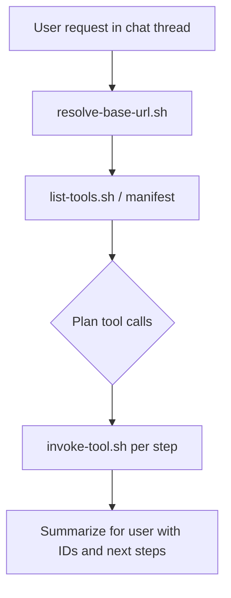

# RealtimeX Signals

Operate **Signals** (local-first social GTM CRM) via its stable REST API. Intelligence lives in the RTX terminal agent — Signals exposes data tools only.

## Start here

Every session:

1. **Resolve base URL** (must succeed before any CRM call):

```bash
.claude/skills/realtimex-signals/scripts/resolve-base-url.sh
```

Export for subsequent commands:

```bash
export SIGNALS_BASE_URL="$(.claude/skills/realtimex-signals/scripts/resolve-base-url.sh)"
```

2. **Load tool manifest** (schemas change — always refresh at session start):

```bash
.claude/skills/realtimex-signals/scripts/list-tools.sh | jq '.tools[] | {name, description, category}'
```

3. **Invoke tools** via the helper (preferred over hand-written curl):

```bash
.claude/skills/realtimex-signals/scripts/invoke-tool.sh query_contacts '{"search":"acme"}'
.claude/skills/realtimex-signals/scripts/invoke-tool.sh create_contact '{"name":"Alex Rivera","company":"Northwind","platform":"linkedin"}'
```

From repo root you can also use `scripts/invoke-agent-tool.sh` with `SIGNALS_BASE_URL` set.

## When to use this skill

- User asks to add, find, update, enrich, or archive contacts in Signals
- User wants CRM analytics, goals, tasks, or workflow status from Signals
- After browser/LLM research in RTX — persist findings into Signals via `enrich_contact` / `update_contact`
- Any open-ended Signals request in a chat-linked terminal agent thread

## When NOT to use

- **In-app Signals chat** (`/api/chat`) — deprecated path; use agent-tools instead
- **Browser scrape / web search / publish** — not on agent-tools API; use RTX browser/credentials, then write to Signals
- **Deterministic scheduled automation** — use Agent Flows in `flows/` instead

## Discovery order

| Priority | Source | Notes |
|----------|--------|-------|
| 1 | `SIGNALS_BASE_URL` | Explicit override |
| 2 | `RTX_PORT` / `PORT` | Embedded Local App |
| 3 | Health probe | Tries `3010`, `3000` on localhost |

Health check: `GET {base}/api/health` → `{ "app": "signals", "status": "ok" }`

## Invoke contract

```bash
POST {base}/api/agent-tools/invoke
Content-Type: application/json

{ "tool": "create_contact", "input": { "name": "..." } }
```

Success: `{ "success": true, "tool": "...", "result": { ... } }`

Errors: `{ "success": false, "code": "VALIDATION_ERROR|TOOL_NOT_FOUND|...", "details": ... }`

Auth: localhost-only by default. Remote calls need `SIGNALS_AGENT_TOOL_TOKEN` + `Authorization: Bearer ...`.

## Agent workflow



1. Parse intent — don't guess IDs; query first if unsure
2. Call manifest-backed tools only — check parameter schema before invoke
3. Chain calls — e.g. `create_contact` → `enrich_contact` → `get_contact`
4. Prefer `enrich_contact` over `update_contact` when filling missing fields
5. Reply with contact IDs, fields changed, enrichment score, suggested follow-ups

## Playbooks

### Add a new person

```bash
.claude/skills/realtimex-signals/scripts/invoke-tool.sh create_contact \
  '{"name":"Jane Doe","company":"Acme","platform":"linkedin"}'

# Use contact id from result:
.claude/skills/realtimex-signals/scripts/invoke-tool.sh enrich_contact \
  '{"contactId":"<id>","title":"Head of Partnerships","email":"jane@acme.com"}'
```

### Find and summarize pipeline

```bash
.claude/skills/realtimex-signals/scripts/invoke-tool.sh query_contacts \
  '{"funnelStage":"qualified","pageSize":20}'
.claude/skills/realtimex-signals/scripts/invoke-tool.sh query_analytics '{}'
```

### Research → CRM (with RTX browser)

1. Use RTX browser / web tools to gather profile data
2. `create_contact` or `query_contacts` to find existing record
3. `enrich_contact` with discovered fields (fill-gaps only)
4. `create_task` for follow-up if appropriate

### Wind Tunnel (variant simulation)

```bash
.claude/skills/realtimex-signals/scripts/invoke-tool.sh create_simulation_run \
  '{"variantId":"<variant-id>","populationSpec":{"contactIds":["<contact-id>"]}}'

# After scoring agents externally:
.claude/skills/realtimex-signals/scripts/invoke-tool.sh record_simulation_results \
  '{"runId":"<run-id>","results":[{"agentId":"<agent-id>","engagementScore":72,"outcome":"like"}]}'

.claude/skills/realtimex-signals/scripts/invoke-tool.sh complete_simulation_run \
  '{"runId":"<run-id>","predictedScore":78,"predictionConfidence":0.85,"predictedMetrics":{"likes":120}}'
```

## Install on an RTX workspace

**Package for upload** (preserves `+x` on `scripts/*.sh`):

```bash
./scripts/package-realtimex-signals-skill.sh /tmp/realtimex-signals.zip
```

**Option A — link from this repo** (development):

Copy or symlink `.claude/skills/realtimex-signals` into the workspace skills directory, or register via RealtimeX admin skills UI.

**Option B — CLI** (when `realtimex-pp-cli` is available):

```bash
realtimex-pp-cli prepare --agent
realtimex-pp-cli create-workspace-agent-skill <workspaceSlug>
# Point skill content at this directory or publish as workspace skill pack
realtimex-pp-cli enable-workspace-agent-skill <workspaceSlug> realtimex-signals
```

Ensure the Signals Local App is running (RTX **Settings → Local Apps**). See [`docs/local-app.md`](../../../docs/local-app.md).

## Reference

- Tool catalog and enums: [reference.md](./reference.md)
- Full API docs: [`docs/agent-tools.md`](../../../docs/agent-tools.md)
- Automation flows (secondary): [`flows/README.md`](../../../flows/README.md)

## Troubleshooting

| Symptom | Fix |
|---------|-----|
| `Could not find a running Signals instance` | Start Local App; set `SIGNALS_BASE_URL=http://localhost:{port}` |
| `VALIDATION_ERROR` | Re-read manifest schema for that tool; fix `input` shape |
| `403` / unauthorized | API called off-localhost — set `SIGNALS_AGENT_TOOL_TOKEN` |
| Empty contacts | Expected on fresh DB — create first contact |
