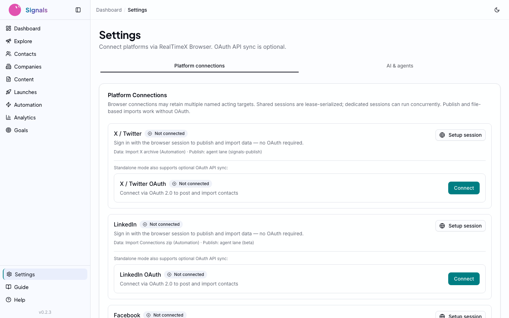

# Getting Started

**From zero to a running CRM in under a minute.**

---

## Why This Is Different

Traditional CRMs take weeks to deploy. You evaluate vendors, sign contracts, configure integrations, import data, train your team. The setup cost alone kills adoption for solo founders and small teams.

Signals takes a page from the indie hacker playbook. Pieter Levels runs [multiple profitable products on SQLite](https://x.com/levelsio/status/1727382446563840368) — no Postgres cluster, no managed database service, just a file on disk. The [local-first software movement](https://www.inkandswitch.com/local-first/), pioneered by Ink & Switch and Martin Kleppmann, argues that the best software owns its data locally and syncs on your terms. Signals embraces both ideas: your CRM graph and credentials live in local SQLite and encrypted config under `~/.signals/`. Semantic search and scheduled persona refreshes may send bounded inputs through RealTimeX `llm.embed` / `llm.chat` — whether those leave your machine depends on your configured RTX/model provider. Terminal agents you run may also fetch external data when you ask them to.

## Prerequisites

- **Node.js 20+** — Check with `node --version`
- **A terminal** — Any terminal works: iTerm, Warp, the VS Code integrated terminal
- **API keys** (configured after install):
  - **RealTimeX workspace** — Terminal agents run enrichment, search, and workflow orchestration via `/api/agent-tools` (see `docs/rtx-agent-orchestration.md`)
  - **Serper API Key** — Optional, for RTX agent web search (2,500 free queries). Get one at [serper.dev](https://serper.dev)
  - **Tavily API Key** — Optional, for RTX agent deep research (1,000 free/month). Get one at [tavily.com](https://tavily.com)

## Installation

```bash
npx @realtimex/signals
```

This single command:
1. Downloads the Signals package
2. Creates `~/.signals/` — your data directory
3. Runs database migrations automatically
4. Starts the Next.js server on `http://localhost:3000`

No Docker. No cloud account. No `.env` file to wrestle with (though you can use one if you prefer).

### Your Data Directory

Everything lives in `~/.signals/`:

```
~/.signals/
  data.db          # SQLite database — your entire CRM
  config.json      # Encrypted API keys and settings
  sessions/        # Browser automation sessions
  media/           # Uploaded images and attachments
```

This is your data. Back it up, move it between machines, or delete it entirely — you're in control.

## Configuring API Keys

Navigate to **Settings** in the sidebar. This is where you connect Signals to the services it needs.


*The Settings page: configure API keys, connect platforms, and manage browser sessions.*

### Search API Keys (Optional)

RTX terminal agents can use web search when you configure:

- **Serper** — Google-based broad discovery. Great for prospecting and finding new contacts. 2,500 free queries (one-time).
- **Tavily** — Deep research engine. Better for enrichment and detailed person lookup. 1,000 free searches per month.

Configure keys in **Settings** or environment variables. Agents choose providers in the RealTimeX workspace — Signals stores CRM results via agent-tools, not in-process LLM loops.

## Connecting Platforms

Below the API key section, you'll find **Platform Connections**. Signals supports three platforms:

- **X / Twitter** — OAuth connection for contact sync and engagement tracking
- **LinkedIn** — OAuth connection for professional network integration
- **Gmail / Google** — OAuth connection for email contact sync

Each connection shows its status (Connected/Disconnected), the signed-in account, granted permissions, and last sync time.

### Browser Sessions (Publish / Engage)

At the bottom of Settings, **Browser Session** supports **publish and engage** flows on X and LinkedIn. Profile enrichment no longer runs inside Signals — use RealTimeX Browser + agent-browser (see `docs/rtx-agent-browser-enrichment.md`).

## The Help Page

If you're not sure what to do next, click **Help** in the sidebar.


*The Help page: a quick setup checklist, environment setup instructions, and platform-specific guides.*

The Help page includes:
- **Quick Setup Checklist** — Shows completion status for each configuration step (API key, platform connections, first sync)
- **Environment Setup** — Instructions for configuring `.env.local` if you prefer environment variables
- **Platform-specific tabs** — Detailed setup guides for X/Twitter, LinkedIn, and Gmail

## Your Dashboard

Once you've connected at least one platform (or imported contacts), head to the **Dashboard**.


*The Dashboard: stat cards for contacts, workflows, tasks, and content. Contact pipeline below.*

The dashboard gives you a single-screen overview:

- **Stat cards** — Total contacts, active workflows, pending tasks, content items
- **Contact Pipeline** — Visual funnel distribution across stages: Prospect, Engaged, Qualified, Opportunity, Customer, Advocate
- **Recent Contacts** — Latest additions to your CRM with stage badges
- **Pending Tasks** — Action items needing your attention

The sidebar navigation mirrors the workflow you'll follow through these guides: **Contacts** → **Content** → **Automation** → **Analytics** → **Goals**. Settings and Help are always at the bottom.

## What's Next

Your CRM is running. Your keys are configured. Time to get people into the system.

**Next: [Contacts and Enrichment](02-contacts-and-enrichment.md)** — Import contacts from X and LinkedIn, understand enrichment scores, and enrich via RTX agents.
