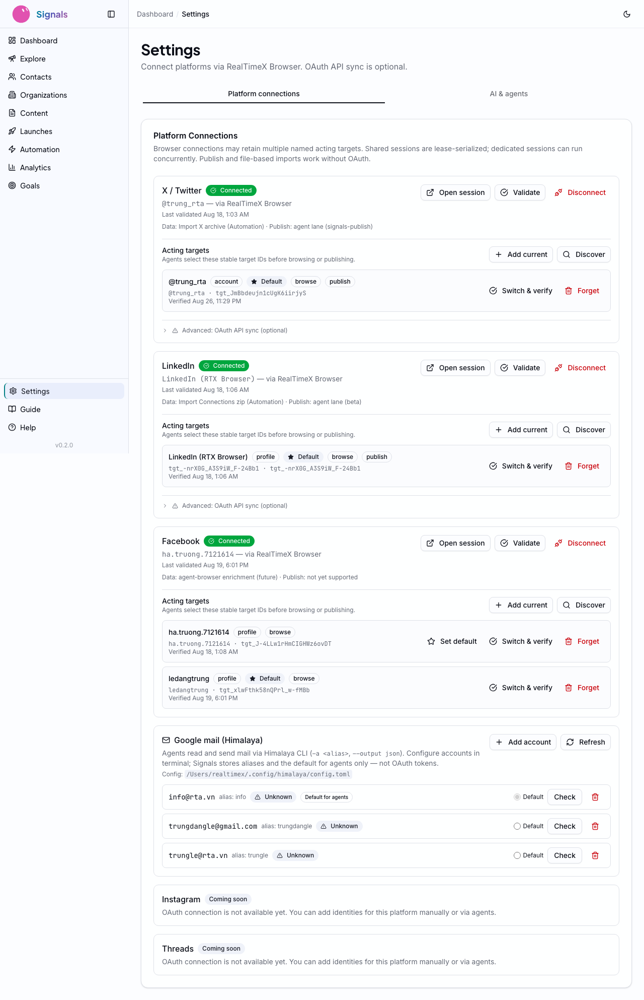
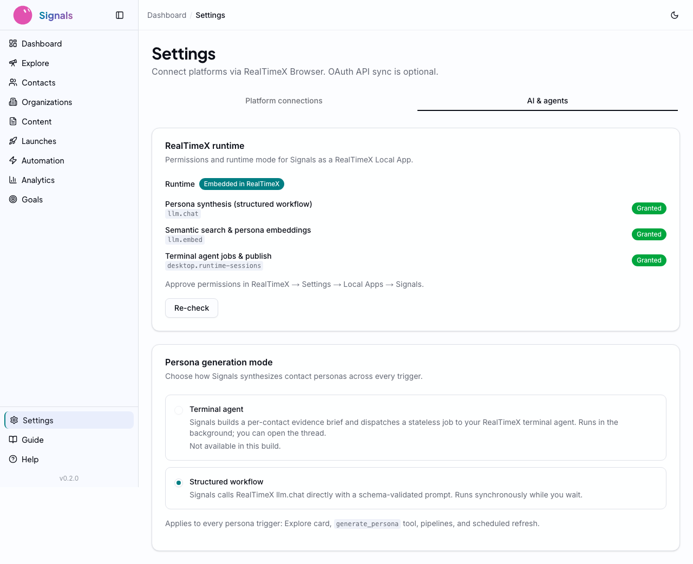
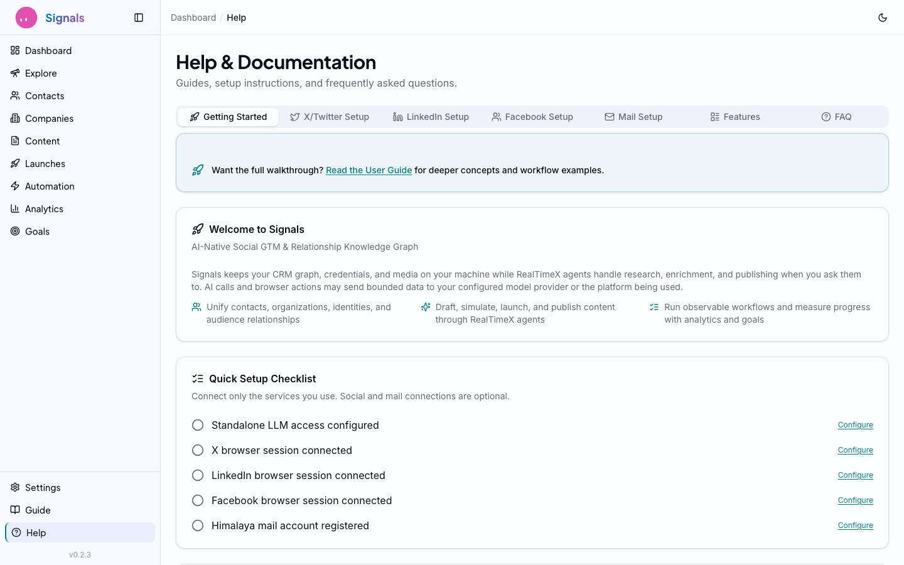
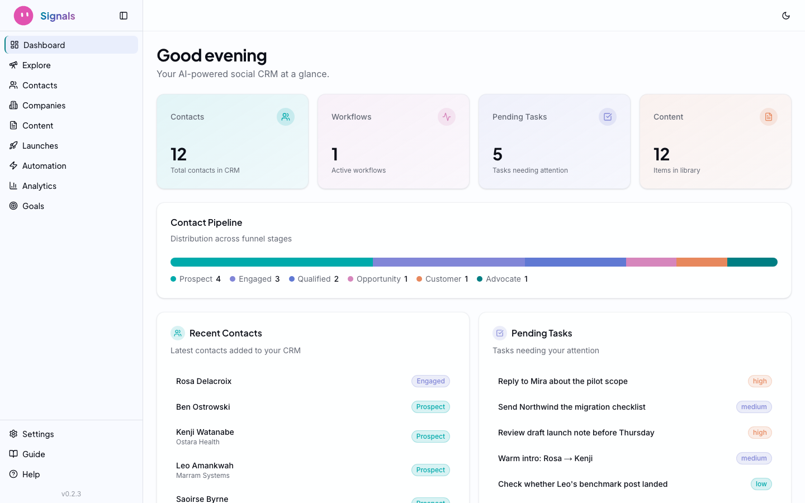

# Getting Started

**From zero to a running CRM in under a minute.**

---

## Why This Is Different

Traditional CRMs take weeks to deploy. You evaluate vendors, sign contracts, configure integrations, import data, train your team. The setup cost alone kills adoption for solo founders and small teams.

Signals takes a page from the indie hacker playbook. Pieter Levels runs [multiple profitable products on SQLite](https://x.com/levelsio/status/1727382446563840368) — no Postgres cluster, no managed database service, just a file on disk. The [local-first software movement](https://www.inkandswitch.com/local-first/), pioneered by Ink & Switch and Martin Kleppmann, argues that the best software owns its data locally and syncs on your terms. Signals embraces both ideas: your CRM graph and credentials live in local SQLite and encrypted config under `~/.signals/`. Semantic search and scheduled persona refreshes may send bounded inputs through RealTimeX `llm.embed` / `llm.chat` — whether those leave your machine depends on your configured RTX/model provider. Terminal agents you run may also fetch external data when you ask them to.

## Prerequisites

- **Node.js 20+** — Check with `node --version`
- **A terminal** — Any terminal works: iTerm, Warp, the VS Code integrated terminal
- **API access** (configured after install):
  - **RealtimeX Local App** — AI chat, embeddings, and search use the RTX SDK proxy. Approve `llm.chat` and `llm.embed` for Signals in RealtimeX **Settings → Local Apps** (no provider keys in Signals Settings).
  - **Standalone development** — Set `ANTHROPIC_API_KEY` in `.env.local` (optional `SERPER_API_KEY` / `TAVILY_API_KEY` until search fully migrates off direct keys).
  - **RealTimeX workspace** — Terminal agents run enrichment, search, and workflow orchestration via `/api/agent-tools` (see `docs/rtx-agent-orchestration.md`)

## Installation

```bash
npx @realtimex/signals
```

This single command:
1. Downloads the Signals package
2. Creates `~/.signals/` — your data directory
3. Runs database migrations automatically
4. Starts the Next.js server on `http://localhost:3000`

No Docker. No cloud account. No `.env` file to wrestle with (though you can use one if you prefer).

### Your Data Directory

Everything lives in `~/.signals/`:

```
~/.signals/
  data.db          # SQLite database — your entire CRM
  config.json      # Encrypted credentials and settings
  sessions/        # Browser automation sessions
  media/           # Uploaded images and attachments
```

This is your data. Back it up, move it between machines, or delete it entirely — you're in control.

## AI and search configuration

Signals does **not** collect Anthropic, Serper, or Tavily API keys in its Settings UI. Configure LLM and search through one of these paths:

### RealtimeX Local App (recommended)

When Signals runs as a Local App (`RTX_APP_ID` set), all LLM compute goes through the RealtimeX SDK proxy:

1. Open RealtimeX **Settings → Local Apps** and select the Signals app.
2. Approve **`llm.chat`** and **`llm.embed`** permissions.
3. Ensure your RealtimeX LLM provider configuration is healthy (models and spend controls live in RTX, not Signals).

In Signals, open **Settings → AI & agents** to review RTX permission status and choose the global persona generation mode. The Settings UI does not expose provider key forms.

### Standalone development

For local dev without the Local App shell, copy `.env.example` to `.env.local` and set:

- **`ANTHROPIC_API_KEY`** — Required for Claude-powered chat and agents.
- **`SERPER_API_KEY`** / **`TAVILY_API_KEY`** — Optional until search routes fully migrate off direct provider keys (ADR-022-9 follow-up).

Restart the dev server after changing environment variables.

## Settings and platform connections

Navigate to **Settings** in the sidebar. The page has two tabs:

- **Platform connections** — Connect X, LinkedIn, and Facebook via **RealTimeX Browser** (Setup, Validate, Disconnect per platform). OAuth API sync is optional for X and LinkedIn (collapsed under **Advanced**) and not required for archive import, publish via agent, or Explore.
- **AI & agents** — Review RealTimeX Local App permission status (`llm.chat`, `llm.embed`, terminal agent jobs) and select **Structured workflow** vs **Terminal agent** for persona generation.


*Platform connections: browser-native cards, acting targets, and Himalaya mail accounts.*


*AI & agents: RTX runtime permissions, Re-check, and the global persona generation mode selector.*

## Connecting platforms

In **Settings → Platform connections**:

- **X / Twitter** — Sign in via the `signals-publish` RealTimeX Browser session. Import followers from an X archive zip (Automation → Workflows). Publish through the terminal agent lane (`docs/rtx-browser-publish.md`).
- **LinkedIn** — Same browser session model. Import connections from a LinkedIn export zip. Publish is beta via the agent lane.
- **Facebook** — Browser session connect only (no Meta OAuth). Validates the active personal account in the shared `signals-publish` session for future agent-browser enrichment. Publish is not yet supported.
- **Google mail** — Himalaya CLI accounts (see Settings mail section and issue #137); no Gmail OAuth in Signals.

Optional **Advanced: OAuth API sync** unlocks paid API contact sync (X Basic `follows.read`, LinkedIn `r_connections`). File-based imports and agent publish do not require OAuth.

Profile enrichment runs via RealTimeX agent-browser — see `docs/rtx-agent-browser-enrichment.md`.

## The Help Page

If you're not sure what to do next, click **Help** in the sidebar.


*The Help page: a quick setup checklist, environment setup instructions, and platform-specific guides.*

The Help page includes:
- **Quick Setup Checklist** — Shows completion status for each configuration step (LLM access, platform connections, first sync)
- **Environment Setup** — Instructions for configuring `.env.local` if you prefer environment variables
- **Platform-specific tabs** — Detailed setup guides for X/Twitter, LinkedIn, and Gmail

## Your Dashboard

Once you've connected at least one platform (or imported contacts), head to the **Dashboard**.


*The Dashboard: stat cards for contacts, workflows, tasks, and content. Contact pipeline below.*

The dashboard gives you a single-screen overview:

- **Stat cards** — Total contacts, active workflows, pending tasks, content items
- **Contact Pipeline** — Visual funnel distribution across stages: Prospect, Engaged, Qualified, Opportunity, Customer, Advocate
- **Recent Contacts** — Latest additions to your CRM with stage badges
- **Pending Tasks** — Action items needing your attention

The sidebar navigation mirrors the workflow you'll follow through these guides: **Contacts** → **Content** → **Automation** → **Analytics** → **Goals**. Settings and Help are always at the bottom.

## What's Next

Your CRM is running. Your platforms and AI access are configured. Time to get people into the system.

**Next: [Contacts and Enrichment](02-contacts-and-enrichment.md)** — Import contacts from X and LinkedIn, understand enrichment scores, and enrich via RTX agents.
