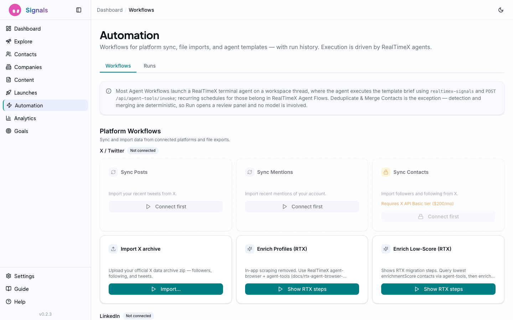
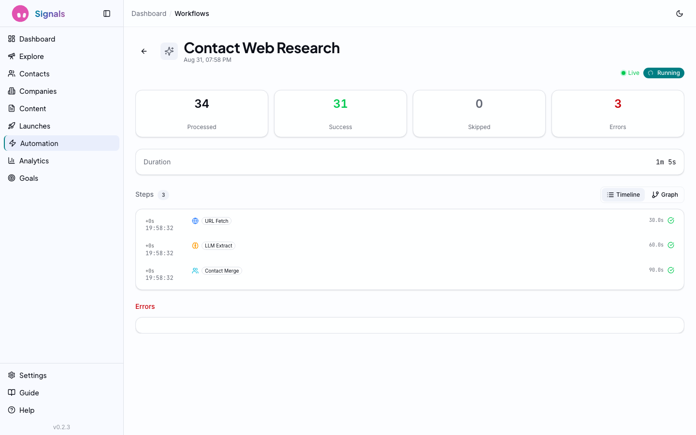

# AI Agents and Automation

**Not chatbots. Agents that use tools, take actions, and show their work.**

---

## What an Agent Actually Is

The word "agent" gets thrown around a lot. Most products slap it on a chatbot and call it a day. Simon Willison, one of the sharpest voices in AI tooling, offers a [clear definition](https://simonwillison.net/2024/Oct/17/agents/): "An LLM agent runs tools in a loop to achieve a goal." That's what Signals ships — not conversational widgets, but tool-using AI systems that search the web, scrape profiles, update your CRM, and report what they did.

Benedict Evans at a16z has argued that [AI agents represent the next computing platform](https://www.ben-evans.com/benedictevans/2024/01/ai-and-everything-else). The bet is that software shifts from "user clicks buttons in a UI" to "user sets a goal and an agent figures out the steps." Signals is built on this premise. The 10 agents it ships aren't features bolted onto a CRM — they're the core architecture. The UI exists to configure, observe, and override them.

## The Agent Gallery

Navigate to **Automation** in the sidebar to see all available agents.

*The Agent Gallery: system agents organized by category (Search, Enrich, Prune, Content, Engage, Outreach) with cost estimates, run counts, and activation buttons.*

Agents are organized into six categories that mirror a typical outreach workflow:

### Search Agents
Discovery — finding new people to add to your CRM.

- **Top AI Influencers** — Finds influential voices in AI/ML on X and LinkedIn. Searches for thought leaders, researchers, and builders across major tech companies and startups. (~$0.50/run)
- **Fintech Leaders** — Discovers leaders in fintech, crypto, and digital banking. Identifies founders, CTOs, and VPs at financial institutions. (~$0.40/run)
- **Developer Advocates** — Finds developer advocates, DevRel professionals, and technical community builders across major tech companies. (~$0.35/run)

### Enrich Agents
Data completion — filling in missing information on existing contacts.

- **Enrich Low-Score Contacts** — Automatically fills in missing data for contacts with low enrichment scores. Searches the web for company, title, location, and social links. (~$0.50/run)
- **Fill Email Gaps** — Finds email addresses for contacts that are missing them. Uses web search to locate professional email patterns. (~$0.40/run)

### Prune Agent
List hygiene — keeping your CRM focused on active, relevant contacts.

- **Prune Inactive Contacts** — Identifies contacts that appear inactive (no social activity, invalid profiles) and recommends them for archival. (~$0.35/run)
- **Deduplicate & Merge Contacts** — Finds records that are the same person across X, LinkedIn, Gmail, and agent research runs, then consolidates their identities, channels, employment, and activity into one surviving record. (~$0.10/run)

### Content Agents
Content creation — generating and publishing posts.

- **Thought Leadership Posts** — Generates and publishes thought leadership content on X and LinkedIn. Creates posts aligned with your brand voice. (~$0.20/run)

### Engage Agents
Relationship building — interacting with your contacts' content.

- **Reply to Mentions** — Monitors and engages with mentions, replies, and tags on X. Uses browser automation to like and reply to relevant conversations. (~$0.15/run)

### Outreach Agents
Cold outreach — making first contact through platform engagement.

- **Cold Intro via Comments** — Builds relationships by engaging with target contacts' posts. Finds posts and leaves thoughtful, relevant comments. (~$0.20/run)

Each agent card shows:
- **Category badge** — Color-coded by type
- **Estimated cost** — Per-run cost based on typical API usage
- **Run history** — Number of previous runs and last execution time
- **Run button** — One-click activation
- **Clone and edit icons** — Customize agents for your specific needs

### System vs. Custom Agents

The gallery has two tabs: **System Agents** (the 10 pre-built ones) and **My Agents**. System agents are templates — you can clone any of them and customize the instructions, target criteria, and behavior for your specific use case. Custom agents inherit the same toolset and execution engine.

## Running an Agent

Click **Run** on any agent card to open the activation dialog and configure parameters. **Important:** in-process agent execution was removed from Signals. The UI still records a workflow run for observability, but execution must happen through **RealTimeX terminal agents** and Agent Flows calling `POST /api/agent-tools/invoke`. See `docs/rtx-agent-orchestration.md`.

When RTX orchestration is wired up, a typical run looks like:

1. **Plan** — Terminal agent reads the template instructions and your CRM context
2. **Tool use** — Agent calls Signals agent-tools (`query_contacts`, `enrich_contact`, `start_workflow`, etc.)
3. **Iteration** — Agent continues until the goal is met or you stop it
4. **Completion** — Results are visible on the workflow run and in the CRM

Until a template is migrated to RTX, runs started from the gallery or scheduler will fail with `AGENT_ORCHESTRATION_UNAVAILABLE`.

Web search and browser scraping are **not** exposed through agent-tools. RTX terminal agents perform search and browser work in the workspace, then write structured results back via `enrich_contact` / `update_contact`. See `docs/agent-tools.md` § “Not exposed via agent-tools”.

## Step-Level Observability

Every agent run is fully observable. Click into any completed run to see the detail view.

*Workflow detail for "Cold Intro via Comments": 59 steps, 4 contacts processed, 4 successes, completed in 4 minutes 31 seconds.*

The detail page shows:

### Summary Cards
- **Processed** — How many items the agent worked on
- **Success** — Completed successfully
- **Skipped** — Items the agent decided to skip (already enriched, no action needed)
- **Errors** — Failures with error details
- **Duration** — Total wall-clock time

### Step Timeline
Every action the agent took, in chronological order:
- **Thinking** steps — The LLM's reasoning (what it decided to do next)
- **Web Search** — Query, provider, result count, routing reason, failover status, and duration
- **Browser Scrape** — URL visited, title extracted, and scrape duration
- **Contact updates** — Fields modified, enrichment score changes
- **Progress updates** — Running tallies as the agent works

Each step shows its timestamp and duration. You can trace the agent's entire decision chain — why it searched for something, what it found, what it decided to do with the results.

### Timeline vs. Graph View

Toggle between **Timeline** (chronological list) and **Graph** (visual dependency graph) views. The graph shows how steps connect — which searches led to which scrapes, which scrapes led to which contact updates.

## Workflow Scheduling

Agent templates can be scheduled on a recurring cron from the Automation page. The scheduler polls every 60 seconds.

- **Cron presets** — Hourly, daily, weekly, monthly
- **Custom cron** — Full cron expression support
- **Next run preview** — Shows the next planned execution
- **Config overrides** — Per-template payload overrides

**Migration note:** scheduled template jobs no longer execute in-process LLM loops. When orchestration is unavailable, the scheduled job is marked **failed** and **disabled**, and shows the error in **Scheduled Workflows**. Recurring jobs are **not** silently rescheduled. Local re-enable is blocked for agent templates — configure the schedule in a **RealTimeX Agent Flow** instead.

## Triggering Agents from RealTimeX

Use a RealTimeX workspace thread or terminal agent instead of the removed Cmd+K chat panel:

> "Query my low-score contacts and enrich the top five."

> "Start the Top AI Influencers template workflow via agent-tools."

Agents should call `GET /api/agent-tools` for the manifest, then `POST /api/agent-tools/invoke` with tools such as `query_contacts`, `start_workflow`, and `enrich_contact`. See `docs/agent-tools.md`.

## Agent Tools API (integration surface)

Signals exposes CRM and workflow tools over `POST /api/agent-tools/invoke`. Common tools include `query_contacts`, `enrich_contact`, `start_workflow`, `query_content`, `query_goals`, and graph/persona tools. Run `GET /api/agent-tools` at session start for the full manifest and JSON schemas.

## What's Next

Agents generate data. Analytics help you understand it. Goals give it direction.

**Next: [Analytics and Goals](05-analytics-and-goals.md)** — Track agent performance, contact growth, and set demand generation targets.
