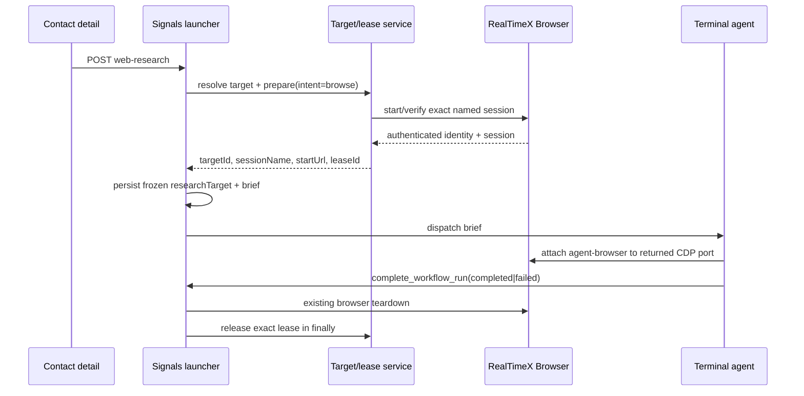

# Contact Enrich Profile: authenticated RTX browser target binding (#384)

**Status:** Accepted (System Design, 2026-08-30, loop `loop-issue-384-b512b84d`)
**Issue:** [therealtimex/signals#384](https://github.com/therealtimex/signals/issues/384)
**Parents:** [`contact-web-research-enrichment.md`](./contact-web-research-enrichment.md) (#369 / PR #383),
[`platform-targets.md`](./platform-targets.md), [`docs/rtx-browser-publish.md`](../docs/rtx-browser-publish.md)
**Out of scope:** verified email discovery (#385).

## Manual-validation correction (2026-08-30)

The ordinary one-click **Contact Enrich Profile** path inherits the live authenticated identity in
the shared `signals-publish` browser session. Stored platform defaults are not an authorization
boundary for research and must not block a run merely because they name an older account.

- Without an explicit `config.targetId` / `config.contactWebResearch.targetId`, preflight probes
  LinkedIn and then X inside `signals-publish`, registers or refreshes the detected live identity,
  and binds the browse lease to that target before dispatch.
- A stale default target is ignored. The live session identity is recorded as `source: "session"`.
- An explicit target override remains exact and fail-closed for callers that intentionally pin an
  identity.
- Preflight still never creates a substitute browser profile. If neither LinkedIn nor X is signed
  in within `signals-publish`, dispatch fails with an actionable 409.

This correction supersedes ADR-384-2's default-target selection for the unconfigured path while
preserving the pre-dispatch lease, exact-session attachment, and no-anonymous-fallback guarantees.

## 1. Problem

Manual validation of merged #383 showed two defects in the contact-detail **Enrich profile** lane:

1. The persistent Signals workspace thread is named **Contact Web Research** (derived from the
   seeded template name by `buildTemplateThreadName(template.name)`), but the user-facing name must
   be **Contact Enrich Profile** — including installs that already hold the old thread binding in
   `workflow_templates.rtx_thread_slug`.
2. The research brief only says "Open this in RealTimeX Browser". Nothing resolves, leases, or
   verifies an authenticated browser target before dispatch, and nothing tells the agent which
   session to attach to. The agent picked an anonymous profile: Google served a CAPTCHA, LinkedIn
   redirected to `/authwall`, relevant profile links were missed, and the run "recovered" on public
   X data — i.e. an unauthenticated run was reported as research.

## 2. What already exists (read before implementing)

| Concern | Existing surface | Notes |
|---|---|---|
| Target registry + default | `src/lib/db/queries/platform-targets.ts` — `resolveDefaultTarget(platform)`, `resolveTargetById`, `listPlatformTargets` | `isDefault` per platform; falls back to oldest active target of that platform. |
| Lease + verify | `src/lib/platforms/platform-target-service.ts` — `preparePlatformTarget({ targetId, intent, holder, leaseId?, leaseTtlSeconds? })` | Acquires the per-connection lease, opens the platform tab in the connection's RTX session, probes login, matches live handle, marks verified. Returns `{ targetId, platform, sessionName, startUrl, expectedHandle, verifiedHandle, lease: { leaseId, expiresAt } }`. Releases the lease itself on any failure. |
| Lease primitives | `src/lib/leases/session-lease.ts` | TTL 30–1800 s; `releaseSessionLease` throws `LEASE_LOST` when already gone. |
| Error codes | `src/lib/platforms/target-errors.ts` | `TARGET_NOT_FOUND`, `TARGET_FORGOTTEN`, `TARGET_CAPABILITY_UNSUPPORTED`, `TARGET_ACTIVATION_UNSUPPORTED`, `CONNECTION_UNAVAILABLE`, `LOGIN_REQUIRED`, `SESSION_LEASE_HELD`, `LEASE_LOST`, `TARGET_NOT_ACTIVE`. |
| Agent tools | `src/lib/agent-tools/platform-target-handlers.ts` — `list_platform_targets`, `get_platform_target`, `prepare_platform_target`, `release_platform_target` | Registered in `registry.ts`; documented in `docs/agent-tools.md` and `openapi/agent-tools.json`. |
| Shared session | `RTX_PUBLISH_SESSION_NAME = "signals-publish"`; guardrails declared on every connect (`buildPublishSessionGuardrails`) | `allowedOrigins` = x.com / www.linkedin.com / www.facebook.com only. **CDP navigation bypasses guardrails**; RTX-routed tab opens (`start-browser-session --url`) do not. |
| Supported agent attachment | provisioned `agent-browser` + `realtimex-browser-sessions` skills | RealTimeX owns profile lifecycle. The agent may list the exact returned session, read its `remoteDebugPort`, and attach `agent-browser`; it must not let `agent-browser` launch/delete the profile or create a substitute session. |
| Dispatch | `src/lib/agents/run-template-via-rtx.ts` — `runTemplateViaRtx` | Health preflight → workspace → `getOrCreateTemplateThread` → brief → `dispatchTerminalAgentViaSendMessage` → stored run config (`rtxWorkspaceSlug`, `rtxThreadSlug`, `rtxRuntimeSessionId`). |
| Thread binding | `src/lib/rtx/template-thread.ts` — `getOrCreateTemplateThread` (`reused` / `created` / `recreated` / `fresh`) | Name is only used on create. Presence via `GET /cli/get-thread/:ws/:thread` (`{ thread: { name, slug, … } }`). RTX also exposes `POST /cli/rename-thread/:ws/:thread` `{ name }` (name-only update). |
| Completion | `src/lib/agent-tools/handlers.ts` — `handleCompleteWorkflowRun` | Emits cascade, posts thread message, `stopRunningRtxBrowserSessions({ stopAllRunning: true })`, schedules terminal release. **Does not release leases.** |
| Result state | `src/lib/contacts/web-research-state.ts` | `partial` when `result.partial`/`ambiguous`/errors/unresolvedFields; `failed` on run status failed. |
| Precedent brief | `src/lib/workflows/social-patrol.ts` P1/P2/P9 | Agent-side `prepare … --intent browse`, connect over CDP to the returned `sessionName`, release at end. |

Two latent defects surfaced during inspection and are in scope because they break the failure
classification this issue requires:

- `src/lib/platforms/target-adapters/linkedin.ts` `activate()` throws
  `TARGET_ACTIVATION_UNSUPPORTED` whenever `verification.active` is false — including the plain
  logged-out case — so `preparePlatformTarget` never reaches its `LOGIN_REQUIRED` branch for
  LinkedIn. The user would be told "account switching is not supported" instead of "sign in".
- The seeded prompt and brief say "Open this in RealTimeX Browser", which an agent can satisfy with
  `create-browser-session`/`start-browser-session --url <google>` — the former creates the anonymous
  profile observed in the repro; the latter is guardrail-blocked in `signals-publish`.

## 3. Decisions (ADR-384)

### ADR-384-1 — Signals resolves and prepares the target *before* dispatch; the agent only attaches

**Decision.** `runTemplateViaRtx` performs a research-target preflight for Contact Web Research
runs, server-side, after the Signals health check and thread resolution and before the brief is
written. It calls the existing `preparePlatformTarget({ targetId, intent: "browse", holder, leaseTtlSeconds })`
-- the service behind the `prepare_platform_target` agent tool -- and freezes the result into the
brief and the run config. The agent never chooses a target, never calls `list_platform_targets` to
pick one, and never creates or starts a browser session.

**Why.** The failure mode was "agent chose". Moving selection + verification into Signals makes the
choice deterministic, lets the route fail fast with a user-actionable error *before* a terminal
agent is spawned, and reuses the lease/verify code path that publish already trusts. The social
patrol precedent (agent-side prepare) is kept for patrol; it is not the right shape for a
one-click contact action that must fail before dispatch.

**Rejected.** (a) Agent-side prepare in the brief (patrol style): cannot produce a pre-dispatch UI
error, and leaves target choice to the model. (b) Dedicated `signals-research` connection: has no
logins; the whole point is reusing the profile that holds the LinkedIn session.



### ADR-384-2 — Deterministic target selection order

**Decision.** New module `src/lib/workflows/contact-web-research-target.ts`:

```ts
export const CONTACT_WEB_RESEARCH_TARGET_PLATFORM_ORDER = ["linkedin", "x"] as const;
export type ContactWebResearchTargetPlatform =
  (typeof CONTACT_WEB_RESEARCH_TARGET_PLATFORM_ORDER)[number];
export const CONTACT_WEB_RESEARCH_LEASE_TTL_SECONDS = 600;
export const CONTACT_WEB_RESEARCH_LEASE_HOLDER_PREFIX = "contact-web-research:"; // + workflowRunId

export type ContactWebResearchTargetSelection = {
  targetId: string;
  platform: ContactWebResearchTargetPlatform;
  source: "config" | "default";
};

export type ContactWebResearchTargetError = {
  code: "NO_RESEARCH_TARGET" | PlatformTargetErrorCode;
  message: string;            // user-facing, includes the Settings repair path
  details?: Record<string, unknown>;
};

export function selectContactWebResearchTarget(config: Record<string, unknown>):
  | { ok: true; selection: ContactWebResearchTargetSelection }
  | { ok: false; error: ContactWebResearchTargetError };
```

Resolution:

1. `config.targetId` (run override) or `config.contactWebResearch.targetId` (template config) if
   present → resolve it to its canonical row (following an existing merged-target pointer); it must
   be `status: "active"`, have the `browse` capability, and have platform `linkedin` or `x`;
   otherwise return the matching `PlatformTargetError` code (`TARGET_NOT_FOUND`, `TARGET_FORGOTTEN`,
   `TARGET_CAPABILITY_UNSUPPORTED`). A Facebook or future-platform target is unsupported until the
   research scorer and auth-state contract include that platform. An explicit target is never
   silently replaced by a default.
2. Else iterate `CONTACT_WEB_RESEARCH_TARGET_PLATFORM_ORDER` and take the first
   `resolveDefaultTarget(platform)` whose view includes `browse`.
3. Else `NO_RESEARCH_TARGET`.

Selection and preparation are one fail-closed decision: if a LinkedIn default exists but prepare
returns `LOGIN_REQUIRED`, `TARGET_NOT_ACTIVE`, or `CONNECTION_UNAVAILABLE`, surface that error. Do
not silently retry on X. X is the deterministic fallback only when no eligible LinkedIn target
exists. This avoids hiding a broken primary login behind lower-quality research.

**Why.** LinkedIn is the primary evidence source (+100 in the SERP scorer), so it is preferred. The
X fallback keeps X-only installs working (the #383 repro recovered via X) while still guaranteeing
a verified X identity and persistent cookie-bearing browser profile for Google. It does not claim
that Google or LinkedIn is authenticated. The order is a constant, not a heuristic.

**Consequence to document.** With an X target, LinkedIn pages will still authwall; those pages are
classified as source failures (ADR-384-6), not evidence, so the run ends `partial` with a clear
message rather than `succeeded`.

### ADR-384-3 — Preflight contract inside `runTemplateViaRtx`

```ts
export type ContactWebResearchPreparedTarget = {
  targetId: string;
  platform: ContactWebResearchTargetPlatform;
  source: "config" | "default";
  sessionName: string;        // from prepare — never assume "signals-publish"
  startUrl: string;           // returned by prepare; identifies the platform content tab
  expectedHandle: string | null;
  verifiedHandle: string | null;
  leaseId: string;
  leaseExpiresAt: number;     // epoch seconds
  preparedAt: number;
};

export async function prepareContactWebResearchTarget(
  input: { config: Record<string, unknown>; workflowRunId: string },
  env?: EnvLike, fetchImpl?: typeof fetch,
): Promise<{ ok: true; target: ContactWebResearchPreparedTarget } | { ok: false; error: ContactWebResearchTargetError }>;

export type ContactWebResearchLeaseRelease = {
  leaseId: string;
  released: boolean;
  alreadyGone: boolean;
};
export function releaseContactWebResearchTarget(leaseId: string): ContactWebResearchLeaseRelease;
// LEASE_LOST -> { released: false, alreadyGone: true }; other errors still throw.
export function getContactWebResearchTargetFromRunConfig(config: string | null | undefined): ContactWebResearchPreparedTarget | null;
```

Wiring in `runTemplateViaRtx` (only when `isContactWebResearchTemplateConfig(runtimeConfig)`):

- Call `prepareContactWebResearchTarget` after `getOrCreateTemplateThread` and before
  `buildAgentWorkflowBrief`. Holder is `contact-web-research:<run.id>`; TTL is
  `CONTACT_WEB_RESEARCH_LEASE_TTL_SECONDS` (600 s). `preparePlatformTarget` already releases its own
  lease on failure.
- On failure: `updateWorkflowRun(run.id, { status: "failed", completedAt, errors: JSON.stringify([message]), errorItems: 1, result: JSON.stringify({ message, partial: true, blocked: error.code }) })`,
  create a step `{ stepType: "error", tool: "platform_target_preflight", error }`, and return
  `{ success: false, errorCode: "research_target_unavailable", httpStatus: 409, error: message, workflowRunId }`.
  No brief is written and no terminal agent is dispatched.
- On success: persist `researchTarget` into the run config immediately (`updateWorkflowRun` with
  the merged config) so the lease is discoverable even if dispatch fails later; pass
  `researchTarget` into `buildAgentWorkflowBrief` → `buildContactWebResearchBriefSection`; include
  it in `buildStoredRunConfig` output by passing `runtimeConfig`, not the earlier `mergedConfig`.
- Use one ownership boundary: `preparedLeaseId` belongs to the launcher until terminal dispatch is
  accepted. A brief-write failure, `launch.success === false`, or exception **before** acceptance
  releases it exactly once. Once `terminalDispatchAccepted` is true, ownership transfers to the
  workflow run and only `complete_workflow_run` (or expiry/watchdog hygiene) releases it. Never
  release from a broad catch after acceptance: the live agent would otherwise browse without the
  serialization lease it was promised.

`WorkflowRun.errors` is serialized JSON, so the failure update is exactly
`errors: JSON.stringify([message])`; the step stores `error: message` and the structured code/details
in its output. Keep `dispatchAccepted` separate from `preparedLeaseId` so this distinction is testable.

**Why 600 s and not 1800 s.** The research budget is ~90 s plus agent start-up and write-back. A
held lease blocks publishing on the same connection; 10 minutes bounds the damage of an agent that
dies without completing. The brief tells the agent how to renew (ADR-384-5) if it legitimately needs
longer.

### ADR-384-4 — Route and UI: actionable failure, no anonymous fallback

`POST /api/contacts/[id]/web-research`:

- `errorCode === "research_target_unavailable"` → HTTP **409**, body
  `{ error, code: "RESEARCH_TARGET_UNAVAILABLE", details: { reason, targetId?, sessionName?, platform?, settingsPath: "/dashboard/settings?tab=platforms", settingsTab: "Platform connections", workflowRunId } }`.
- `error` copy is built once in `contact-web-research-target.ts` (`describeResearchTargetError`) so
  the route, run errors, and the run result message agree. Per reason:
  - `NO_RESEARCH_TARGET`: "No authenticated LinkedIn or X browser target is connected for contact research. Open Settings → Platform connections, connect LinkedIn in the RealTimeX Browser session, then retry."
  - `LOGIN_REQUIRED` / `TARGET_NOT_ACTIVE`: "The {platform} browser session is signed out or signed in as a different account ({detectedHandle}). Open Settings → Platform connections and verify {targetName}, then retry."
  - `TARGET_ACTIVATION_UNSUPPORTED`: "The {platform} browser session is signed in as a different account and cannot switch automatically. Open Settings → Platform connections, use the configured account (or a dedicated connection), verify it, then retry."
  - `CONNECTION_UNAVAILABLE`: "The RealTimeX Browser session {sessionName} could not be started. Check Settings → Platform connections, then retry."
  - `SESSION_LEASE_HELD`: "The {sessionName} browser session is in use by {holder}. Retry in {retryAfterSeconds}s."
  - `TARGET_FORGOTTEN` / `TARGET_NOT_FOUND` / `TARGET_CAPABILITY_UNSUPPORTED` (explicit `targetId` only): "The configured research target {targetId} is unavailable. Re-discover targets in Settings → Platform connections or clear `contactWebResearch.targetId`."
- `enrich-contact-button.tsx` already renders `body.error`; retain the response code in a small
  `repairHref`/boolean state and, when it is `RESEARCH_TARGET_UNAVAILABLE`, render a link to
  `/dashboard/settings?tab=platforms` labelled "Open Platform connections". Clear that repair state
  before each retry. No new workflow state machine: `state.status` stays `failed` with the message
  (the failed preflight run stores the same message in `result.message`, so
  `GET …/web-research` polling shows it too).

`getContactWebResearchState` status logic needs no change: a failed preflight run maps to
`status: "failed"` and `message` from `result.message`. ADR-384-6 still extends its response shape
with `blockedUrls`.

### ADR-384-5 — Brief contract: attach to the exact session, never a fresh profile

`buildContactWebResearchBriefSection` gains a required `researchTarget: ContactWebResearchPreparedTarget`
input and emits, **before** "Hop 0a":

```
### Authenticated browser session (required — do not research without it)
Target ID: <targetId> (<platform>, <source>)  Expected handle: <expectedHandle>  Verified handle: <verifiedHandle>
Session name: <sessionName>   Start URL: <startUrl>
Lease ID: <leaseId>   Lease expires: <ISO time from leaseExpiresAt seconds> (renew below if needed)
B1. Discover the already-prepared session port: realtimex-pp-cli list-browser-sessions --agent --compact=false --data-source live --no-cache → exact entry with sessionName "<sessionName>" → remoteDebugPort (or runtime.remoteDebugPort/runtime.port).
    prepare_platform_target already started and verified this session. If the exact entry is absent, stopped, or has no positive remoteDebugPort, fail closed. Never run create-browser-session, start-browser-session, stop-browser-session, or delete-browser-session; never use another session name.
B2. Attach without launching a browser: agent-browser --session <sessionName> connect <remoteDebugPort>; then agent-browser --session <sessionName> tab. Ignore devtools://, /cli-browser/index.html, file:///.../src/cli-browser/index.html, and the target titled "RealTimeX Browser". Select the HTTPS content target whose host matches <startUrl>/<platform>; if none exists, fail closed rather than attaching elsewhere.
B3. Navigate ONLY through agent-browser (open <url>) inside this session. Never open URLs through realtimex-pp-cli start-browser-session --url — the session allowlist blocks non-platform origins on that path.
B4. Every hop (Google search, refined search, profile visits, company pages) runs in this same session so its cookies and the <platform> login are retained.
B5. If B1–B2 fail, do not research in any other profile. Call complete_workflow_run with status "failed" and errors ["browser_session_unavailable: <detail>"].
B6. If the lease will expire before you finish, renew: prepare_platform_target { targetId: "<targetId>", intent: "browse", leaseId: "<leaseId>", holder: "contact-web-research:<runId>" }. Do not release the lease yourself; complete_workflow_run releases it.

### Auth-state failures (source failures, never evidence)
- LinkedIn /authwall, /login, /checkpoint/*, /uas/login; Google /sorry/* or any reCAPTCHA interstitial; X /i/flow/login or /login; accounts.google.com.
- Do not extract, score, or write anything from such a page. Record the URL in result.blockedUrls.
- URL patterns are the server-verifiable floor. Also inspect the rendered page for a CAPTCHA/reCAPTCHA challenge or sign-in/auth-wall copy; if a challenge is rendered without a URL change, record the current URL in result.blockedUrls.
- On the <platform> platform itself an auth wall means the verified session was lost: call complete_workflow_run with status "failed" and errors ["auth_state_lost: <url>"].
- On any other platform record the block, continue with remaining candidates, and set partial=true.
```

Also change existing lines: "Open this in RealTimeX Browser" → "Open this in the attached
`<sessionName>` session via agent-browser"; execution requirement 9 in `template-brief.ts` stays
generic (research overrides it in its own section).

`CONTACT_WEB_RESEARCH_TOOLS` adds `get_platform_target`, `prepare_platform_target` (renew only) and
`release_platform_target` (emergency abort only). It intentionally does **not** add
`list_platform_targets`: selection is a server decision, not an agent decision. Normal success and
failure must use `complete_workflow_run`, not manual release. Tool hint order: keep research tools
first, session tools last.

Seeded `systemPrompt` (`seed-templates.ts`) is updated to the same rules (attach to the brief's
session; auth walls are failures; never create a profile). Bump `SEED_VERSION` 26 → 27 so existing
installs receive the prompt (the seed loop already rewrites `systemPrompt` when the stored version
is older).

### ADR-384-6 — Login/auth-wall/CAPTCHA pages cannot become evidence (server-enforced)

New `src/lib/contacts/web-research-page-state.ts`:

```ts
export type ResearchPageState = "content" | "authwall" | "login" | "captcha";
export function classifyResearchPageUrl(url: string): ResearchPageState;   // pure, URL-only
export function isBlockedResearchUrl(url: string): boolean;                 // state !== "content"
```

Patterns (host + path, case-insensitive): `linkedin.com/authwall`, `linkedin.com/login`,
`linkedin.com/uas/login`, `linkedin.com/checkpoint/`, `google.com/sorry/`, `recaptcha`,
`x.com|twitter.com` + `/i/flow/login` or `/login`, `accounts.google.com`, `facebook.com/login`,
`facebook.com/checkpoint/`.

Host checks are exact-or-subdomain checks, never substring checks. The classifier is deliberately
URL-only and cannot see a same-URL CAPTCHA DOM; the explicit `result.blockedUrls` channel in the
brief covers that observable. Do not claim the server can infer rendered CAPTCHA state it was not
given.

Enforcement:

1. `handleUpsertContactIdentity`: if `platformUrl` or `websiteUrl` is a blocked URL → throw
   `AgentToolError("VALIDATION_ERROR", "…is a login/auth-wall URL, not a profile page")`. This is the
   regression guard the issue asks for ("/authwall or login pages cannot produce identity writes").
2. `handleCompleteWorkflowRun`, when the run is a Contact Web Research run
   (`isContactWebResearchTemplateConfig(parseObject(run.config))`), normalizes the callback **before**
   `resultJson` and `updateWorkflowRun`: compute the deduplicated union
   `blockedUrls = [...input.result.blockedUrls, ...visitedUrls.filter(isBlockedResearchUrl)]`.
   Explicit entries are honored even when their URL looks ordinary because that is how the agent
   reports a rendered same-URL CAPTCHA. If the union is non-empty, persist it, force
   `result.partial = true`, and append deduplicated `source_blocked:<url>` entries to a normalized
   union of existing run errors and `input.errors`. Persist that union as JSON and set
   `errorItems` consistently; do not write a JavaScript array into the text column.
3. If a URL-classified auth page is on the prepared target's own platform (LinkedIn authwall/login
   for a LinkedIn target, or X login for an X target), override a claimed `completed` callback to
   effective status `failed`; the verified auth state was lost and no cascade may run. Blocks on a
   different source (for example LinkedIn authwall while using an explicit X target, or Google
   CAPTCHA) remain a completed run with `partial: true` and errors -- never `succeeded`.
4. `getContactWebResearchState` reports `failed` for the former and `partial` for the latter.
   `visitedUrls` keeps blocked entries for provenance.
5. `completeWorkflowRunSchema.result` gains optional `blockedUrls: z.array(z.string().url()).max(20)`;
   `ContactWebResearchState` gains `blockedUrls: string[]`.

The cascade rule is unchanged: `resolveContactWebResearchCascadeTarget` still requires
`identityLinked === true`, which after (1) can only be set by a real profile URL write.

### ADR-384-7 — Lease release is owned by Signals, on every terminal path

- `handleCompleteWorkflowRun`: after persisting the effective terminal status/result, a research
  run first awaits the existing browser teardown and releases the recorded research lease in that
  teardown's `finally`; only then does it emit the completion event/cascade and post the completion
  message. This avoids a child cascade contending for the parent lease or a global browser stop
  racing a newly launched child. Non-research completion keeps its current parallel path. Run this
  for both `completed` and `failed`. On the normal return, include the full
  `leaseRelease: { leaseId, released, alreadyGone }` outcome. `LEASE_LOST` means expiry or an
  emergency manual release already made the resource safe; it is not a completion error. Release
  still happens if browser teardown throws.
- `runTemplateViaRtx` releases only failures before dispatch acceptance (ADR-384-3). After
  acceptance the callback owns release; the 600-second TTL is the bounded fallback if the agent
  process disappears and cannot call back.
- `releaseTimedOutWorkflowTerminalRun` also calls the same run-config release helper as hygiene
  before returning. The lease will normally have expired well before the four-hour watchdog, but
  this keeps terminalization paths explicit and future-proofs a longer TTL.
- Existing teardown (`stopRunningRtxBrowserSessions({ stopAllRunning: true })` + scheduled terminal
  release) is untouched. Stopping `signals-publish` does not lose logins (persistent profile); the
  next prepare restarts it.
- Manual `release_platform_target` is emergency-only. A cooperative abort calls
  `complete_workflow_run` with `status: "failed"`, so status, browser teardown, terminal teardown,
  and lease release remain one terminal transaction boundary.

### ADR-384-8 — LinkedIn adapter reports logged-out instead of "switching unsupported"

`linkedin.ts` `activate()`: `if (!verification.loggedIn) return { ...verification, switched: false };`
before the `TARGET_ACTIVATION_UNSUPPORTED` throw, so `preparePlatformTarget` raises `LOGIN_REQUIRED`
for a signed-out session and reserves `TARGET_ACTIVATION_UNSUPPORTED` for "logged in as someone
else". No change to the X or Facebook adapters. This also fixes the Settings "Verify" copy for
LinkedIn.

### ADR-384-9 — Thread name: `Contact Enrich Profile`, converged in place on every run

- `src/lib/workflows/contact-web-research.ts`: `export const CONTACT_WEB_RESEARCH_THREAD_NAME = "Contact Enrich Profile";`
- `src/lib/workflows/template-brief.ts`: add
  `resolveTemplateThreadName(template: Pick<WorkflowTemplate, "name" | "config">): string` →
  `CONTACT_WEB_RESEARCH_THREAD_NAME` when `isContactWebResearchTemplateConfig(parseTemplateConfig(template.config))`,
  else `buildTemplateThreadName(template.name)`. `runTemplateViaRtx` (and any other
  `buildTemplateThreadName(template.name)` caller — grep `buildTemplateThreadName(`) switches to it.
  The seeded template **name stays `Contact Web Research`** (route lookup, state lookup, seed
  matching, run `templateName`, and the "Run #N — …" routing message all keep the technical name).
- `src/lib/rtx/cli-provisioning.ts`: add `getRtxThread(workspaceSlug, threadSlug)` →
  `{ presence: "exists" | "missing" | "unknown"; name: string | null }` (same endpoint as
  `getRtxThreadPresence`, which becomes a thin wrapper) and `renameRtxThread(workspaceSlug, threadSlug, name)`
  → `POST /cli/rename-thread/:ws/:thread` `{ name }` via `rtxCliRequestOk`.
- `src/lib/rtx/template-thread.ts`: on the `reused` path, if `presence === "exists"` and
  `name !== input.threadName`, call `renameRtxThread`; a rename failure is logged into the result as
  `{ renamed: false, renameError }` and never creates a replacement thread. Apply the same
  convergence helper when a concurrent claim returns another run's winning slug. Result type gains
  `threadName: string; renameAttempted: boolean; renamed: boolean; renameError?: string`.
  `runTemplateViaRtx` records those fields in the existing `rtx_terminal_agent` step output.
- Migration semantics: **no DB migration**. The binding (`rtx_thread_slug`) is kept; only the RTX
  thread's display name converges. Signals owns template threads, so a manually renamed thread is
  reverted on the next run (documented). The one-off path keeps `"<name> — one-off"`.

Rename failure is deliberately non-blocking: availability of contact research wins over a
temporary display-name API failure, while the unchanged binding prevents a duplicate timeline and
the next run retries convergence. The trade-off is that the old label can remain visible for one
run; surface `renameError` in the workflow step so it is diagnosable rather than silently ignored.

**Rejected.** Renaming the seeded template to "Contact Enrich Profile" (PLATFORM_NATIVE_WRITING
precedent): the issue keeps the internal name, and renaming would ripple into `getSystemTemplateByName`
callers, `templateName` in stored run configs, and thread routing messages.

### ADR-384-10 — Google origin is *not* added to the `signals-publish` allowlist

The allowlist is blast-radius control for a session holding live logins; CDP navigation (the
`agent-browser` path, and the path Signals' own verification uses) bypasses it by design
(`docs/rtx-browser-publish.md`). The brief therefore mandates CDP navigation (B3) instead of widening
the allowlist. Revisit only if RTX starts enforcing guardrails on CDP.

## 4. File-level change list

| File | Change |
|---|---|
| `src/lib/workflows/contact-web-research-target.ts` (new) | ADR-384-2/3 selection, prepare, release, run-config reader, `describeResearchTargetError`. |
| `src/lib/contacts/web-research-page-state.ts` (new) | ADR-384-6 URL classifier. |
| `src/lib/workflows/contact-web-research.ts` | `CONTACT_WEB_RESEARCH_THREAD_NAME`; tools list + brief section (ADR-384-5); `ContactWebResearchBriefContext` gains `researchTarget`. |
| `src/lib/workflows/template-brief.ts` | `resolveTemplateThreadName`; pass `researchTarget` through. |
| `src/lib/agents/run-template-via-rtx.ts` | Preflight + lease lifecycle + `researchTarget` in stored config + `research_target_unavailable` result. Use `resolveTemplateThreadName`. |
| `src/lib/rtx/cli-provisioning.ts` | `getRtxThread`, `renameRtxThread`. |
| `src/lib/rtx/template-thread.ts` | Rename-on-reuse (ADR-384-9). |
| `src/lib/platforms/target-adapters/linkedin.ts` | ADR-384-8. |
| `src/lib/agent-tools/handlers.ts` | Identity URL guard; pre-persistence completion normalization; lease release in `finally`. |
| `src/lib/agent-tools/schemas.ts` | `result.blockedUrls`. |
| `src/lib/contacts/web-research-state.ts` | `blockedUrls`. |
| `src/lib/rtx/workflow-run-terminal-watchdog.ts` | Best-effort research-lease release on timeout terminalization. |
| `src/app/api/contacts/[id]/web-research/route.ts` | 409 `RESEARCH_TARGET_UNAVAILABLE` mapping with details. |
| `src/app/dashboard/contacts/[id]/enrich-contact-button.tsx` | Settings `?tab=platforms` repair link on that code. |
| `src/lib/db/seed-templates.ts` | Prompt update, `SEED_VERSION = 27`. |
| `openapi/agent-tools.json`, `docs/agent-tools.md` | `blockedUrls`, `leaseRelease` in complete_workflow_run response; research-lane note. |
| `docs/rtx-agent-browser-enrichment.md` | Thread name, which Platform connection is used (default LinkedIn browse target → X), repair steps, failure classification. |
| `specs/contact-web-research-enrichment.md` | Link to this spec; note thread name ≠ template name. |
| `docs/qa/contact-enrich-profile-authenticated-target.md` (new) | Embedded Dev QA scenario (§6). |

## 5. Test plan (focused; all Vitest, DB-backed via `resetCoreTables`)

1. `contact-web-research-target.test.ts` — explicit `targetId` wins; LinkedIn default preferred over
   X; X fallback only when no eligible LinkedIn target; an unusable selected LinkedIn target does
   not silently fall back; `NO_RESEARCH_TARGET` when none; forgotten / Facebook / no-`browse`
   explicit target → matching code; merged target IDs canonicalize; `describeResearchTargetError`
   mentions "Platform connections".
   `prepareContactWebResearchTarget` with `preparePlatformTarget` mocked (`vi.mock("@/lib/platforms/platform-target-service")`)
   maps a `PlatformTargetError` to `{ ok: false }` and a success to the frozen shape.
2. `run-template-via-rtx.test.ts` (extend) — research template: (a) success → brief file contains
   `Session name: signals-publish`, `Start URL:`, `Lease ID:`, `Target ID:`; run config has
   `researchTarget` before dispatch and after final config persistence;
   (b) prepare failure → no brief written, no dispatch fetch, run `failed`, step
   `platform_target_preflight`, `errorCode: "research_target_unavailable"`, `httpStatus: 409`;
   (c) dispatch rejection after prepare → exact lease released; (d) dispatch acceptance transfers
   ownership and a later injected failure does not release the live agent's lease.
3. `contact-web-research.test.ts` (extend) — brief section includes B1–B6, the auth-state block,
   exact session/start URL, `--compact=false`, shell-target exclusions, and **does not** contain a
   create/start/delete browser-session fallback or the bare "Open this in RealTimeX Browser".
4. `template-brief` tests — `resolveTemplateThreadName` → "Contact Enrich Profile" for research
   config, unchanged for others.
5. `template-thread.test.ts` (extend) — reused + stale name → `POST /cli/rename-thread` with
   `{ name: "Contact Enrich Profile" }`; reused + same name → no rename call; rename 500 → dispatch
   proceeds with `renameError`; concurrent winning slug also converges; slug unchanged in all cases
   (binding preserved).
6. `route.test.ts` (extend) — mocked `research_target_unavailable` → 409, `code: RESEARCH_TARGET_UNAVAILABLE`,
   `details.settingsPath === "/dashboard/settings?tab=platforms"`.
7. New `enrich-contact-button.test.tsx` — the 409 renders the error and "Open Platform
   connections" link with the exact tab URL; a retry clears it. Run React Doctor because this is a
   React state-flow change.
8. `handlers` tests — `upsert_contact_identity` rejects `https://www.linkedin.com/authwall?…` and
   `…/login` as `platformUrl` (regression); accepts `/in/…`. `complete_workflow_run` on a research
   run: releases the recorded lease (real lease row → gone), tolerates an already-expired lease,
   and releases even if a mocked completion side effect throws. A LinkedIn target + LinkedIn
   `/authwall` overrides `completed` to `failed`; an X target + LinkedIn authwall and an explicit
   same-URL CAPTCHA entry stay completed-but-`partial`; all persist `blockedUrls` and
   `source_blocked:` errors. `getContactWebResearchState` mirrors `failed`/`partial`.
9. `web-research-page-state.test.ts` — exact/subdomain host classifier table plus substring
   negatives.
10. `target-adapters.test.ts` (extend) — LinkedIn logged-out → `loggedIn: false`, no throw; service
   then raises `LOGIN_REQUIRED`.
11. `workflow-run-terminal-watchdog.test.ts` — timed-out research run invokes idempotent lease
    cleanup without changing non-research behavior.
12. `seed-templates.test.ts` — `_seedVersion: 27`; prompt contains "Session name" / "authwall".
13. `smoke-agent-tools.integration.test.ts` — over real HTTP, `upsert_contact_identity` rejects an
    authwall URL with `VALIDATION_ERROR` and accepts a real `/in/…` URL. This is the API-boundary
    integration proof; the embedded scenario below covers RealTimeX browser and thread boundaries.

Verification commands the Dev handoff must report (with a disposable data directory):

```bash
nvm use
npm run generate:agent-tools-openapi
npx vitest run <all focused files above>
npm run doctor
npm run test:integration
SIGNALS_DATA_DIR=/private/tmp/signals-agent-<unique> npm run check
```

## 6. Embedded Dev QA scenario (manual, RealTimeX Dev app)

Record in `docs/qa/contact-enrich-profile-authenticated-target.md` with the evidence below.

Run only against the RealTimeX **Dev** host and a receipt-backed `Signals issue-384 QA` Local App:

```bash
cd /Users/realtimex/rtgit/realtimex-ai-app && yarn dev:all
cd <issue-384-worktree>
node scripts/qa/provision-signals-qa-local-app.mjs \
  --issue 384 --worktree "$PWD" --loop-id loop-issue-384-b512b84d
```

Never repoint or use the canonical `Signals` Local App. The QA record uses a disposable
`/private/tmp/signals-qa-issue-384-*` data directory. Settings → Platform connections must show a
LinkedIn profile target on the intended connection (normally `signals-publish`) with **Verify**
succeeding.

The migration proof needs a real pre-existing binding, not a mocked new install. Prepare the
receipt-backed QA app on base `551e1f7` long enough to create the old **Contact Web Research**
thread, record its exact slug, then stop that QA app and point **only that same issue QA app** at the
issue worktree while preserving its disposable data directory. The QA document must record the
exact guarded commands used for this baseline→upgrade switch. Do not edit SQLite by hand, copy the
user's canonical database, or mutate the canonical Local App.

1. Contact detail → **Enrich profile** on a sparse contact → 202.
   - Proof A (thread migration): before upgrade, the recorded slug resolves to **Contact Web
     Research**. After the first issue-build run, the same slug resolves to **Contact Enrich
     Profile**; the template's `rtx_thread_slug` is unchanged;
     `realtimex-pp-cli list-threads signals --json` has exactly one research thread (no parallel
     "Contact Web Research"/"(2)").
   - Proof B (binding): the brief file `workflow-runs/<runId>/…` contains `Session name: signals-publish`
     (or the actual configured session), `Start URL`, target ID, expected/verified handles, and the
     lease ID; `GET /api/platform-targets` shows `connections[].lease.held === true` with holder
     `contact-web-research:<runId>` while pending.
   - Proof C (authenticated same-session use): diff browser-session lists captured immediately
     before and during the run; the exact prepared session and CDP port are reused and no new
     profile appears. A sanitized agent-browser probe on the matching LinkedIn content tab shows
     `.global-nav__me` (or another documented logged-in marker) and a `linkedin.com/in/…` visit.
     `GET /api/contacts/:id/web-research` contains that profile URL, `blockedUrls` is empty, and the
     status is `succeeded` or evidence-partial, never auth-failed.
   - Proof D (release): after completion `lease.held === false`; the run config contains
     `researchTarget.leaseId`; `complete_workflow_run` returns
     `leaseRelease: { released: true, alreadyGone: false }`.
2. Negative — sign out of LinkedIn in the prepared session → **Enrich profile** → 409 with the
   `LOGIN_REQUIRED` repair copy (not "account switching"); no terminal dispatch and no anonymous
   session. Restore login before continuing.
3. Negative — Settings → Forget the LinkedIn target (and ensure no eligible X target) → **Enrich profile** → 409
   `RESEARCH_TARGET_UNAVAILABLE`, message names Settings → Platform connections, link renders; no
   thread message/terminal dispatch, no new browser session, and no lease row.
4. Regression — invoke `upsert_contact_identity` with `platformUrl: https://www.linkedin.com/authwall?…`
   → `VALIDATION_ERROR`.

Because `enrich-contact-button.tsx` changes, commit the repo-required before/after evidence for the
contact error view in desktop/mobile × light/dark under `.evidence/`. Redact personal profile data;
the screenshots need only prove the error copy and Platform connections link.

Before handoff, tear down and prove hygiene:

```bash
node scripts/qa/cleanup-signals-qa-local-app.mjs --issue 384
REALTIMEX_RUNTIME=dev node scripts/qa/verify-signals-local-app-hygiene.mjs --issue 384
```

Then stop `yarn dev:all` and confirm the issue Signals port plus 3100, 3101, and 9888 are clear.

## 7. Risks and rollout notes

- **Server-side CDP from Next.js.** `preparePlatformTarget` opens the platform tab with Playwright
  over CDP from the Signals process — the same path Settings verify/discover and publish already
  use; it is gated by `isRtxEmbedded`. The user will see the LinkedIn tab focus briefly.
- **Lease contention.** While a research run holds the lease (≤600 s), publish/patrol on the same
  connection get `SESSION_LEASE_HELD` — existing, intended serialization (I1 in
  `platform-targets.md`).
- **No post-verify restart.** `preparePlatformTarget` returns only after the exact session is
  running and authenticated. If it disappears before agent attachment, the run fails instead of
  restarting it without re-verification. This gives up automatic recovery to preserve the auth
  guarantee; retrying from the UI performs a fresh prepare.
- **Default fallback quality.** X is used only when no eligible LinkedIn target exists. It proves
  the X identity and persistent session, not a LinkedIn login; LinkedIn authwall is therefore an
  explicit partial source failure. An invalid/unusable explicit target or selected LinkedIn default
  never silently falls through to X.
- **`stopAllRunning` teardown** stops `signals-publish` at completion (pre-existing behavior for
  all workflows). Logins persist in the profile; nothing new here, but note it in QA if the
  next run's prepare takes a few seconds longer.
- **Thread rename convergence** reverts manual renames of the Signals-owned research thread.
- **Rename availability trade-off.** A transient rename failure does not block research and does
  not create a duplicate; the workflow step records the error and the next run retries. The old
  label can therefore survive one run during a RealTimeX API outage.
- **Seed bump** rewrites the research template's `systemPrompt` on existing installs (intended).
- **CLI surface.** Server preflight calls the same service behind `prepare_platform_target`; lease
  renewal in the brief uses agent-tools REST (`POST /api/agent-tools/invoke`) via
  `run-signals-pp-cli.sh`/curl for `prepare_platform_target`; do not depend on a
  `signals-pp-cli targets …` subcommand unless the pinned CLI version is verified to expose it.
- **No schema migration.** The change reuses template config JSON, run config JSON, and the existing
  lease table. OpenAPI regeneration is required for callback fields, but Drizzle migration is not.
- **Not in scope:** email discovery (#385); widening the publish allowlist (ADR-384-10); any
  change to the SERP scorer or hop budgets.
