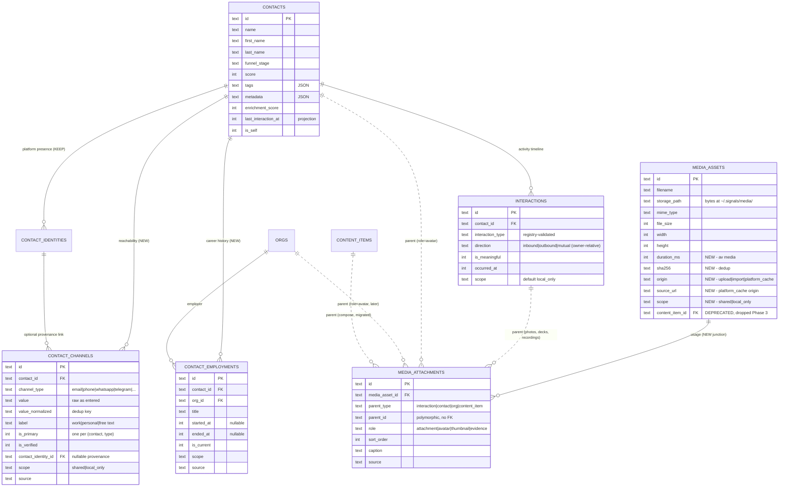

# Contact Golden Record — Channels, Career, Activity, Media

**Status:** Proposed (System Design deliverable for [#92](https://github.com/therealtimex/signals/issues/92), Phase 0)
**Date:** 2026-08-16
**Aligned to:** [`specs/signals-spec-v0.5.md`](./signals-spec-v0.5.md) §2–3, [`specs/schema-v0.5.md`](./schema-v0.5.md) (#22)
**Related:** #76 (CRM graph UI), #90/#91 (self-contact owner, shipped), #62 (niche clustering — out of scope)

---

## 1. Problem & Constraints

`contacts` is simultaneously the golden record and a denormalized cache. Thirteen scalar columns (`email`, `phone`, `platform`, `platform_user_id`, `company`, `title`, `avatar_url`, `photo_url`, `profile_url`, `headline`, `bio`, `location`, `website`, plus the dependent `verified_email`) are read and written directly by the UI, REST routes, agent tools, importers, enrichment scoring, embeddings, and simulations. Meanwhile the graph layer already has the right primitives — `contact_identities`, `interactions`, `graph_edges` (`works_at`, `relationship`), `orgs` — and a working filesystem media pattern (`media_assets` + `~/.signals/media/`) that is locked to content compose.

Consequences today:

- One email / one phone per contact; importer dedup does raw `eq(contacts.email, …)` scans.
- `company`/`title` are a single snapshot; the `works_at` dual-write flows *from* the scalars, so career history is unrepresentable.
- Three avatar-ish URL columns (`avatar_url`, `photo_url`, `profile_url`) with writers setting two of them in lockstep; no unified media model.
- `interactions` carry text + JSON only — meeting photos, decks, and recordings have nowhere to live.

Constraints (inherited from schema-v0.5 §1 and §4, extended here):

1. **Additive first, drops last.** Every phase is additive DDL + idempotent backfill + consumer migration; column drops are separate, final, per-phase migrations (this epic introduces the first drops ever — see §4.2 for the protocol).
2. **Keep `contact_identities`.** Channels do not replace identities (ADR-092-1).
3. **No blobs in SQLite.** Bytes live under `~/.signals/media/`; the DB stores metadata + references only — not in columns, not base64 in JSON (ADR-092-3).
4. **Agent-tools v1 stays callable.** Existing param/response keys keep working through a deprecation shim; structured inputs are additive. No breaking change without a versioned path (epic out-of-scope rule).
5. **Privacy defaults conservative.** New personal data classes (activity attachments, relationship state) default `local_only`; sentinels stay green (ADR-092-7).

---

## 2. Target ERD



### 2.1 `contact_channels` (new — Phase 1)

Reachability records: how you contact this person. Distinct from identities (who they are on a platform — ADR-092-1).

```ts
export const contactChannels = sqliteTable("contact_channels", {
  id: text("id").primaryKey(),
  contactId: text("contact_id")
    .notNull()
    .references(() => contacts.id, { onDelete: "cascade" }),
  channelType: text("channel_type").notNull(),
    // open text validated against CHANNEL_TYPES registry (§2.5):
    // "email" | "phone" | "whatsapp" | "telegram" | "signal" | "imessage" |
    // "wechat" | "zalo" | "discord" | "slack" | "other"
  value: text("value").notNull(),            // raw, as entered/imported
  valueNormalized: text("value_normalized").notNull(), // dedup key (ADR-092-6)
  label: text("label"),                      // "work" | "personal" | free text
  isPrimary: integer("is_primary", { mode: "boolean" }).notNull().default(false),
  isVerified: integer("is_verified", { mode: "boolean" }).notNull().default(false),
  contactIdentityId: text("contact_identity_id")
    .references(() => contactIdentities.id, { onDelete: "set null" }),
    // set when the channel was derived from a synced identity (provenance, not identity replacement)
  scope: text("scope", { enum: ["shared", "local_only"] })
    .notNull().default("shared"),
  source: text("source").notNull(),          // "manual" | "sync:gmail" | "import:linkedin-csv" | "agent" | "backfill:contacts-scalars"
  metadata: text("metadata").default("{}"),  // JSON
  ...timestamps,
}, (table) => [
  uniqueIndex("idx_channel_contact_value").on(table.contactId, table.channelType, table.valueNormalized),
  index("idx_channel_lookup").on(table.channelType, table.valueNormalized), // dedup / reverse lookup
  index("idx_channel_contact").on(table.contactId),
]);
```

Write-path invariants (enforced in `src/lib/db/queries/contact-channels.ts`, not by the DB):

- At most one `is_primary = 1` per (`contact_id`, `channel_type`); setting a new primary demotes the old in the same transaction.
- `value_normalized` is always recomputed server-side from `value` (never client-supplied).
- Unknown `channel_type` rejected against the registry.

Replaces: `contacts.email`, `contacts.phone`, `contacts.verified_email` (folds into `is_verified` on the email channel), and the importer dedup tiers.

### 2.2 `contact_employments` (new — Phase 2)

LinkedIn-Experience-style career history. **Source of truth for employment**; the `works_at` graph edge becomes a projection of this table (ADR-092-2 — this *inverts* the current dual-write direction).

```ts
export const contactEmployments = sqliteTable("contact_employments", {
  id: text("id").primaryKey(),
  contactId: text("contact_id")
    .notNull()
    .references(() => contacts.id, { onDelete: "cascade" }),
  orgId: text("org_id")
    .notNull()
    .references(() => orgs.id, { onDelete: "cascade" }),
    // free-text employer names resolve through ensureOrgByName() first — an
    // employment always points at a real org node (keeps the graph connected)
  title: text("title"),
  startedAt: integer("started_at"),          // unixepoch; nullable = unknown
  endedAt: integer("ended_at"),              // nullable; NULL + is_current=1 = ongoing
  isCurrent: integer("is_current", { mode: "boolean" }).notNull().default(true),
  scope: text("scope", { enum: ["shared", "local_only"] })
    .notNull().default("shared"),
  source: text("source").notNull(),          // "manual" | "sync:linkedin" | "agent" | "backfill:contacts-company-title"
  metadata: text("metadata").default("{}"),  // JSON — e.g. LinkedIn position raw
  ...timestamps,
}, (table) => [
  index("idx_employment_contact_current").on(table.contactId, table.isCurrent),
  index("idx_employment_org").on(table.orgId),
]);
```

Write-path invariants:

- Deduplication by natural key (`contact_id`, `org_id`, `title`, `started_at`) is app-level (SQLite unique indexes treat NULLs as distinct, so a DB unique index cannot express it).
- Multiple `is_current = 1` rows are allowed (people hold parallel roles), but the *resolved* `currentEmployment` picks one deterministically: latest `started_at`, then latest `created_at`.
- Every mutation projects onto `graph_edges`: upsert one `works_at` edge per (contact, org) with `properties = { title, is_current, start_date }` aggregated across that contact's stints at the org (`is_current` = any current). Edge deletion when the last employment for the org is deleted. This keeps every existing `works_at` reader (orgs queries, explore, persona evidence, simulations) working unchanged.

Replaces: `contacts.company`, `contacts.title`, and the scalar→edge direction of `contact-org-dual-write.ts`.

### 2.3 Media: generalized `media_assets` + `media_attachments` (Phase 3)

One blob store, one metadata table, one polymorphic usage junction (ADR-092-3). Bytes stay exactly where they are: `~/.signals/media/{nanoid}.{ext}` (`MEDIA_DIR` in `src/lib/db/queries/media.ts`).

Additive columns on the existing `media_assets`:

```ts
// added to mediaAssets — all nullable or defaulted (additive rule)
origin: text("origin", { enum: ["upload", "import", "platform_cache"] })
  .notNull().default("upload"),
sourceUrl: text("source_url"),        // remote origin when origin = platform_cache
sha256: text("sha256"),               // content hash — dedup + integrity; backfilled lazily
durationMs: integer("duration_ms"),   // video/audio
scope: text("scope", { enum: ["shared", "local_only"] })
  .notNull().default("shared"),       // existing compose assets are shared; see §6
// contentItemId + platformTarget: DEPRECATED — replaced by an attachment row
// (parent_type = "content_item"); dropped at the end of Phase 3
```

New junction:

```ts
export const mediaAttachments = sqliteTable("media_attachments", {
  id: text("id").primaryKey(),
  mediaAssetId: text("media_asset_id")
    .notNull()
    .references(() => mediaAssets.id, { onDelete: "cascade" }),
  parentType: text("parent_type").notNull(),
    // open text validated against ATTACHMENT_PARENTS registry:
    // "interaction" | "contact" | "org" | "content_item"  (extensible without migration)
  parentId: text("parent_id").notNull(),   // polymorphic — no FK, same rule as graph_edges (schema-v0.5 §4 rule 7)
  role: text("role").notNull().default("attachment"),
    // "attachment" | "avatar" | "thumbnail" | "evidence"
  sortOrder: integer("sort_order").notNull().default(0),
  caption: text("caption"),
  source: text("source"),                  // provenance tag
  ...timestamps,
}, (table) => [
  uniqueIndex("idx_attachment_identity").on(
    table.mediaAssetId, table.parentType, table.parentId, table.role,
  ),
  index("idx_attachment_parent").on(table.parentType, table.parentId),
  index("idx_attachment_asset").on(table.mediaAssetId),
]);
```

Rules:

- **Write path validates parent existence**; the `graph-integrity` maintenance job extends to orphaned attachments (parent deleted → attachment rows deleted; assets with zero attachments and no compose link, older than 24 h → file + row garbage-collected).
- **At most one `role = "avatar"` attachment per parent** (write-path invariant; replacing an avatar deletes the previous attachment row, and the orphaned asset falls to GC).
- **Synced platform media stays remote** — a URL on the engagement/identity. Caching it locally is an explicit act that creates a `media_assets` row with `origin = "platform_cache"` + `source_url`. Nothing auto-downloads.
- `content_items.media_paths` JSON array is redundant with the junction and retires with the compose migration (Phase 3).

Replaces: `contacts.avatar_url` / `photo_url` (as *upload* storage — resolution order in §5.1), the content-only `media_assets.content_item_id` coupling, and gives `interactions` their attachment model.

### 2.4 `interactions` — extended, no new columns

Phase 4 adds **zero DDL** to `interactions`: attachments arrive via `media_attachments` (`parent_type = "interaction"`), and dyadic semantics are already representable (`direction`, `is_meaningful`, `scope` — ADR-092-5). What Phase 4 does add:

- **`INTERACTION_TYPES` registry** (`src/lib/db/interaction-types.ts`) formalizing the open vocabulary already in use, grouped by activity kind for the timeline UI:
  - `communication`: `meeting`, `call`, `message`, `dm`, `email`, `reply`, `intro`
  - `social`: `like`, `comment`, `share`, `follow`, `quote`, `bookmark`, `restack`
  - `passive`: `view`, `impression`, `click`, `open`
  - `manual`: `note`
  - The engagement→interaction mapper (`engagement-interaction-sync.ts`) already emits only registry values; `log_interaction` gains registry validation (reject unknown types with the allowed list in the error — agent-friendly).
- **Timeline read model**: contact detail timeline is a union query over `interactions` + relevant `content_activities`/engagement events ordered by `occurred_at`, each item carrying its resolved attachments. No parallel `activities` table (epic rule: only if the union proves insufficient — it hasn't).
- **Relationship projection** (Phase 6): when `logInteraction` writes a row with `is_meaningful = true`, it bumps `last_meaningful_interaction` in the `relationship` edge properties between the owner (self contact, #90) and the contact, inside the same transaction — same pattern as `touchContactLastInteraction`.

### 2.5 Registries

Following the `PLATFORMS` precedent (schema-v0.5 §5): open text columns validated in the write path against a registry module, so vocabulary growth is a code edit, not a migration.

- `CHANNEL_TYPES` — `src/lib/db/channel-types.ts`: type list + per-type normalizer + display metadata (icon, "can call/message" affordances).
- `ATTACHMENT_PARENTS` and `ATTACHMENT_ROLES` — with `src/lib/db/queries/media-attachments.ts`.
- `INTERACTION_TYPES` — `src/lib/db/interaction-types.ts` (§2.4).

### 2.6 What stays on `contacts` (minimal golden record)

`id`, `name`, `first_name`, `last_name` (identity); `funnel_stage`, `score`, `tags`, `metadata` (CRM state); `is_self`, `last_interaction_at` (projection), `enrichment_score`, timestamps. Everything else is scheduled for retirement in §3–4.

---

## 3. Gap Matrix

Every retiring scalar → replacement, read-time resolution, consumers to migrate, and drop phase. Consumer lists are the verified inventory as of `4c22567` (merge of #91); files listed once under their heaviest scalar.

| Scalar | Replacement (write) | Resolved read | Consumers to migrate | Drop |
|---|---|---|---|---|
| `email` | `contact_channels` (`channel_type = "email"`) | `ContactDTO.primaryEmail` | `queries/contacts.ts` (search LIKE :81, dead `findContactByNameOrEmail` :139 — delete), `queries/workflow-templates.ts:244` (`contactEmail`), `sync-gmail-contacts.ts` (write + dedup tier 2 :150–158), `sync-gmail-metadata.ts` (working set + to:/from: queries), `linkedin/csv-import.ts` (write + dedup :216–222), `gmail/mappers.ts`, `linkedin/mappers.ts`, `contact-form.tsx`, `contact-detail-client.tsx`, `explore-self-picker.tsx:29`, REST zod schemas, agent `schemas.ts`/`handlers.ts`, `enrichment.ts`, privacy sentinels, e2e 02/03 | P1 |
| `phone` | `contact_channels` (`"phone"`) | `ContactDTO.primaryPhone` | `enrichment.ts:24`, `enrich-contact.ts`, `gmail/mappers.ts:38`, `sync-gmail-contacts.ts`, `contact-form.tsx`, `contact-detail-client.tsx`, REST + agent schemas, sentinel | P1 |
| `verified_email` | `contact_channels.is_verified` on the email channel | `primaryEmail.isVerified` | `enrichment.ts` (+15/+10 rule) | P1 |
| `platform` | `contact_identities` only (already authoritative) | `identities[]` | `queries/contacts.ts:88–92` (list filter → identities EXISTS), `handlers.ts` (`assertPlatform(input.platform ?? "x")` :110 — **remove the "x" default**, returned in query/get DTOs), x/linkedin/gmail mappers + `csv-import.ts:262`, `contact-detail-client.tsx:292`, REST PATCH passthrough `[id]/route.ts:21–22`, `migrate-identities.ts` (retire after drop), e2e 02 | P1 |
| `platform_user_id` | `contact_identities` | — | same file set as `platform` | P1 |
| `company` | `contact_employments` (via `ensureOrgByName`) | `ContactDTO.currentEmployment.orgName` | `contact-org-dual-write.ts` + `contact-org-api.ts` (**invert**: employments → org + edge + projection), `backfills/{orgs,works-at}.ts` (rebase onto employments), `enrichment.ts:34`, `embeddings.ts:448`, `persona-evidence.ts:307`, `simulations.ts:312`, REST routes (create/update + org linking), agent `handlers.ts` (7 sites) + `schemas.ts`, `sync-gmail-contacts.ts`, `csv-import.ts`, `gmail/mappers.ts:39`, `contact-form.tsx` (OrgPicker), `contact-list-client.tsx:209`, `contact-detail-client.tsx`, `dashboard/page.tsx:130`, `explore-self-picker.tsx` | P2 |
| `title` | `contact_employments.title` | `ContactDTO.currentEmployment.title` | same hub as `company`, plus `queries/orgs.ts:126–140` (`worksAtTitle` fallback), `persona-evidence.ts:151` | P2 |
| `avatar_url` | `media_attachments` (`role = "avatar"`) for uploads; identity `avatar_url` for synced | `ContactDTO.resolvedAvatarUrl` (§5.1) | `enrichment.ts:53`, `contact-explore.ts:469,497`, `explore-map.ts:234,311`, `explore-identity-header.tsx:24` (already identity-first), all platform mappers/adapters/syncs (redirect to identity `avatar_url` only), REST schemas | P5 |
| `photo_url` | same as `avatar_url` (duplicate concept) | `resolvedAvatarUrl` | writers set both in lockstep — same file set | P5 |
| `profile_url` | `contact_identities.platform_url` (migration already exists) | primary identity `platformUrl` | `contact-detail-client.tsx:298`, `x/mappers.ts:34`, `linkedin/mappers.ts`, `csv-import.ts:263`, REST schemas | P5 |
| `headline` | `contact_identities.headline` (**new additive column** — only profile field with no identity home; lift in `identity-stats.ts`) | resolved profile (§5.1) | `enrichment.ts:29`, `embeddings.ts:447`, `contact-explore.ts:21,468,496`, `linkedin/mappers.ts:35,90` + `sync-linkedin-contacts.ts:113` (only writers), agent schemas/handlers, `contact-form.tsx`, `contact-list-client.tsx:202`, `contact-detail-client.tsx:255`, `explore-self-picker.tsx:30` | P7 |
| `bio` | `contact_identities.bio` (exists) | resolved profile | `enrichment.ts:49`, `embeddings.ts:450`, `persona-evidence.ts:309`, `simulations.ts:314`, x/gmail mappers + syncs, agent schemas/handlers, `contact-form.tsx`, `contact-detail-client.tsx` | P7 |
| `location` | `contact_identities.location` (exists) | resolved profile | `enrichment.ts:44`, `embeddings.ts:451`, `persona-evidence.ts:308`, `simulations.ts:313`, `contact-explore.ts:23,470,498`, `explore-identity-header.tsx:27` (already identity-first), mappers/syncs, forms, REST + agent schemas | P7 |
| `website` | `contact_identities.website_url` (exists) | resolved profile | `enrichment.ts:59`, `x/mappers.ts:30`, `gmail/mappers.ts:45`, syncs, forms, agent schemas/handlers | P7 |

Cross-cutting consumers (touch many scalars at once, migrate incrementally per phase):

- **Type funnel**: `src/lib/db/types.ts` (`Contact`, `ContactWithIdentities`) — gains `ContactDTO` (§5.1); legacy keys survive as computed shim fields until each phase's drop.
- **REST zod schemas**: `api/contacts/route.ts:22–51`, `api/contacts/[id]/route.ts:13–37`.
- **Agent tools**: `agent-tools/schemas.ts:29–66`, `handlers.ts:55–177`.
- **Enrichment**: `src/lib/db/enrichment.ts` — rewritten once in Phase 1 to a source-based formula (same weights, new sources: channels → email/phone points; employments → company/title points; avatar attachment or identity avatar → photo points; identity profile fields → the rest). Recalc triggers move to channel/employment/attachment mutations.
- **Embeddings**: `queries/embeddings.ts:445–452` — profile text built from the resolved DTO; note: changing the text invalidates `content_hash` for every stored contact vector → one-time re-embed sweep, scheduled with Phase 2 (first phase that changes the text inputs).
- **Full-row fixtures**: `explore-self-contact.test.ts:24–51`, `e2e/smoke/02-api.spec.ts`, `e2e/smoke/03-agent-tools.spec.ts` — updated per phase.
- **Indexes**: `idx_contacts_email`, `idx_contacts_company` must be dropped in the same migration as their columns (SQLite rejects dropping an indexed column; Drizzle emits a table rebuild either way).

---

## 4. Migration Rules

Rules 1–8 of schema-v0.5 §4 remain in force. This epic adds the drop protocol (the first destructive DDL in the project) and the phase gates.

### 4.1 Phase shape

Every phase follows the same five steps, each landable as a separate PR:

1. **DDL** — additive migration (`drizzle/000N_*.sql`), no data movement.
2. **Backfill** — idempotent, provenance-tagged script (pattern: `src/lib/db/backfills/*`), wired into startup behind an idempotency check.
3. **Consumer migration** — writers first (importers, REST, agent tools write structured data; the query layer keeps the old scalar as a write-through projection so readers see no change), then readers (switch to resolved DTO fields).
4. **Shim window** — scalar columns become query-layer-maintained projections only. Direct scalar writes from UI/sync/agents are gone; the DTO still exposes the legacy keys, computed. Verification gate runs here (§4.3).
5. **Drop** — destructive migration removing columns + their indexes; the DTO keeps the legacy keys (now purely computed) until Phase 7 closes.

### 4.2 Drop protocol (new — first destructive migrations)

A drop migration may ship only when all four gates pass, quoted in the PR description:

- **G1 Consumer sweep**: `grep` audit shows zero references to the Drizzle field outside the schema file, the drop migration, and explicitly-marked shim code.
- **G2 Backfill verification**: counting queries prove parity, e.g. Phase 1: `COUNT(contacts WHERE email IS NOT NULL AND NOT archived)` = `COUNT(DISTINCT contact_id FROM contact_channels WHERE channel_type='email' AND source LIKE 'backfill:%' OR ...)` — exact queries defined per phase in the child issue.
- **G3 Release window**: at least one released version ran with the shim (schema N usable by code with schema N−1 semantics — the "old binary" test still holds because the shim maintained the columns until the drop).
- **G4 Reversibility**: the drop migration's PR links the backfill script that could reconstruct the column from the child table if rolled back (data is never lost, only denormalization).

SQLite mechanics: `ALTER TABLE … DROP COLUMN` requires the column to be unindexed and unreferenced; drops of `email`/`company` include their index drops; Drizzle may emit a table rebuild (`CREATE new → INSERT SELECT → DROP → RENAME`) — acceptable, data-preserving, and covered by the existing empty-DB + upgraded-DB migration tests.

### 4.3 Backfill plan

| Script | Phase | Logic | Provenance |
|---|---|---|---|
| `backfill-channels` | P1 | For each contact: `email` → email channel (`is_primary = 1`, `is_verified = verified_email`), `phone` → phone channel (`is_primary = 1`). Normalize; `INSERT OR IGNORE` on the (`contact_id`, `type`, `value_normalized`) unique key. | `backfill:contacts-scalars` |
| `backfill-employments` | P2 | For each contact with `company`: resolve org via existing `works_at` edge (preferred — keeps explicit org links) else `ensureOrgByName`; insert employment (`title = contacts.title`, `is_current = 1`, `started_at = NULL`). Skip if an employment for (contact, org) already exists. Then re-project `works_at` edges from employments (idempotent upsert; edges gain `start_date = null` — no property loss). | `backfill:contacts-company-title` |
| `backfill-media-attachments` | P3 | For each `media_assets` row with `content_item_id`: insert attachment (`parent_type = "content_item"`, `role = "attachment"`, `sort_order` from `content_items.media_paths` position). Unique key makes it idempotent. | `backfill:content-media` |
| `backfill-identity-avatars` | P5 | For each contact with `avatar_url`/`photo_url` and a primary identity lacking `avatar_url`: copy URL to the identity. Values with no identity at all are preserved into `contacts.metadata.legacyAvatarUrl` before the drop (nothing silently lost). | `backfill:contacts-avatar` |
| `backfill-identity-headline` | P7 | Lift `headline` from LinkedIn identity `platform_data` into the new `contact_identities.headline`; copy `contacts.headline` where the identity has none. Same pattern for `bio`/`location`/`website` → primary identity, only filling gaps, tagged so it's reversible. | `backfill:contacts-profile` |

### 4.4 Column drop schedule

| Phase-end migration | Drops |
|---|---|
| P1 | `contacts.platform`, `platform_user_id`, `email`, `phone`, `verified_email`; index `idx_contacts_email` |
| P2 | `contacts.company`, `title`; index `idx_contacts_company` |
| P3 | `media_assets.content_item_id`, `platform_target`; `content_items.media_paths` |
| P5 | `contacts.avatar_url`, `photo_url`, `profile_url` |
| P7 (conditional) | `contacts.headline`, `bio`, `location`, `website` — dropped only if the Phase 7a usage review confirms redundancy (ADR-092-8); `orgs.avatar_url` retirement is planned the same way as a follow-up, not in this epic |

---

## 5. API / DTO Contracts

### 5.1 `ContactDTO` (resolved read model)

Defined in `src/lib/db/types.ts`, assembled in the query layer (one batched query set — no N+1):

```ts
type ContactDTO = {
  // golden record
  id: string; name: string; firstName: string | null; lastName: string | null;
  funnelStage: FunnelStage; score: number; tags: string[]; metadata: Record<string, unknown>;
  enrichmentScore: number; lastInteractionAt: number | null; isSelf: boolean;
  createdAt: number; updatedAt: number;

  // structured children
  channels: ContactChannelDTO[];        // { id, channelType, value, label, isPrimary, isVerified, source }
  employments: ContactEmploymentDTO[];  // { id, orgId, orgName, title, startedAt, endedAt, isCurrent }
  identities: ContactIdentityDTO[];     // unchanged shape

  // resolved conveniences (computed, never stored)
  primaryEmail: string | null;          // primary → verified → newest email channel
  primaryPhone: string | null;
  currentEmployment: { orgId: string; orgName: string; title: string | null } | null;
  resolvedAvatarUrl: string | null;     // §5.1a
  profile: { headline: string | null; bio: string | null;
             location: string | null; website: string | null };  // §5.1b

  // deprecation shim — legacy keys, computed from the above; removed when P7 closes
  email: string | null;                 // = primaryEmail
  phone: string | null;                 // = primaryPhone
  company: string | null;               // = currentEmployment?.orgName
  title: string | null;                 // = currentEmployment?.title
  avatarUrl: string | null;             // = resolvedAvatarUrl
  headline/bio/location/website;        // = profile.*
};
```

**5.1a Avatar resolution order** (Phase 5): local upload (`media_attachments` where `parent_type="contact"`, `role="avatar"` → `/api/media/{assetId}`) → primary identity `avatar_url` → Gravatar hash of `primaryEmail` → initials (client-side). Resolution lives in one function (`resolveContactAvatar`) used by DTO assembly, explore card, and map nodes.

**5.1b Profile resolution order** (Phase 7): primary identity value → any identity value (most recently synced) → `null`. Manual profile edits during P1–P6 keep writing the contact scalars (they remain real columns until P7); P7a redirects manual edits to a designated identity or drops the affordance per the usage review.

### 5.2 REST

- `GET /api/contacts`, `GET/POST/PUT/PATCH /api/contacts/[id]` return `ContactDTO` (superset of today's `ContactWithIdentities` — additive for clients; legacy keys stay populated via the shim).
- `POST /api/contacts` / `PATCH` accept **additive** structured fields: `channels?: { channelType, value, label?, isPrimary?, isVerified? }[]`, `employments?: { orgId?, orgName?, title?, startedAt?, endedAt?, isCurrent? }[]`. Scalar fields (`email`, `phone`, `company`, `title`, …) remain accepted during the shim window and are translated to structured writes inside the handler; after each phase's drop they are **rejected with a 400 naming the replacement field** (hard error per epic).
- `?platform=` list filter re-targets to an EXISTS over `contact_identities`; `?search=` email matching re-targets to an EXISTS over email channels.
- New: `GET /api/contacts/[id]/timeline?page=` — the Phase 4 union read model (interactions + content activity), items carrying `attachments: MediaAttachmentDTO[]`.
- Media (Phase 3, extending the existing routes):
  - `POST /api/media` — unchanged contract (multipart upload → asset row); gains an `attachment` validation context (§ADR-092-4) alongside the platform compose contexts, selected by an optional `context` form field.
  - `POST /api/media/[id]/attachments` `{ parentType, parentId, role?, sortOrder?, caption? }` → creates the junction row (validates parent exists, enforces single-avatar rule). `DELETE /api/media/[id]/attachments/[attachmentId]` detaches.
  - `GET /api/media?parentType=&parentId=` — list by parent.
  - `GET /api/media/[id]` — serve; gains the inline/download policy of ADR-092-4 (`Content-Disposition`, `X-Content-Type-Options: nosniff`).

### 5.3 Agent tools

Existing tools keep their names and all current response keys (contract rule; keys become shim-computed as columns retire).

- `create_contact` / `update_contact`: params gain `channels?: […]`, `employments?: […]` (same shapes as REST). Legacy `email`/`company`/`title` params shim to structured writes; `platform` param is deprecated — **the `assertPlatform(input.platform ?? "x")` default is removed in Phase 1** (a contact without identities simply has none; no more phantom "x" identity pressure). Responses gain `primaryEmail`, `currentEmployment`, `channelCount`.
- `get_contact` / `query_contacts`: responses gain `channels`, `employments` (get) and `primaryEmail`/`currentEmployment`-derived values populate the existing `email`/`company`/`title` keys.
- `enrich_contact`: gains `channels?`/`employments?`; scalar profile params keep working per the phase schedule; `fieldsUpdated` reports the structured names (`"channels.email"`, `"employments"`) — e2e assertions updated in the same PR.
- `log_interaction`: gains `attachmentIds?: string[]` — each ID must reference an existing `media_assets` row; the handler creates `media_attachments` rows (`parent_type = "interaction"`, `role = "attachment"`, scope inheritance per §6) in the same transaction. Response gains `attachmentCount`.
- New tool `upload_media` is **not** added — agents attach assets uploaded through the REST/UI flow by ID; a base64 tool param would put blobs through the DB-adjacent path this epic forbids. Revisit only with a file-path-based tool if agent workflows demand it.

### 5.4 Dedup contract

`findContactByChannel(channelType, rawValue)` in the query layer (normalizes, hits `idx_channel_lookup`) replaces: Gmail sync tier-2 email loop, LinkedIn CSV tier-2 email match. Dead `findContactByNameOrEmail` is deleted, not migrated. Importer dedup order becomes: identity (`platform`, `platform_user_id`) → channel (`email`, normalized) → create.

---

## 6. Privacy & Scope Defaults (extends schema-v0.5 §6)

| Data class | Scope default | Rationale |
|---|---|---|
| `contact_channels` | `shared` | Reachability is CRM data; GTM flows may need it. Sentinels still forbid channel **values** in persona-evidence/simulation payloads (they ground on behavior, not PII) — the existing email/phone sentinel extends to channels. |
| `contact_employments` | `shared` | Public-career data; matches `works_at` edge default. |
| `media_assets` (compose/publish) | `shared` | Created to be published. |
| `media_assets` (activity-attachment uploads) | `local_only` | Meeting photos and recordings are personal records (epic acceptance 8). The upload handler sets asset scope from the attachment context; an asset attached to any `local_only` parent context is `local_only` unless the user explicitly shares it. |
| `media_attachments` | inherits parent semantics | Junction rows carry no scope; the **asset** scope governs export. Read rule: any surface that leaves the private context (export, simulation grounding, future sync) filters `media_assets.scope = 'shared'` — in the query layer, per the established pattern. |
| `interactions` + relationship edge | `local_only` (unchanged) | Already the default; Phase 6 UI keeps it. |

Invariant test (ships with Phase 3): a fixture with `local_only` interactions + attached assets yields zero attachment/asset references through `query_graph` without the flag, persona evidence, simulation grounding, and any export endpoint — extending the existing sentinel suite in `src/test/privacy-sentinels.ts`.

---

## 7. ADRs

All **Proposed → Accepted on spec approval** (this loop's review gate).

**ADR-092-1: Channels and identities are different tables, linked by provenance.** Context: both describe "where this person exists"; merging was considered. Decision: `contact_identities` = presence on a platform we sync from (account, follower graph, stats, content); `contact_channels` = an address we reach them at (email, phone number, messenger endpoint). The same real-world service can appear as both (a Telegram account identity and a Telegram channel); a WhatsApp channel's value is a phone number with no identity at all. Channels carry an optional `contact_identity_id` for provenance when derived from sync. Alternatives rejected: channels-as-identity-rows (breaks the unique (`platform`, `platform_user_id`) contract, pollutes sync/stats code with unreachable "accounts"); identities-as-channels (destroys the follower-graph/enrichment backbone the explore surface runs on). Consequences: two small tables with crisp write paths; the cost is occasional double entry for messenger platforms, mitigated by the provenance link.

**ADR-092-2: `contact_employments` is the career source of truth; `works_at` edges become a projection.** Context: today `contacts.company`/`title` scalars drive `ensureOrgByName` + edge upsert (`contact-org-dual-write.ts`); history is impossible and the edge's `properties.title` is a lossy copy. Decision: employments table (org FK required, temporal fields, multiple current roles allowed) owns the data; every mutation projects one aggregated `works_at` edge per (contact, org) so all existing edge readers keep working; the scalar→edge dual-write inverts to employment→(scalar projection during shim, edge always). Alternatives rejected: putting temporal data in edge properties (unqueryable dates in JSON, no room for parallel stints at one org since edge identity is (type, src, dst)); keeping scalars + edges only (status quo — no history). Consequences: graph stays clean (connectivity, not chronology); one more projection to maintain, tested with the dual-write tests that already exist for the scalar path.

**ADR-092-3: One media store — filesystem bytes, `media_assets` metadata, polymorphic `media_attachments` usage.** Context: content compose already stores bytes at `~/.signals/media/` with a DB metadata row, but the FK locks assets to content; avatars are URL scalars; interactions have no attachments. Decision: generalize the existing table (additive `origin`/`scope`/`sha256`/`duration_ms`/`source_url`), add a junction with polymorphic parents (registry-validated, integrity-job-audited — same trade-off as `graph_edges`, schema-v0.5 §1) and roles, keep a single flat blob directory. **Hard rule: no bytes in SQLite — no BLOB columns, no base64 in JSON metadata**; PRs adding either are rejected on review. Alternatives rejected: per-domain media tables (N upload/serve/GC paths); FK-per-parent nullable columns on `media_assets` (migration per new parent type, sparse rows); blob columns (kills DB size, backup, and the local-first sync story). Consequences: one upload/serve/GC pipeline for everything; referential integrity for attachments is write-path + maintenance job, not engine-enforced.

**ADR-092-4: MIME and serving policy — allowlist in, inline-or-download out.** Context: `/api/media/[id]` currently serves any stored asset inline with the browser-supplied MIME type; attachments widen the accepted set (video, audio, PDF, Office decks). Decision: (a) upload validation contexts — existing platform compose constraints stay; new `attachment` context allows `image/jpeg|png|gif|webp|heic`, `video/mp4|quicktime|webm`, `audio/mpeg|mp4|m4a|wav|ogg`, `application/pdf`, and the Office OpenXML types (pptx/docx/xlsx), with size caps (images 25 MB, video 512 MB, audio 200 MB, documents 100 MB); MIME comes from the browser but the extension must agree with the claimed type's extension set. (b) Serving: `Content-Disposition: inline` only for image/video/audio/PDF; **everything else (and always SVG and anything HTML-ish) is `attachment`** — stored-XSS via uploaded HTML/SVG rendered same-origin is the attack this kills; plus `X-Content-Type-Options: nosniff`. (c) Previews: images render directly; video/audio use native players; PDF inline; decks/docs get an icon + filename card (no server-side thumbnailing in this epic — `role = "thumbnail"` attachments are the extension point). Range/streaming support is an accepted follow-up, not a blocker at local scale. Consequences: safe-by-default serving with one place to widen the allowlist.

**ADR-092-5: Dyadic self↔contact interactions stay single-anchored.** Context: Phase 6 needs "me ↔ them" events; a two-FK (or participants-table) event model was considered. Decision: `interactions` keeps its single `contact_id` anchor; the owner (the `is_self` contact, #90) is the implicit second party; `direction` is owner-relative (`inbound` = them→me, `outbound` = me→them, `mutual`). Multi-party events (an intro between two contacts) anchor on the primary contact and carry `metadata.participants: contactId[]`; if cross-contact queries ever need it, `interaction` is already a `graph_edges` node type — edges, not schema change. Owner self-notes are just interactions with `contact_id = self`. Alternatives rejected: `counterparty_contact_id` column (99% of rows would duplicate the self id — pure noise until a real second-party feature exists); participants junction table (event-sourcing ceremony for a single-user local app). Consequences: zero DDL on the hottest table; the timeline query stays one-index cheap; revisit only if multi-user ever arrives.

**ADR-092-6: Channel normalization and primary selection.** Decision: `value` preserves user input; `value_normalized` is the machine key — email: trim, lowercase, no plus-tag stripping (`a+b@x.com` is a distinct deliverable address; collapsing would merge distinct contacts on dedup); phone/whatsapp: strip formatting to digits, best-effort E.164 with a default region only when the number carries a `+` or is unambiguous, else digits-as-entered (no libphonenumber dependency in Phase 1; the normalizer is one function per type in the registry, upgradeable later); handles (telegram/discord/…): trim, lowercase, strip leading `@`. Primary: explicit `is_primary` flag, one per (contact, type), write-path enforced; resolution when none is flagged: verified first, then newest. Dedup lookups always compare normalized values via `idx_channel_lookup`. Consequences: deterministic dedup that never destroys the original formatting; normalizer upgrades require a one-shot renormalize backfill (idempotent by design).

**ADR-092-7: Scope defaults per data class** — the table in §6 is the decision. Context: epic acceptance 8 requires relationship data, manual notes, and activity attachments to default private while map/explore sentinels stay green. Consequence: privacy machinery (scope columns + query-layer filters + sentinels) exists *before* the first attachment is written, mirroring how schema-v0.5 shipped scope before relationship data existed.

**ADR-092-8: Scalar retirement via query-layer shim, then hard drops.** Context: 30+ consumer files can't flip atomically; the epic demands scalars stop being source of truth *and* eventually disappear. Decision: per phase — writers go structured first; scalars become projections maintained only inside the query layer; the DTO exposes legacy keys as computed fields; drops ship as separate migrations behind the four gates of §4.2; after a drop, writes naming a retired field are 400/validation errors that name the replacement. Phase 7 profile drops are explicitly conditional on a usage review (manual-edit traffic on `headline`/`bio`/`location`/`website`) — if users actively hand-edit these, the review decides between keeping the columns as manual overrides or moving manual edits to an identity-backed home before dropping. Consequences: every phase is independently shippable and reversible until its drop lands; the codebase never has two competing write paths outside the query layer.

---

## 8. Phase → Child-Issue Map (implementation order)

Matches the epic's Phases 1–7; each phase = DDL PR + backfill PR + consumer PRs + drop PR (§4.1). No open schema questions remain — Dev can cut these directly.

| Phase | Child issues (suggested slicing) | Key acceptance |
|---|---|---|
| **P1 Channels** | (a) `contact_channels` DDL + registry + query layer (invariants, `findContactByChannel`); (b) `backfill-channels` + verification; (c) REST + agent tools structured params, remove `platform ?? "x"` default, enrichment rewrite; (d) Gmail sync + LinkedIn CSV dedup re-target; (e) drop migration (`platform`, `platform_user_id`, `email`, `phone`, `verified_email`) | Multiple emails/phones per contact round-trip through UI+API+agents; importer dedup hits channels; `npm run check` green |
| **P2 Employments** | (a) DDL + query layer + `works_at` projection; (b) backfill + edge re-projection + embedding re-embed sweep; (c) REST/agent/UI (OrgPicker → employment editor), explore/persona/simulation readers; (d) drop (`company`, `title`) | Career history renders; `works_at` readers unchanged; dual-write direction inverted |
| **P3 Media foundation** | (a) `media_assets` additive columns + `media_attachments` DDL + registries; (b) attachment API routes + serving policy (ADR-092-4) + upload contexts; (c) compose migration to junction + `backfill-media-attachments`; (d) GC/integrity job + privacy invariant test; (e) drop (`content_item_id`, `platform_target`, `media_paths`) | Upload→attach→serve for image/video/audio/pdf/deck; no blob anywhere; sentinel green |
| **P4 Activity timeline** | (a) `INTERACTION_TYPES` registry + `log_interaction` validation + `attachmentIds[]`; (b) timeline union read model + `GET /api/contacts/[id]/timeline`; (c) manual log UI with upload | Timeline shows interactions + content activity with mixed-type attachments |
| **P5 Avatar resolution** | (a) `resolveContactAvatar` + DTO field + explore/map consumers; (b) avatar upload UI (`role=avatar`) ; (c) `backfill-identity-avatars`; (d) drop (`avatar_url`, `photo_url`, `profile_url`) | Avatar renders from upload → identity → Gravatar → initials everywhere |
| **P6 Relationship mode** | (a) relationship edge UI (stage/warmth/notes, `local_only`); (b) `last_meaningful_interaction` bump in `logInteraction` | Dyadic logging updates relationship health; privacy sentinels green |
| **P7 Profile cleanup** | (a) `contact_identities.headline` column + `identity-stats` lift + resolved `profile` in DTO + usage review; (b) conditional drop | Profile renders from identities; scalars dropped or retention decision recorded |

**Epic acceptance traceability**: 1 → this spec; 2 → §4.1 step 4 + ADR-092-8; 3 → P1–P2; 4 → P3 + ADR-092-3; 5 → P4 + ADR-092-4; 6 → §4.2/§4.4; 7 → per-phase acceptance above; 8 → §6 + ADR-092-7.
