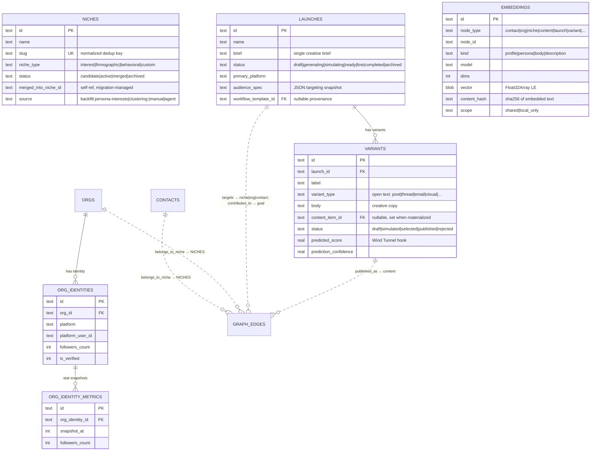

# Schema v0.5 — Phase 2 Design Addendum

**Status:** Proposed (System Design deliverable for [#22](https://github.com/therealtimex/signals/issues/22), Phase 2)
**Date:** 2026-08-14
**Base:** `main` @ `fab534e` (Phase 1 merged via PR #31)
**Extends:** [`specs/schema-v0.5.md`](./schema-v0.5.md) — its §4 Migration Rules and §6 Privacy Boundary apply verbatim to everything below.

---

## 1. Scope & Constraints

Phase 1 delivered the graph overlay: `orgs`, `graph_edges`, `interactions`, explore-card tables (`identity_metrics`, `contact_personas`), backfills, six new agent tools, engagement→interaction dual-write, and the `graph-integrity` job. This addendum designs the remaining schema-v0.5 nodes and the read-side retirement of `engagements`:

1. **`niches` + `belongs_to_niche` edges** — graduate persona `interests` JSON to graph membership (§4.1)
2. **`launches` / `variants`** — GTM launch and creative-variant nodes (§4.2)
3. **`embeddings`** — `(node_type, node_id)` vector storage for semantic search (§4.3, ADR-022-4)
4. **`org_identities`** — org-level platform identities (§4.4, ADR-022-5)
5. **Engagements read retirement** — migrate all product reads to `interactions` (§6)
6. **Sync adapter stubs** — instagram / facebook / threads (§7)

Constraints unchanged from Phase 1 (quoted in every PR): **additive-only DDL** (new tables, new indexes, new nullable/defaulted columns; enum *widening* is the only permitted column mutation), **agent-tools API frozen** (new capabilities are new tools), **`contacts` remains a projection**, **SQLite + Drizzle, no graph/vector database**, **privacy defaults conservative** (scope filtering in the query layer, `properties_private` never serialized outward).

Out of scope for Phase 2 design: encryption-at-rest (Phase 4, ADR-022-2), full Wind Tunnel UI and simulation-run storage (§9 boundary), persona *generation* workflow (§9 boundary), breaking any of the 19 registered agent tools.

---

## 2. Target ERD — Phase 2 additions

Existing tables are context; **new tables are `niches`, `launches`, `variants`, `embeddings`, `org_identities`, `org_identity_metrics`**. Connectivity still lives in `graph_edges` (ADR-022-1); typed FKs are used only *inside* an aggregate (variant → launch).



### Node type registry (delta)

| Node type | Table | Status |
|---|---|---|
| `niche` | `niches` | **Phase 2 (new)** — enum value already present in `graph_edges` since Phase 1 |
| `launch` | `launches` | **Phase 2 (new)** — enum value already present |
| `variant` | `variants` | **Phase 2 (new)** — enum value already present |
| `org_identity` | `org_identities` | **Phase 2 (new)** — requires one additive enum widen on `graph_edges.src_type`/`dst_type` (§4 rule 4) |

`embeddings` rows are *not* graph nodes — they are per-node derived artifacts, addressed by `(node_type, node_id)`, never edge endpoints.

### Edge catalog additions

| edge_type | src → dst | Key properties | Scope default |
|---|---|---|---|
| `belongs_to_niche` | contact\|org → niche | `weight` = confidence 0–1 | shared *(catalogued in Phase 1, live now)* |
| `targets` | launch\|variant → niche\|org\|contact | `priority` | shared |
| `published_as` | variant → content | `platform`, `published_at` | shared |
| `contributes_to` | launch → goal | `contribution`, `delta_rule` | shared *(src widened per Phase 1 catalog)* |

Edge multiplicity rule unchanged: one edge per `(edge_type, src, dst)`; repeated events are `interactions`.

---

## 3. Gap Matrix — current `main` vs Phase 2 target

| Spec v0.5 concept | Current `main` (post-PR #31) | Gap | Resolution |
|---|---|---|---|
| Niche node + clustering membership | ❌ `niche` only as enum value; interests live in `contact_personas.interests` JSON | Not queryable across contacts; no org membership; no confidence; explore-card chip reads JSON | **`niches` table + `belongs_to_niche` edges + interests backfill** (§4.1). Persona `interests` JSON becomes a projection (kept, additive rule) |
| Launch (Campaign) node | ❌ `workflow_templates` ("formerly campaigns") approximates but is an automation config, not a GTM launch | Brief → variants → publish → outcomes flow unrepresentable; no goal linkage for launches | **`launches` table** (§4.2); optional `workflow_template_id` provenance link; `contributes_to` edges to goals |
| Variant node (generated creative) | ❌ generated content goes straight to `content_items` with no launch/variant grouping | Cannot compare variants, hold predictions, or map outcomes back to a launch | **`variants` table** FK'd to launch, linked to `content_items` on materialization, `published_as` edge on publish |
| Embeddings / semantic search | ❌ nothing | Graph Engine spec §4.A requires embeddings; niche clustering and audience search need vectors | **`embeddings` table** + query-layer brute-force search (§4.3, ADR-022-4) |
| Org PlatformIdentity | ❌ `contact_identities` is contact-only | Org X/LinkedIn accounts unstorable; org explore-card impossible | **`org_identities` (+ `org_identity_metrics`)** mirroring the contact pattern (§4.4, ADR-022-5) |
| Interactions as sole read model | ⚠️ dual-write live; `interactions` lacks `content_post_id` / `platform` / `workflow_run_id`, so analytics, goals, and content-detail still read `engagements` | Two read models drift; `engagements` enum-locked types leak into product surfaces | **Additive parity columns + reader ports with parity tests** (§6); `engagements` demoted to sync-provenance ledger |
| Multi-network sync (instagram/facebook/threads) | ⚠️ `PLATFORMS` registry widened in Phase 1, but `PlatformAdapter.platform` is hard-locked to `"x"\|"linkedin"\|"gmail"\|"substack"` and no adapters exist | Cannot even register the new platforms in the sync layer | **Adapter type widening + capability-flagged stubs** (§7) |
| Persona generation workflow | ❌ storage exists (`contact_personas`), generation doesn't | — | **Out of scope; follow-on epic** (§9) |

---

## 4. Phase 2 Drizzle Sketch

Additions to `src/lib/db/schema.ts`, matching existing style (text PKs, unixepoch timestamps, JSON-as-text, `...timestamps`).

### 4.1 Niches

```ts
// --- Niches (derived interest / firmographic clusters; spec §3 Niche node) ---
// The table stores clustering RESULTS with provenance. The clustering computation
// itself is workflow-owned (ADR-022-6) — this schema is neutral about the algorithm.

export const niches = sqliteTable("niches", {
  id: text("id").primaryKey(),
  name: text("name").notNull(),            // display name, e.g. "Startup Operators"
  slug: text("slug").notNull(),            // normalized dedup key (casefold, kebab)
  description: text("description"),
  nicheType: text("niche_type", {
    enum: ["interest", "firmographic", "behavioral", "custom"],
  }).notNull().default("interest"),
  status: text("status", { enum: ["candidate", "active", "merged", "archived"] })
    .notNull().default("active"),
  mergedIntoNicheId: text("merged_into_niche_id"), // self-ref FK managed via migration SQL (sourceTemplateId pattern)
  scope: text("scope", { enum: ["shared", "local_only"] })
    .notNull().default("shared"),
  source: text("source"), // "backfill:persona-interests" | "clustering:<workflow_run_id>" | "manual" | "agent"
  metadata: text("metadata").default("{}"), // JSON — cluster stats, naming rationale
  ...timestamps,
}, (table) => [
  uniqueIndex("idx_niches_slug").on(table.slug),
  index("idx_niches_status").on(table.status),
]);
```

Membership is **only** `belongs_to_niche` edges in `graph_edges` (`weight` = confidence 0–1). No junction table — the edge overlay is the junction, and it already gives us scope, provenance, and the `idx_edge_dst` index for "who is in this niche".

**Backfill `backfill-niches-from-interests`** (idempotent, provenance-tagged, §4 rules 5–6):
for each **active** `contact_personas` row, for each entry in `interests` JSON → normalize to slug → `INSERT OR IGNORE` into `niches` (`source = 'backfill:persona-interests'`, `nicheType = 'interest'`) → upsert edge `(belongs_to_niche, contact, …, niche, …)` with `weight = contact_personas.confidence ?? null`, `source = 'backfill:persona-interests'`. Re-running after persona regeneration adds new memberships; it never deletes (pruning stale interest edges belongs to the clustering workflow). `contact_personas.interests` stays populated (projection rule) — the explore card keeps rendering from it until Phase 3 UI reads edges.

### 4.2 Launches & Variants

```ts
// --- Launches (GTM campaign node; spec §3 Launch, modules C/D/E) ---

export const launches = sqliteTable("launches", {
  id: text("id").primaryKey(),
  name: text("name").notNull(),
  brief: text("brief"),                    // the single creative brief (module C input)
  status: text("status", {
    enum: ["draft", "generating", "simulating", "ready", "live", "completed", "archived"],
  }).notNull().default("draft"),
  primaryPlatform: text("primary_platform"), // open text, validated against PLATFORMS
  audienceSpec: text("audience_spec").default("{}"), // JSON — targeting snapshot (niche ids, org ids, filters) at brief time
  workflowTemplateId: text("workflow_template_id")
    .references(() => workflowTemplates.id), // provenance link to the automation that runs it, if any
  scope: text("scope", { enum: ["shared", "local_only"] })
    .notNull().default("shared"),
  source: text("source"),                  // "manual" | "agent"
  metadata: text("metadata").default("{}"),
  launchedAt: integer("launched_at"),
  completedAt: integer("completed_at"),
  ...timestamps,
}, (table) => [
  index("idx_launches_status").on(table.status),
]);

// --- Variants (generated creatives under a launch; spec §3 Variant) ---
// variant → launch is a real FK (intra-aggregate); variant → content/niche/goal
// connectivity goes through graph_edges like every other cross-node relation.

export const variants = sqliteTable("variants", {
  id: text("id").primaryKey(),
  launchId: text("launch_id")
    .notNull()
    .references(() => launches.id, { onDelete: "cascade" }),
  label: text("label"),                    // "A", "Thread v2", …
  variantType: text("variant_type").notNull().default("post"),
    // open vocabulary: "post" | "thread" | "email" | "visual" | ... (formats grow; §5 rule)
  body: text("body"),                      // creative copy; media via content pipeline
  contentItemId: text("content_item_id")
    .references(() => contentItems.id),    // set when materialized into the content pipeline
  status: text("status", {
    enum: ["draft", "simulated", "selected", "published", "rejected"],
  }).notNull().default("draft"),
  // Wind Tunnel hooks (simulation-run storage itself is Phase 3 — §9):
  predictedScore: real("predicted_score"),         // 0–100 predicted engagement
  predictionConfidence: real("prediction_confidence"), // 0–1
  predictedMetrics: text("predicted_metrics").default("{}"), // JSON per-metric breakdown
  predictionModel: text("prediction_model"),
  simulatedAt: integer("simulated_at"),
  generationModel: text("generation_model"),
  generationMetadata: text("generation_metadata").default("{}"), // JSON — prompt ref, brief version
  metadata: text("metadata").default("{}"),
  ...timestamps,
}, (table) => [
  index("idx_variants_launch").on(table.launchId),
  index("idx_variants_content_item").on(table.contentItemId),
]);
```

Design notes:

- **Launch outcomes flow through existing pipes.** Publishing a selected variant creates a `content_items` row (existing pipeline) + `published_as` edge; real engagement arrives as `interactions` against that content; goal advancement uses `contributes_to` (launch → goal) edges evaluated by the existing goal-progress machinery. No new metrics tables — `engagement_metrics` already snapshots content performance.
- **`workflow_templates` is not retired.** It remains the automation-config store; a launch may reference the template that executes it. The two concepts stop being conflated.
- **Prediction fields live on the variant** as *latest-value* columns so "compare variants" is one indexed read. Full simulation-run history (per-agent transcripts, populations) is deliberately deferred (§9) — when it lands, runs will reference `variant_id` and these columns become a projection of the latest run, consistent with the `contacts` projection rule.

### 4.3 Embeddings

```ts
// --- Embeddings (per-node derived vectors; ADR-022-4) ---
// Source of truth is this plain table. Search is app-side brute force at
// local-first scale; sqlite-vec may later ACCELERATE reads but never owns data.

export const embeddings = sqliteTable("embeddings", {
  id: text("id").primaryKey(),
  nodeType: text("node_type").notNull(),   // open text validated against the node registry
  nodeId: text("node_id").notNull(),
  kind: text("kind").notNull().default("profile"),
    // which facet was embedded: "profile" (contact/org synthesis) | "persona" |
    // "description" (niche/launch) | "body" (content/variant) — open vocabulary
  model: text("model").notNull(),          // embedding model id, e.g. "text-embedding-3-small"
  dims: integer("dims").notNull(),
  vector: blob("vector", { mode: "buffer" }).notNull(), // Float32Array, little-endian
  contentHash: text("content_hash").notNull(), // sha256 of the exact embedded text → staleness + idempotency
  scope: text("scope", { enum: ["shared", "local_only"] })
    .notNull().default("shared"),          // inherits the MOST RESTRICTIVE scope of any source field (§5)
  createdAt: integer("created_at").notNull().default(sql`(unixepoch())`),
  updatedAt: integer("updated_at").notNull().default(sql`(unixepoch())`),
}, (table) => [
  uniqueIndex("idx_embeddings_node_kind_model").on(
    table.nodeType, table.nodeId, table.kind, table.model,
  ),
  index("idx_embeddings_model_kind").on(table.model, table.kind),
]);
```

Query layer (`src/lib/db/queries/embeddings.ts`):

- `upsertEmbedding(nodeType, nodeId, kind, model, vector, contentHash)` — no-op when `contentHash` matches (skip re-embedding unchanged text); polymorphic endpoint validated like edge endpoints (write-path check + `graph-integrity` orphan sweep).
- `semanticSearch({ nodeTypes, kind, model, queryVector, k, includeLocalOnly = false })` — loads candidate vectors filtered by `(model, kind, node_type)`, computes cosine in JS over `Float32Array` views, returns top-k `(nodeType, nodeId, score)`. At the target scale (≤ tens of thousands of nodes × ≤1536 dims ≈ tens of MB, worst case) a full scan is well under interactive latency; measured regression test guards this assumption so we know when ADR-022-4's revisit trigger fires.
- **Embedding-source rule (privacy):** the text assembled for embedding may only draw from `shared`-scoped rows and must never read `properties_private` or `local_only` interactions unless the caller explicitly builds a `local_only` embedding — in which case the row is stored `scope = 'local_only'` and excluded from GTM/simulation/export search by the same central filter as every other scoped read (§6 of the Phase 1 doc). The §6 zero-private-bytes invariant test extends to `semantic_search`.

Embedding *generation* (which model, batching, cost, refresh cadence) is a pipeline concern configured where personas are generated; this doc only fixes storage and the read interface. Slice 2.3 ships the table, the search, and an on-demand embed helper — not a bulk backfill of every node.

### 4.4 Org Identities

```ts
// --- Org Identities (org-level platform accounts; ADR-022-5) ---
// Deliberately mirrors contact_identities (typed table, real FK) rather than
// generalizing into a polymorphic identity table.

export const orgIdentities = sqliteTable("org_identities", {
  id: text("id").primaryKey(),
  orgId: text("org_id")
    .notNull()
    .references(() => orgs.id, { onDelete: "cascade" }),
  platform: text("platform").notNull(),    // open text validated against PLATFORMS (new-table rule, Phase 1 §5)
  platformUserId: text("platform_user_id").notNull(),
  platformHandle: text("platform_handle"),
  platformUrl: text("platform_url"),
  platformData: text("platform_data").default("{}"), // JSON raw-sync catch-all
  displayName: text("display_name"),
  bio: text("bio"),
  avatarUrl: text("avatar_url"),
  location: text("location"),
  websiteUrl: text("website_url"),
  isVerified: integer("is_verified", { mode: "boolean" }),
  followersCount: integer("followers_count"),
  followingCount: integer("following_count"),
  postsCount: integer("posts_count"),
  listedCount: integer("listed_count"),
  platformCreatedAt: integer("platform_created_at"),
  statsUpdatedAt: integer("stats_updated_at"),
  isPrimary: integer("is_primary").notNull().default(0),
  isActive: integer("is_active").notNull().default(1),
  lastSyncedAt: integer("last_synced_at"),
  syncErrors: text("sync_errors"),
  ...timestamps,
}, (table) => [
  uniqueIndex("idx_org_identity_platform_user").on(table.platform, table.platformUserId),
  index("idx_org_identity_org").on(table.orgId),
]);

// --- Org Identity Metrics (snapshot pattern, mirrors identity_metrics) ---
// Separate table because identity_metrics.contact_identity_id is NOT NULL and
// relaxing it would be a forbidden mutation (§4 rule 1).

export const orgIdentityMetrics = sqliteTable("org_identity_metrics", {
  id: text("id").primaryKey(),
  orgIdentityId: text("org_identity_id")
    .notNull()
    .references(() => orgIdentities.id, { onDelete: "cascade" }),
  snapshotAt: integer("snapshot_at").notNull().default(sql`(unixepoch())`),
  followersCount: integer("followers_count"),
  followingCount: integer("following_count"),
  postsCount: integer("posts_count"),
  listedCount: integer("listed_count"),
  engagementRate: real("engagement_rate"),
  metadata: text("metadata").default("{}"),
}, (table) => [
  index("idx_org_identity_metrics_identity_time").on(table.orgIdentityId, table.snapshotAt),
]);
```

Cross-table ambiguity guard: the same platform account must not be claimed as both a contact identity and an org identity. The write path checks `contact_identities` for `(platform, platform_user_id)` before creating an org identity (and vice versa) and rejects with a "reassign, don't duplicate" error; `graph-integrity` reports any duplicates that slip through sync races. `graph_edges.src_type`/`dst_type` gain the `org_identity` value via the permitted one-time enum widen.

---

## 5. Vocabulary & Validation Rules (recap applied to Phase 2)

- `edge_type`, `interaction_type`, `variant_type`, `kind` (embeddings), and `platform` on **new** tables are open text validated in the write path against their registries/catalogs — adding a value is a code edit, not a migration.
- Status columns on new tables use Drizzle enums (widening later is the permitted rebuild).
- Polymorphic endpoints (`graph_edges`, `embeddings.node_*`) are validated on write and swept by `graph-integrity`, which gains two checks: orphaned `embeddings` rows and orphaned niche-membership edges after niche merge/archive (merge repoints `belongs_to_niche` edges to `merged_into_niche_id`, then archives the source niche).

---

## 6. Engagements Read Retirement

Phase 1 established `interactions` as the canonical event log with dual-write and a 1:1 `engagement_id` provenance link. Phase 2 moves **all product reads** to `interactions`; `engagements` is demoted to a write-side sync-provenance ledger (dedup by `platform_engagement_id`, raw `platform_data`). The table is **not** dropped in v0.5 — that would violate rule 1 and is at earliest a Phase 4 decision.

Current direct readers on `main` (audit 2026-08-14):

| Reader | What it reads | Port target |
|---|---|---|
| `src/lib/db/queries/analytics.ts` | engagement trends, inbound/outbound by week, top engaged contacts | same functions over `interactions` |
| `src/lib/db/queries/goals.ts` (auto-progress metric) | engagement counts per goal window / workflow run | `interactions` (needs `workflow_run_id`) |
| `src/lib/db/queries/engagements.ts` | list by content post; dedup lookup; record | reads → `interactions` (needs `content_post_id`); `record` + dedup lookup **stay** (write path) |
| `src/app/dashboard/content/[id]/page.tsx` | per-post engagement list | via ported query |
| `src/app/dashboard/goals/goal-dialog.tsx`, `workflows/activate-dialog.tsx` | engagement-derived counts via API | via ported queries |
| `src/app/api/platforms/x/engage/route.ts` | **write** path | unchanged (dual-write continues) |

### 6.1 Additive parity columns on `interactions`

The blockers are three fields that only exist on `engagements`. All nullable — rule 1:

```ts
// interactions — Phase 2 additive columns
contentPostId: text("content_post_id").references(() => contentPosts.id),
platform: text("platform"),              // open text validated against PLATFORMS
workflowRunId: text("workflow_run_id").references(() => workflowRuns.id),
// + index("idx_interactions_content_post").on(table.contentPostId)
```

Dual-write starts populating them immediately; **`backfill-interaction-read-parity`** (idempotent `UPDATE … WHERE content_post_id IS NULL AND engagement_id IS NOT NULL`, provenance implied by the existing `engagement_id` link) copies them onto every already-backfilled row from its source engagement.

### 6.2 Port protocol (per reader)

1. Re-implement the query over `interactions` **behind the same exported signature**.
2. **Parity test**: seeded fixture written through the dual-write path; assert old and new implementations return equal results before the swap lands. (Sync-derived interactions are `scope = 'shared'`, so parity holds; manual `local_only` interactions appearing in *local* analytics is correct behavior for a local-first app — the export/simulation boundary is enforced centrally per Phase 1 §6, not in these dashboards.)
3. Delete the old read implementation in the same PR (dead code, not schema — rule 1 doesn't protect it) and mark `queries/engagements.ts` module-doc as "sync-provenance writes only".

End state: grep for `from(engagements)` / `FROM engagements` outside the write path and migrations returns nothing; enforced by a lint-style test so regressions can't sneak in.

---

## 7. Sync Adapter Stubs (instagram / facebook / threads)

The Phase 1 `PLATFORMS` registry already carries the new networks, but `PlatformAdapter.platform` in `src/lib/platforms/adapter.ts` is still typed `"x" | "linkedin" | "gmail" | "substack"`. Phase 2:

1. Widen `PlatformAdapter.platform` to the registry `Platform` type (type-level change, no behavior).
2. Add `capabilities` to the adapter contract (e.g. `{ oauth, contactSync, contentSync, engagementSync, statsSync }`) so the UI and sync scheduler gate features per platform instead of assuming full parity.
3. Ship `instagram/`, `facebook/`, `threads/` adapter stubs registered in `src/lib/platforms/index.ts` with all capabilities `false` and clearly-typed `NotImplementedError`s. This makes "add a network" a per-capability implementation task in follow-on epics, with connect-UI showing honest "coming soon" states, and lets manual/agent enrichment create identities for those platforms today (identities tables already accept them).

No schema change in this slice. Real API/browser sync implementations are separate epics per platform.

---

## 8. Agent-Tool Impact (additive only)

The 19 registered tools are untouched. New tools (registry + schemas + handlers + `realtimex-signals` skill docs):

| Tool | Purpose | Notes |
|---|---|---|
| `query_niches` | list/search niches with member counts | scope-filtered by default |
| `upsert_niche` | create/update a niche (manual/agent curation) | membership itself via existing `upsert_edge` (`belongs_to_niche`) |
| `query_launches` | list launches with variant summaries + goal links | |
| `upsert_launch` | create/update a launch (brief, status, audience spec) | |
| `upsert_variant` | add/update a variant under a launch | prediction fields writable by simulation agents |
| `semantic_search` | top-k nodes by embedding similarity | `includeLocalOnly?: boolean` default `false`, same auditability rationale as `query_graph` |

`query_graph` / `upsert_edge` need no signature change — new node types and edge types are new *values* through existing open-text parameters, which is additive for callers.

---

## 9. Follow-On Boundaries (documented, not designed here)

- **Persona generation workflow** (separate epic): inputs = identities + content + shared-scope interactions; outputs = new `contact_personas` version + `belongs_to_niche` edges + `embeddings(kind='persona')` row. All storage hooks exist after slices 2.1/2.3; the epic owns prompting, cadence, cost, and supersede orchestration.
- **Niche clustering workflow** (separate epic, ADR-022-6): consumes `embeddings` + graph; writes `niches` (`source = 'clustering:<run>'`) and membership edges; owns merge/prune decisions. Schema is algorithm-neutral.
- **Wind Tunnel simulation-run storage** (Phase 3): per-run populations, transcripts, calibration. Will FK to `variants`; the prediction columns in §4.2 then become a latest-run projection.
- **Org explore card UI**, full multi-network sync implementations: separate epics; schema stops being the blocker after 2.4/2.6.

---

## 10. Sequenced Implementation Slices

Each slice = one Dev child issue = DDL (if any) + query layer + tests + agent tools, honoring the §4 rules (DDL and backfill separate, backfills idempotent + provenance-tagged, old-binary test).

| Slice | Content | Depends on | Parallel group |
|---|---|---|---|
| **2.1 Niches** | `niches` DDL; `belongs_to_niche` write/read in graph query layer; `backfill-niches-from-interests`; `query_niches` / `upsert_niche` tools; integrity-job niche checks | — | A |
| **2.2 Launches & variants** | `launches` + `variants` DDL; `targets` / `published_as` edge support; publish flow creates content link + edge; `query_launches` / `upsert_launch` / `upsert_variant` tools | — | A |
| **2.3 Embeddings** | `embeddings` DDL; vector query layer + cosine search + latency regression test; embed-on-demand helper; `semantic_search` tool; §6 privacy invariant extension | — (embeds niches too if 2.1 landed) | B |
| **2.4 Org identities** | `org_identities` + `org_identity_metrics` DDL; `org_identity` enum widen on `graph_edges`; dedup-vs-contact guard; query layer; stats population hook in sync/enrichment | — | B |
| **2.5 Engagements read retirement** | `interactions` parity columns DDL; dual-write extension; `backfill-interaction-read-parity`; port analytics/goals/content readers with parity tests; no-direct-reads lint test | — | A |
| **2.6 Adapter stubs** | adapter `platform` type widen + `capabilities` contract; instagram/facebook/threads stubs; connect-UI gating | — | B |

All six slices are mutually independent at the schema level (Phase 1 already reserved the node-type enum values), so ordering is a review-bandwidth choice; the suggested sequence is 2.1 → 2.5 → 2.2 → 2.4 → 2.3 → 2.6, front-loading the two slices that unblock follow-on epics (clustering needs 2.1; single read model de-risks everything else). Recommended: land 2.1 and 2.5 first (group A), then the rest in any order.

---

## ADR Summary (Phase 2)

**ADR-022-4: Embeddings in a plain SQLite table with app-side search; extensions may accelerate, never own.** — Proposed. Context: spec requires embeddings + semantic search; stack is SQLite + Drizzle, local-first, no vector DB; native extensions (sqlite-vec) complicate the `npx signals` install matrix. Decision: `embeddings` table keyed `(node_type, node_id, kind, model)` with Float32 BLOB vectors and `content_hash` staleness; brute-force cosine in the query layer behind `semanticSearch()`; if scale outgrows it (regression test is the tripwire), adopt sqlite-vec as a derived index behind the same interface. Consequences: zero install risk, trivially correct, easy re-embedding; cost is O(n) scans — acceptable at tens of thousands of nodes, and the revisit path is contained to one module.

**ADR-022-5: Separate typed `org_identities` table, not a generalized polymorphic identity table.** — Proposed. Context: orgs need platform identities; options were (a) new `org_identities` mirroring `contact_identities`, (b) generalized `platform_identities(owner_type, owner_id)`, (c) widening `contact_identities` with a nullable org FK. Decision: (a), consistent with ADR-022-1's typed-node philosophy — real FK with cascade, no polymorphic endpoints to integrity-sweep, `contact_identities` and its heavy read paths untouched; (b) would re-introduce app-enforced integrity for the highest-churn sync surface and force a risky migration of existing identities; (c) muddies NOT NULL semantics (forbidden mutation). Consequences: some column-shape duplication (mitigated by shared TS helpers) and a mirrored `org_identity_metrics` snapshot table; cross-table account-claim ambiguity handled by a write-path guard + integrity check.

**ADR-022-6: Niche membership as graph edges; clustering computation is workflow-owned.** — Proposed. Context: niches must be queryable across contacts *and* orgs with confidence and provenance; clustering algorithms/models will change frequently. Decision: `niches` stores results with provenance (`source`), membership is `belongs_to_niche` edges (edge overlay is the junction — scope, weight, provenance, indexes for free); the clustering job is a workflow (`workflow_runs`-tracked) outside this schema, and persona `interests` JSON becomes a maintained projection seeded backward via backfill. Consequences: schema survives algorithm churn; bad clustering runs are surgically deletable by `source` tag; cost is that "interests" exist in two places until Phase 3 UI reads edges, governed by the projection rule.

**ADR-022-7: Launches/variants as typed nodes joined to the existing content pipeline; simulation storage deferred.** — Proposed. Context: GTM flow needs brief → variants → publish → outcomes with goal linkage; `workflow_templates` conflates automation config with campaign identity; full Wind Tunnel storage is not in scope. Decision: `launches` (with optional `workflow_template_id` provenance) and `variants` (FK to launch — intra-aggregate, so a real FK, not an edge); publishing materializes a variant into `content_items` + `published_as` edge so real outcomes flow through existing interactions/metrics/goal machinery; latest prediction values live on the variant row as a projection-in-waiting for Phase 3 simulation runs. Consequences: variant comparison is one indexed read and no metrics duplication; cost is prediction history absent until simulation-run storage lands, and the launch/template split must be explained in docs.
