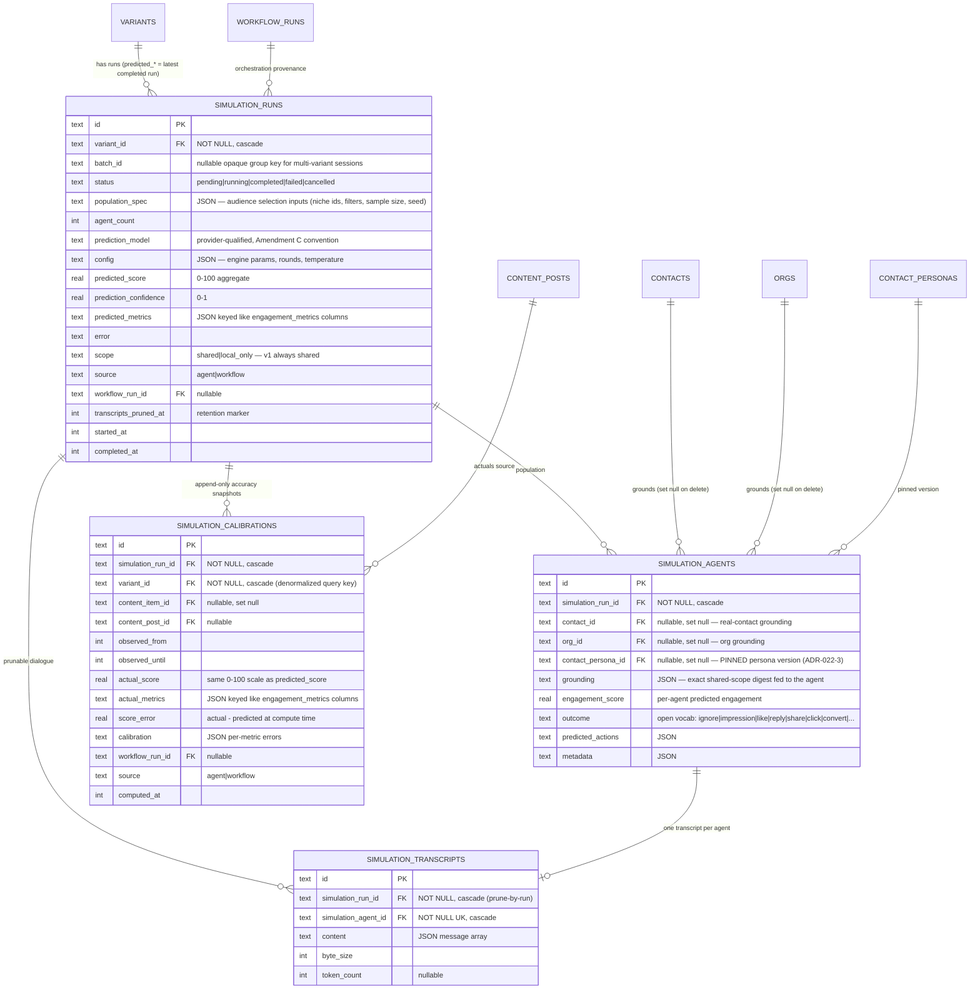

# Schema v0.5 — Phase 3 Design Addendum: Wind Tunnel Simulation-Run Storage

**Status:** Proposed (System Design deliverable for [#43](https://github.com/therealtimex/signals/issues/43), epic [#22](https://github.com/therealtimex/signals/issues/22) Phase 3)
**Date:** 2026-08-15
**Base:** `main` @ `b965622` (Phase 2 complete via PRs #38–#42)
**Extends:** [`specs/schema-v0.5.md`](./schema-v0.5.md) (§4 Migration Rules and §6 Privacy Boundary apply verbatim) and [`specs/schema-v0.5-phase-2.md`](./schema-v0.5-phase-2.md) (§4.2 variant hooks, §9 boundary, ADR-022-7)

---

## 1. Scope & Constraints

Phase 2 shipped `launches` + `variants` with **latest-value Wind Tunnel hook columns** on `variants` (`predicted_score`, `prediction_confidence`, `predicted_metrics`, `prediction_model`, `simulated_at`) and deliberately deferred simulation-run storage (Phase 2 §9, ADR-022-7). This addendum designs that deferred slice — spec `signals-spec-v0.5.md` §D (Wind Tunnel: "Agent populations grounded in real Contact + Org data. Multi-variant simulation, predicted engagement + confidence, real-outcome feedback"):

1. **`simulation_runs`** — one row per simulation execution of one variant; status lifecycle; batch grouping for multi-variant sessions (§4.1)
2. **`simulation_agents`** — per-run synthetic population, grounded on real contacts/orgs with pinned `contact_personas` versions (§4.1, §5)
3. **`simulation_transcripts`** — per-agent dialogue/outcome records with a size + retention policy (§4.2, ADR-022-11)
4. **`simulation_calibrations`** — predicted vs real outcomes after publish, computed from existing pipes (§4.3, §7, ADR-022-12)
5. **Projection rule** — the five `variants.predicted_*` columns become a projection of the latest completed run (§6), completing the plan recorded in ADR-022-7
6. **Privacy** — the §6 zero-private-bytes invariant extends to simulation grounding and transcript export paths (§8)
7. **workflow_runs linkage** — when a run is workflow-orchestrated vs direct agent-tool invocation (§9)
8. **Agent tools** — additive only, registry sketch (§10); sequenced Dev slices (§11); ADRs 022-10/11/12 (§12)

Constraints unchanged and quoted in every PR: **additive-only DDL** (new tables, new indexes, new nullable/defaulted columns; enum *widening* is the only permitted column mutation — and per the Amendment D audit, Drizzle text enums in this codebase emit no CHECK constraint, so widens are code-only with zero DDL), **agent-tools API frozen** (all 27 registered tools untouched; new capabilities are new tools), **`contacts` remains a projection** (and `variants.predicted_*` now joins it as a projection surface), **SQLite + Drizzle, no graph/vector database**, **privacy defaults conservative** (scope filtering in the query layer; `properties_private` never serialized outward), **all LLM compute via the RTX SDK proxy** (ADR-022-9 — no provider keys; the simulation *engine* consumes `llm.chat` through `src/lib/rtx/llm.ts` conventions when workflow-orchestrated).

Out of scope for Phase 3 design (per handoff): Wind Tunnel UI, persona *generation* workflow, niche clustering workflow, Relationship Management product Phase 3, and any implementation before Review approves this spec.

---

## 2. Target ERD — Phase 3 additions

**New tables: `simulation_runs`, `simulation_agents`, `simulation_transcripts`, `simulation_calibrations`.** Existing tables are context.

A load-bearing decision up front: **simulation tables are *not* graph nodes** (no `graph_edges` enum widen, no new node types). Like `embeddings`, they are *derived computational artifacts* addressed by typed FKs, not entities anything traverses to generically. Run → variant is an intra-aggregate FK (same rationale as variant → launch in ADR-022-7); run → contact/persona grounding is provenance, not connectivity; calibration → content flows through the variant's existing `published_as` edge. Nothing in the Wind Tunnel needs `query_graph` to reach a run, so we don't pay the polymorphic-endpoint integrity cost (ADR-022-10).



### Node type registry (delta)

No delta. `simulation_run` / `simulation_agent` are **not** added to `graph_edges.src_type`/`dst_type`, `NODE_TYPES`, or `nodeTable()` — see §2 preamble and ADR-022-10. `graph-integrity` gains FK-backed sweeps only where SQLite can't enforce (none here — every Phase 3 reference is a real FK), so the integrity job needs **no new checks** for this phase.

### Edge catalog additions

None. The existing `published_as` (variant → content) edge is the bridge from simulation predictions to real outcomes; `contributes_to` (launch → goal) remains the goal linkage. Adding `grounded_on` edges (run → contact) was considered and rejected: it duplicates the typed `simulation_agents.contact_id` FK as thousands of polymorphic rows with zero traversal use case.

---

## 3. Gap Matrix — current `main` @ `b965622` vs Phase 3 target

| Spec v0.5 concept | Current `main` | Gap | Resolution |
|---|---|---|---|
| Simulation run (§D "multi-variant simulation") | ❌ only latest-value `predicted_*` columns on `variants`, writable via `upsert_variant` | No run history, no lifecycle, no reproducibility (population/config/seed unrecorded), no way to compare runs or audit a prediction | **`simulation_runs`** (§4.1); `variants.predicted_*` demoted to projection (§6) |
| Agent populations "grounded in real Contact + Org data" | ❌ nothing | Which contacts/orgs/personas grounded a prediction is unrecoverable | **`simulation_agents`** with typed FKs + `grounding` digest (§4.1) |
| Persona version pinning (ADR-022-3: "simulation runs can pin the persona version they were grounded on") | ⚠️ `contact_personas` is versioned/supersede-only — the *pinnable* half exists, nothing pins it | Pin storage absent | **`simulation_agents.contact_persona_id`** FK to the immutable version row (§5) |
| Per-agent transcripts | ❌ nothing | Dialogue/rationale unauditable; no size control if naively stored | **`simulation_transcripts`** separate prunable table + retention policy (§4.2, ADR-022-11) |
| "Real-outcome feedback" / calibration (§D; §G "Simulation Performance"; §H "Simulation Accuracy" goal) | ⚠️ real outcomes exist (`engagement_metrics`, `interactions` ∪ `content_activities`, `published_as` edge) but nothing joins them back to predictions | Predicted-vs-actual unrepresentable | **`simulation_calibrations`** computed from existing pipes — no new metrics ingestion (§4.3, §7) |
| Projection rule for `variants.predicted_*` | ⚠️ columns exist as free-write latest-value fields (ADR-022-7 called them "a projection-in-waiting") | No defined writer, ordering, or consistency rule | **Latest-completed-run projection** with one choke-point writer (§6) |
| Simulation privacy (§6 invariant: "excluded from public GTM simulations") | ⚠️ central scope filter + zero-private-bytes test exist for `query_graph`/export/`semantic_search`; simulation grounding path doesn't exist yet | Invariant must cover grounding + transcripts *before* they exist (Phase 1 precedent) | **Grounding assembly reads `shared` scope only; no `includeLocalOnly` on simulation tools at all** (§8) |
| Workflow-tracked simulation | ⚠️ `workflow_runs` exists; `workflow_type` enum lacks simulation values | Orchestrated runs can't be typed | **Code-only enum widen** `workflow_type` + `"simulate"`, `"calibrate"` (§9) |
| Simulation Accuracy goal type (§H) | ❌ `goals.goal_type` still the narrow 4-value enum | Calibration can't feed a typed goal | **Deferred** — calibration rows are queryable now; wiring a `simulation_accuracy` goal type is a product decision left to the goals epic (§7 note) |
| Simulation agent tools | ❌ `upsert_variant` prediction fields are the only surface | Agents can't create runs, record results, or read history | **Five additive tools** (§10); 27 → 32 |

---

## 4. Phase 3 Drizzle Sketch

Additions to `src/lib/db/schema.ts`, matching existing style (text PKs, unixepoch timestamps, JSON-as-text, `...timestamps`). Migrations are next-in-sequence: `0013` (runs + agents, slice 3.1), `0014` (transcripts, slice 3.3), `0015` (calibrations, slice 3.4). Slice 3.2 ships no DDL. All tables are new → invisible to N-1 binaries (rule 8 satisfied by construction); the only enum widens are code-only (§9). If `drizzle-kit generate` proposes anything beyond the three CREATE TABLE migrations, stop and escalate (Amendment D guard).

### 4.1 Simulation Runs & Agents (migration `0013`)

```ts
// --- Simulation Runs (Wind Tunnel executions; spec §D, ADR-022-10) ---
// One row per simulation of ONE variant. Multi-variant sessions share a batch_id.
// Runs are derived artifacts, not graph nodes — addressed only via typed FKs.

export const simulationRuns = sqliteTable("simulation_runs", {
  id: text("id").primaryKey(),
  variantId: text("variant_id")
    .notNull()
    .references(() => variants.id, { onDelete: "cascade" }),
  batchId: text("batch_id"),               // opaque group key; one Wind Tunnel session over N variants = N runs, same batch_id
  status: text("status", {
    enum: ["pending", "running", "completed", "failed", "cancelled"],
  }).notNull().default("pending"),
  populationSpec: text("population_spec").default("{}"),
    // JSON — the selection INPUT: niche ids, org ids, filters, sampleSize, seed.
    // simulation_agents rows are the materialized OUTPUT of this spec.
  agentCount: integer("agent_count").notNull().default(0),
  predictionModel: text("prediction_model"), // provider-qualified "provider:model" (Amendment C convention)
  config: text("config").default("{}"),    // JSON — engine params (rounds, temperature, scoring recipe version)
  // Aggregate outputs — the projection source for variants.predicted_* (§6):
  predictedScore: real("predicted_score"),           // 0–100
  predictionConfidence: real("prediction_confidence"), // 0–1
  predictedMetrics: text("predicted_metrics").default("{}"),
    // JSON — keys MUST use engagement_metrics column names (likes, comments, shares,
    // impressions, clicks, bookmarks, quotes, retweets) so calibration compares like-for-like (§7)
  error: text("error"),
  scope: text("scope", { enum: ["shared", "local_only"] })
    .notNull().default("shared"),          // v1 always writes 'shared' — grounding is shared-only (§8);
                                           // transcripts inherit run scope
  source: text("source").notNull().default("agent"), // "agent" | "workflow"
  workflowRunId: text("workflow_run_id").references(() => workflowRuns.id), // set iff workflow-orchestrated (§9)
  transcriptsPrunedAt: integer("transcripts_pruned_at"), // set by retention job; results remain valid after pruning
  startedAt: integer("started_at"),
  completedAt: integer("completed_at"),
  ...timestamps,
}, (table) => [
  index("idx_sim_runs_variant_completed").on(table.variantId, table.completedAt), // latest-completed lookup (§6)
  index("idx_sim_runs_batch").on(table.batchId),
  index("idx_sim_runs_status").on(table.status),
]);

// --- Simulation Agents (per-run synthetic population; spec §D grounding) ---
// Populations are RUN-OWNED: a batch simulating 5 variants against the same 100
// contacts writes 500 agent rows. Accepted duplication (ADR-022-10) — each run is
// self-contained and auditable, and local-first scale makes the cost trivial.

export const simulationAgents = sqliteTable("simulation_agents", {
  id: text("id").primaryKey(),
  simulationRunId: text("simulation_run_id")
    .notNull()
    .references(() => simulationRuns.id, { onDelete: "cascade" }),
  contactId: text("contact_id")
    .references(() => contacts.id, { onDelete: "set null" }),   // real-contact grounding; survives contact deletion as history
  orgId: text("org_id")
    .references(() => orgs.id, { onDelete: "set null" }),
  contactPersonaId: text("contact_persona_id")
    .references(() => contactPersonas.id, { onDelete: "set null" }),
    // THE PIN (ADR-022-3, §5): the immutable persona VERSION row that grounded this
    // agent. Never repointed; persona regeneration supersedes rows, it doesn't mutate them.
  grounding: text("grounding").default("{}"),
    // JSON — the exact shared-scope digest fed to the synthetic agent (name, bio,
    // persona archetype/tone/interests, identity stats, niche labels). Assembled
    // under the §8 privacy rule; doubles as the audit surface and survives
    // contact/persona deletion so old runs stay explainable.
  engagementScore: real("engagement_score"),  // per-agent predicted engagement, 0–100
  outcome: text("outcome"),
    // open vocabulary, write-path validated against SIMULATION_OUTCOMES registry (§4.4):
    // "ignore" | "impression" | "like" | "reply" | "share" | "click" | "convert" | ...
  predictedActions: text("predicted_actions").default("[]"), // JSON — richer per-action detail
  metadata: text("metadata").default("{}"),
  createdAt: integer("created_at").notNull().default(sql`(unixepoch())`),
}, (table) => [
  index("idx_sim_agents_run").on(table.simulationRunId),
  index("idx_sim_agents_contact").on(table.contactId),
  index("idx_sim_agents_persona").on(table.contactPersonaId),
]);
```

Design notes:

- **Batch grouping is a key, not a table.** "Optional launch-level grouping" (handoff item 1) is served by `batch_id`: the launch of a batch is derivable through any member's `variant_id` join, and a `simulation_batches` table would hold nothing but an id today. If batches later grow their own lifecycle/config, promote then (additive). Launch-level rollups ("best variant this session") are one indexed query on `batch_id`.
- **`contact_id` is nullable** to admit archetype-level agents (grounded on a niche or persona archetype rather than a specific person) without schema change; `grounding` records what actually grounded them. Real-contact grounding is the primary v1 path per spec §D.
- **Deletion semantics:** run history is preserved when source entities disappear (`set null` + `grounding` snapshot); runs themselves die only with their variant (cascade), which matches variant → launch cascade already in place.

### 4.2 Simulation Transcripts (migration `0014`)

```ts
// --- Simulation Transcripts (per-agent dialogue; ADR-022-11) ---
// Separate table so retention can prune dialogue WITHOUT touching runs, agents,
// or results. One row per agent, whole transcript as a JSON message array —
// per-message rows rejected (no query ever addresses individual messages).

export const simulationTranscripts = sqliteTable("simulation_transcripts", {
  id: text("id").primaryKey(),
  simulationRunId: text("simulation_run_id")
    .notNull()
    .references(() => simulationRuns.id, { onDelete: "cascade" }), // denormalized for prune-by-run
  simulationAgentId: text("simulation_agent_id")
    .notNull()
    .references(() => simulationAgents.id, { onDelete: "cascade" }),
  content: text("content").notNull(),      // JSON — [{ role, text, ... }] message array
  byteSize: integer("byte_size").notNull(), // length of content at write time; retention accounting
  tokenCount: integer("token_count"),      // nullable — engine-reported when available
  createdAt: integer("created_at").notNull().default(sql`(unixepoch())`),
}, (table) => [
  uniqueIndex("idx_sim_transcripts_agent").on(table.simulationAgentId),
  index("idx_sim_transcripts_run").on(table.simulationRunId),
]);
```

**Size & retention policy (ADR-022-11).** Expected envelope: ~50–200 agents/run × ~2–10 KB transcript ≈ 0.1–2 MB per run — fine for dozens of runs, unbounded growth over hundreds. Policy:

- Transcripts are **never load-bearing**: `engagement_score`, `outcome`, `predicted_actions`, and run aggregates survive pruning; a pruned run stays fully comparable and calibratable.
- **Retention default:** keep transcripts for (a) the latest completed run per variant (the projection source stays explainable) and (b) any run younger than 30 days. Everything else is prunable.
- **Prune job** (`simulation-transcript-retention`): idempotent maintenance task in the `graph-integrity` mold, registered as a recurring `scheduled_jobs` entry; deletes qualifying `simulation_transcripts` rows by `simulation_run_id` and sets `simulation_runs.transcripts_pruned_at`. Report (rows/bytes freed) surfaces in Sync Health alongside graph-integrity output. Thresholds live in the job's config, not the schema.

### 4.3 Simulation Calibrations (migration `0015`)

```ts
// --- Simulation Calibrations (predicted vs real; ADR-022-12) ---
// Append-only snapshots joining a run's predictions to real post-publish outcomes.
// Actuals are COMPUTED from existing pipes (engagement_metrics, interactions ∪
// content_activities) — this table stores results, it never ingests platform data.

export const simulationCalibrations = sqliteTable("simulation_calibrations", {
  id: text("id").primaryKey(),
  simulationRunId: text("simulation_run_id")
    .notNull()
    .references(() => simulationRuns.id, { onDelete: "cascade" }),
  variantId: text("variant_id")
    .notNull()
    .references(() => variants.id, { onDelete: "cascade" }), // denormalized: "accuracy by variant/launch" without a run join
  contentItemId: text("content_item_id")
    .references(() => contentItems.id, { onDelete: "set null" }), // the materialized publish target at compute time
  contentPostId: text("content_post_id")
    .references(() => contentPosts.id),   // platform post whose metrics grounded the actuals
  observedFrom: integer("observed_from").notNull(),   // window start (publish time)
  observedUntil: integer("observed_until").notNull(), // window end (snapshot horizon)
  actualScore: real("actual_score"),       // 0–100, same scoring recipe as predicted_score (recipe version in calibration JSON)
  actualMetrics: text("actual_metrics").default("{}"),
    // JSON — engagement_metrics column names, same keyspace as predicted_metrics
  scoreError: real("score_error"),         // actual_score − run.predicted_score at compute time (sortable accuracy analytics)
  calibration: text("calibration").default("{}"),
    // JSON — per-metric predicted/actual/error triples, scoring recipe version, notes
  workflowRunId: text("workflow_run_id").references(() => workflowRuns.id),
  source: text("source").notNull().default("workflow"), // "workflow" | "agent"
  computedAt: integer("computed_at").notNull().default(sql`(unixepoch())`),
}, (table) => [
  index("idx_sim_calibrations_run_window").on(table.simulationRunId, table.observedUntil),
  index("idx_sim_calibrations_variant").on(table.variantId),
]);
```

Append-only like `engagement_metrics` / `goal_progress`: recalibrating at a longer horizon adds a row (new `observed_until`); "current accuracy" reads the latest row per run. No unique window key — horizons are caller-chosen and overlapping snapshots are harmless history.

### 4.4 Query-layer boundaries

New module `src/lib/db/queries/simulations.ts` (single owner of all four tables' writes) plus a small open-vocabulary registry `src/lib/db/simulation-outcomes.ts` (`SIMULATION_OUTCOMES`, write-path validated, mirroring `variant-types.ts` — adding an outcome is a code edit, not a migration):

| Function | Responsibility |
|---|---|
| `createSimulationRun({ variantId, populationSpec, batchId?, predictionModel?, config?, workflowRunId? })` | Insert run (`pending`); **materialize the population**: resolve `populationSpec` through existing scope-filtered query functions, pin each agent's active persona version (§5), assemble `grounding` digests under the §8 privacy rule; set `agentCount`. Returns run + agents with grounding (the payload a simulating agent role-plays from). |
| `startSimulationRun(runId)` | `pending → running`, sets `startedAt`. |
| `recordSimulationAgentResults(runId, results[])` | Batch per-agent writes (`engagementScore`, `outcome` validated against `SIMULATION_OUTCOMES`, `predictedActions`, optional transcript → `simulation_transcripts` with `byteSize`). Idempotent per `agentId` (re-record overwrites). Rejected unless run is `running`. |
| `completeSimulationRun(runId, { predictedScore, predictionConfidence, predictedMetrics? })` | **The projection choke point** (§6). Sets `completed` + `completedAt` + aggregates, then in the same transaction projects onto the parent variant iff this run is now the latest completed one. Also the only path to `failed`/`cancelled` (no projection on those). |
| `listSimulationRuns({ variantId?, launchId?, batchId?, status?, page? })`, `getSimulationRun(id, { includeAgents?, includeTranscripts? })` | Reads. Transcripts load only on explicit request (size). `launchId` filter joins through `variants`. |
| `pruneSimulationTranscripts({ keepDays?, dryRun? })` | Retention job entry point (§4.2). |
| `calibrateSimulationRun(runId, { observedUntil? })` | §7. Resolves the run's variant → `content_item` → `content_posts`; computes `actual_metrics` from the latest `engagement_metrics` snapshot in-window plus `interactions` ∪ `content_activities` counts for the post; scores with the same recipe as predictions; inserts calibration row. Fails cleanly if the variant is unpublished. |

Boundary rules, mirroring Phase 2 precedent: agent-tool handlers and workflow steps call these functions and never touch the tables directly; direct `variants.predicted_*` writes outside `completeSimulationRun` (other than the frozen `upsert_variant` contract, §6) are an architectural smell; grounding assembly is the only place simulation code reads CRM data, and it goes through the existing scope-filtered query layer — never raw table access.

---

## 5. Persona Pinning (ADR-022-3 fulfilled)

`contact_personas` was designed versioned precisely for this moment (ADR-022-3: "Wind Tunnel can pin the persona version it was grounded on"; schema-v0.5.md §5: "simulation runs can pin the persona version they were grounded on"). The mechanism:

- **Pin = FK to the immutable version row.** `simulation_agents.contact_persona_id` references the specific `contact_personas.id` that grounded the agent — which, by the supersede-never-update rule, is a frozen snapshot. At `createSimulationRun` time the population assembler selects each contact's **active** persona row and stores that row's id; later regeneration supersedes the row but never mutates it, so the pin stays truthful forever.
- **Runs record version(s), plural, for free:** different agents in one run may pin different persona versions (e.g. a run created mid-regeneration), and "which persona versions grounded run X" is `SELECT DISTINCT contact_persona_id FROM simulation_agents WHERE simulation_run_id = ?`.
- **Belt and braces:** the `grounding` JSON also embeds the persona fields actually used (archetype, tone, interests…), so even if the persona row is cascade-deleted with its contact (`set null` on the pin), the run remains explainable and calibration remains meaningful.
- Personas with `scope = 'local_only'` are **never** selected for grounding (§8); an agent whose contact has only a local-only persona is grounded on identity/public data alone, `contact_persona_id` NULL.

---

## 6. Projection Rule — `variants.predicted_*`

ADR-022-7 declared the five prediction columns "a projection-in-waiting for Phase 3 simulation runs." This section makes them a projection, following the `contacts` projection rule (schema-v0.5.md §4 rule 2: dual-write in the write path, same transaction, logic in TypeScript).

**Rule:** `variants.predicted_score`, `prediction_confidence`, `predicted_metrics`, `prediction_model`, `simulated_at` are a **projection of the latest completed `simulation_runs` row for that variant**, ordered by `completed_at` (ties broken by `id`).

Mechanics:

1. **Single writer:** `completeSimulationRun` (§4.4). On transition to `completed` it checks (via `idx_sim_runs_variant_completed`) whether this run is now the latest completed for its variant; if so, in the same transaction it copies `predicted_score → variants.predicted_score`, `prediction_confidence`, `predicted_metrics`, `prediction_model`, and sets `variants.simulated_at = run.completed_at`.
2. **Status interplay:** the same transaction sets `variants.status = 'simulated'` iff current status is `'draft'` — never downgrading `selected` / `published` / `rejected` (a re-simulation of a selected variant refreshes numbers, not workflow position). This mirrors the publish choke point's exclusive ownership of `'published'` (Phase 2 Amendment B).
3. **Frozen-contract carve-out:** `upsert_variant` keeps accepting prediction fields (the 27-tool API is frozen). Its writes are now documented as **manual override**: they set the columns directly, create no run, and the next completed run overwrites them. The tool description gains a pointer to the new simulation tools; nothing breaks.
4. **Failed/cancelled runs never project.** A variant whose only runs failed keeps its previous projection (or NULLs).
5. **No recompute path in v1:** runs are deleted only by variant cascade (which deletes the projection target too), so projection-repair logic is unnecessary. If a targeted run-delete capability ever ships, it must recompute the projection from the remaining latest completed run — noted here so the invariant travels with the feature.
6. **Read rule:** variant-comparison surfaces (existing `query_launches` variant summaries, future Wind Tunnel UI) keep reading the variant columns — one indexed read, unchanged contract. Run *history* reads go to `simulation_runs`.

---

## 7. Calibration Model — real outcomes through existing pipes

Calibration closes spec §D's "real-outcome feedback" loop **without any new ingestion**. The full path already exists on `main`; Phase 3 only adds the join-and-snapshot step:

```
variant ──published_as──▶ content_item ──▶ content_posts ──▶ engagement_metrics   (metric snapshots)
                                            └──▶ interactions ∪ content_activities (event counts)
simulation_runs (predicted) ──▶ simulation_calibrations ◀── actuals computed from the above
```

1. **Trigger:** a variant reaches `published` through the Phase 2 choke point (`publishVariant` / `publishVariantForContentItem`), which guarantees `content_item_id` + `published_as` edge exist. Calibration becomes *possible* for every completed run of that variant.
2. **Compute** (`calibrateSimulationRun`, §4.4): pick the observation window (`observed_from` = publish time from the `published_as` edge properties; `observed_until` = caller horizon, default "now"); read the latest in-window `engagement_metrics` snapshot for the post, plus event counts from the §6.3 union read (`interactions` ∪ `content_activities` by `content_post_id`); normalize into `actual_metrics` using the **same keyspace** as `predicted_metrics` (engagement_metrics column names — the alignment rule in §4.1 exists for exactly this comparison); compute `actual_score` with the same scoring recipe used for predictions (recipe version recorded in `calibration` JSON so recipe drift is detectable); store `score_error`.
3. **Cadence & horizons:** append-only; typical use is one snapshot at publish+48h and one at publish+14d. The calibration workflow (§9) owns cadence; the schema is horizon-neutral.
4. **Goals:** "Simulation Accuracy" (spec §H) consumption is **deferred** — `goals.goal_type` widening to `simulation_accuracy` is a code-only enum widen available whenever the goals epic wants it, and calibration rows are already queryable for `goal_progress` computation via the existing machinery. No goal wiring ships in Phase 3 (kept out to avoid product-scope creep; noted in the gap matrix).
5. **Ownership (ADR-022-12):** calibration *computation* is workflow-owned (like clustering, ADR-022-6) — a `workflow_type: "calibrate"` run that sweeps published variants with uncalibrated or stale-horizon runs. The agent tool (§10) is a manual trigger over the same query-layer function, `source: 'agent'`.

---

## 8. Privacy — §6 invariant extended to simulation

Spec §2: *"Private personal notes and relationship stages remain local and are excluded from public GTM simulations unless explicitly permitted."* Simulation is the **canonical** "leaves the private context" consumer that §6 of `schema-v0.5.md` was written for. Rules:

1. **Grounding reads `shared` scope only.** `createSimulationRun`'s population assembly may read: `contacts` projection fields, `contact_identities` / `org_identities` (unscoped public platform facts), `contact_personas` with `scope = 'shared'`, `shared` graph edges' `properties` (never `properties_private`), `shared` interactions, and `shared`-scoped niches/orgs. It goes through the existing centrally-filtered query layer — the filter is not re-implemented in simulation code.
2. **No `includeLocalOnly` on simulation tools — by design.** Unlike `query_graph` (where an RTX agent acting for the local user may legitimately need private data), simulation grounding is *definitionally* the public-GTM context. The five new tools take no scope flag; there is no code path from `local_only` rows or `properties_private` into `grounding`, transcripts, or predictions. "Unless explicitly permitted" (spec §2) is deliberately **not implemented** in v1 — permitting private grounding would need its own reviewed design (per-run consent recording, exportability implications) and an ADR amendment; until then the door stays closed rather than flag-gated.
3. **Transcripts and exports.** Transcript `content` is generated from `grounding` + variant body + engine output — all shared-derived, so transcripts are exportable wherever the run is (`scope` inherited from the run, `'shared'` in v1). Every export/serialization path for simulation data (tool responses, future UI export) runs the same central scope filter as other consumers; if a `local_only` run ever exists (future), its transcripts and agents are excluded by the run-scope join.
4. **Invariant test extension (ships with slice 3.1, before any real grounding code path has users):** the §6 fixture DB (`local_only` edges + interactions + `properties_private` + a `local_only` persona) must produce **zero private bytes** through: `createSimulationRun` grounding output, `query_simulations` with `includeAgents`/`includeTranscripts`, `record`/`complete` round-trips, calibration rows, and export endpoints. Same test harness as the Phase 1/2 invariant (`query_graph`, exports, `semantic_search`), extended with the new surfaces.

---

## 9. workflow_runs Linkage

**Enum widen (code-only, rule 4):** `workflow_runs.workflow_type` gains `"simulate"` and `"calibrate"` (current: `sync | enrich | search | prune | sequence | agent`). Per the Amendment D audit, Drizzle text enums here have no CHECK constraint — this is a `schema.ts` edit with zero DDL; if drizzle-kit proposes a rebuild, escalate.

**When is a simulation workflow-tracked vs direct?**

| Path | `workflow_run_id` | `source` | When |
|---|---|---|---|
| **Workflow-orchestrated** | set (FK to a `workflow_type: "simulate"` run) | `"workflow"` | Signals' own engine executes the simulation: multi-agent LLM loops via the RTX proxy (`llm.chat`, ADR-022-9), batch sessions over a launch, scheduled re-simulation. Token/cost accounting lands on `workflow_runs` (existing columns); per-agent steps may log as `workflow_steps` with existing `tool_call`/`decision` step types — no step-type widen needed in v1. |
| **Direct agent-tool invocation** | NULL | `"agent"` | An RTX terminal agent drives the loop itself: `create_simulation_run` → role-plays each agent in its own runtime → `record_simulation_results` → `complete_simulation_run`. Its compute happens outside Signals, so there is no `workflow_runs` row to link; the model used is recorded in `simulation_runs.prediction_model` and `config`. |

Calibration mirrors this exactly (`workflow_type: "calibrate"` vs tool-triggered, §7.5). The rule of thumb, consistent with how `contact_personas.workflow_run_id` and `niches.source = 'clustering:<run>'` already work: **`workflow_run_id` records Signals-side orchestration provenance; it is never fabricated for external (RTX-agent) compute.**

The batch pattern composes: one `workflow_type: "simulate"` workflow run may own N `simulation_runs` sharing a `batch_id`, all pointing `workflow_run_id` at the same orchestration row.

---

## 10. Agent-Tool Impact (additive only; 27 → 32)

The 27 registered tools are untouched (one *description* clarification on `upsert_variant` per §6.3 — descriptions are not contract). New tools (registry + schemas + handlers + `realtimex-signals` skill docs):

| Tool | Purpose | Notes |
|---|---|---|
| `create_simulation_run` | create run + materialize grounded population for a variant | `{ variantId, populationSpec?, batchId?, predictionModel?, config? }` → run + agents with `grounding` digests. Handler hardcodes `source: 'agent'`. Returns everything an agent needs to role-play the population. Slice 3.1 |
| `query_simulations` | run history + results per variant/launch/batch | `{ variantId?, launchId?, batchId?, status?, includeAgents?, includeTranscripts?, page?, pageSize? }`. **No `includeLocalOnly`** (§8.2). Transcripts only on explicit flag; also surfaces latest calibration per run once 3.4 lands. Slice 3.1 |
| `record_simulation_results` | batch per-agent outcomes (+ optional transcripts) | `{ runId, results: [{ agentId, engagementScore, outcome, predictedActions?, transcript? }] }`. Idempotent per agent; `outcome` validated against `SIMULATION_OUTCOMES`. Slice 3.2 (transcript param activates in 3.3) |
| `complete_simulation_run` | finish run, write aggregates, fire the §6 projection | `{ runId, status?: "completed"\|"failed"\|"cancelled", predictedScore?, predictionConfidence?, predictedMetrics?, error? }`. The only tool path that touches `variants.predicted_*` (via the choke point). Slice 3.2 |
| `calibrate_simulation_run` | compute predicted-vs-actual for a published variant's run | `{ runId, observedUntil? }` → calibration row. `source: 'agent'`. Fails with an actionable error when the variant is unpublished. Slice 3.4 |

`query_launches` needs no signature change — its variant summaries already expose `predicted_score`, which simply becomes projection-backed. `upsert_edge` / `query_graph` are untouched (no new node types, §2).

---

## 11. Sequenced Implementation Slices

Each slice = one Dev child issue = DDL (if any) + query layer + tests + agent tools, honoring the §4 rules of `schema-v0.5.md` (DDL and backfill separate — note: **no backfills exist in Phase 3** (no pre-existing simulation data to lift), so rules 5–6 are untriggered; old-binary test per repo convention; `npm run check` green).

| Slice | Content | DDL | Depends on |
|---|---|---|---|
| **3.1 Runs & populations** | `simulation_runs` + `simulation_agents` DDL; `SIMULATION_OUTCOMES` registry; `queries/simulations.ts` create/start/list/get with population materialization, persona pinning (§5), grounding assembly under §8; `workflow_type` widen (`simulate`, `calibrate` — both here, one code edit); §8.4 invariant-test extension; tools `create_simulation_run`, `query_simulations` | `0013` | — |
| **3.2 Results, completion & projection** | `recordSimulationAgentResults` + `completeSimulationRun`; §6 projection rule incl. latest-completed ordering, status interplay, failed/cancelled non-projection; `upsert_variant` description note; tools `record_simulation_results`, `complete_simulation_run`; projection + lifecycle tests | — | 3.1 |
| **3.3 Transcripts & retention** | `simulation_transcripts` DDL; transcript writes through `record_simulation_results`; `includeTranscripts` read flag; `simulation-transcript-retention` prune job + `scheduled_jobs` registration + Sync Health report line; byte accounting; §8.3 transcript-export privacy test | `0014` | 3.2 |
| **3.4 Calibration** | `simulation_calibrations` DDL; `calibrateSimulationRun` over existing pipes (§7) incl. scoring-recipe versioning; calibrate workflow runner (`workflow_type: "calibrate"`); tool `calibrate_simulation_run`; `query_simulations` calibration surfacing; predicted/actual keyspace-alignment tests | `0015` | 3.2 (parallel with 3.3) |

Suggested sequence: **3.1 → 3.2 → {3.3 ∥ 3.4}**. 3.1+3.2 alone deliver a working Wind Tunnel storage loop (agent-driven simulation with projected predictions); 3.3 and 3.4 are independent enrichments.

---

## 12. ADR Summary (Phase 3)

**ADR-022-10: Simulation storage as normalized run/agent tables with JSON leaves; runs are derived artifacts, not graph nodes; populations are run-owned.** — Proposed. Context: Wind Tunnel needs run history, grounded populations, and auditability under additive-only SQLite constraints; options were (a) one JSON blob per run on `variants`, (b) fully normalized tables down to per-message rows, (c) normalized run/agent skeleton with JSON at the leaves (`population_spec`, `grounding`, `predicted_metrics`, transcript content), (d) modeling runs as graph nodes with `grounded_on` edges. Decision: (c); JSON only where no query addresses the interior; runs/agents addressed exclusively by typed FKs like `embeddings` — not graph nodes (d rejected: thousands of polymorphic edge rows duplicating typed FKs, integrity-sweep cost, zero traversal use case; a rejected (a) would make history unqueryable and re-projection impossible). Populations are run-owned rather than batch-owned — a batch re-simulating N variants duplicates agent rows per run; accepted at local-first scale in exchange for self-contained, independently auditable runs and no batches table (batch = opaque `batch_id` key, promotable later, additively, if batches acquire lifecycle). Consequences: every prediction is reproducible and explainable; comparison/projection are indexed reads; cost is agent-row duplication across batches and JSON-blind interiors, both revisitable additively.

**ADR-022-11: Transcripts in a separate prunable table; results never depend on transcripts.** — Proposed. Context: per-agent dialogue is the largest artifact (~0.1–2 MB/run) and the least queried; storing it inline on agents makes every population read heavy and retention destructive to results. Options: (a) `transcript` column on `simulation_agents`, (b) separate one-row-per-agent transcript table, (c) per-message rows. Decision: (b) — `simulation_transcripts` with `byte_size` accounting, unique per agent, cascade to run for prune-by-run; retention default keeps the latest completed run per variant plus a 30-day window, enforced by an idempotent scheduled maintenance job that sets `transcripts_pruned_at` and reports to Sync Health; (c) rejected as pure overhead (no message-level queries exist), (a) rejected because pruning would rewrite result rows. Consequences: reads stay light by default (`includeTranscripts` opt-in), disk growth is bounded by policy not schema, and pruned runs remain fully comparable/calibratable; cost is one extra join when transcripts *are* wanted and a job to operate.

**ADR-022-12: Calibration is workflow-owned computation over existing outcome pipes; the schema stores append-only snapshots.** — Proposed. Context: spec §D requires real-outcome feedback; real outcomes already flow through `published_as` → `content_posts` → `engagement_metrics` and `interactions` ∪ `content_activities`; the question is who computes accuracy and where it lives. Options: (a) compute-on-read (views/queries joining predictions to live metrics), (b) calibration rows written by the publish path, (c) append-only `simulation_calibrations` written by a `workflow_type: "calibrate"` workflow (agent tool as manual trigger). Decision: (c) — (a) rejected: accuracy must be pinnable to an observation window and stable under later metric churn and scoring-recipe evolution (recipe version is recorded per row); (b) rejected: publish time is exactly when actuals don't exist yet, and coupling calibration cadence to publishing conflates two lifecycles. Ownership lands with the Signals workflow engine (consistent with clustering ADR-022-6 and persona-generation boundaries): workflows own *when* and *for which horizon*; the query layer owns *how* (one function both paths share); no new metrics ingestion ever — calibration reads pipes, it doesn't fill them. Consequences: predicted-vs-actual is a stable, sortable record (`score_error`) usable by future Simulation Accuracy goals and engine tuning; cost is snapshot staleness between calibration passes and one more workflow type to schedule.
