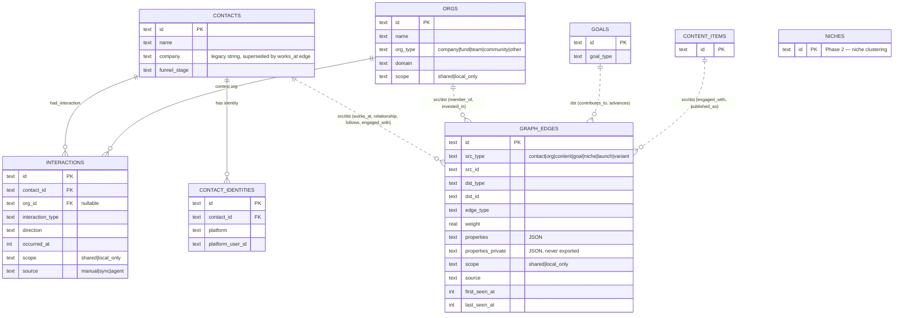

# Schema v0.5 — Graph-First Re-model Design

**Status:** Proposed (System Design deliverable for [#22](https://github.com/therealtimex/signals/issues/22))
**Date:** 2026-08-14
**Aligned to:** [`specs/signals-spec-v0.5.md`](./signals-spec-v0.5.md)
**Related:** #3 (agent-tools API), #8 (privacy boundary), #21 (RTX terminal-agent validation)

---

## 1. Problem & Constraints

The current schema (`src/lib/db/schema.ts`) is an OpenVolo-fork CRM model: contact-centric tables with hard-coded FK relationships (`engagements.contact_id`, `contacts.company` as a plain string, goals linked only to workflow templates). Spec v0.5 requires a **graph-first** model: Contacts *and* Orgs as first-class nodes, typed property edges (`works_at`, `relationship`, `contributes_to`, …), interactions as events linked to relationships, and a hard privacy boundary around personal relationship data.

Constraints that shape this design:

1. **Additive only.** Existing databases under `~/.signals/data.db` must keep working after upgrade with zero data loss and no destructive DDL.
2. **Agent-tools API stays stable.** The 13 tools in `src/lib/agent-tools/registry.ts` (`query_contacts`, `create_contact`, `query_goals`, …) are the contract RTX terminal agents depend on (#21). Their request/response shapes must not break.
3. **`contacts` remains a projection.** UI and API keep reading `contacts` during the transition; the graph is introduced *underneath*, not instead.
4. **SQLite + Drizzle.** No graph database. The graph is a relational encoding that SQLite can index and recursive CTEs can traverse.

### Key architectural decision: hybrid graph, not a generic node store

Two options were considered:

| Option | Description | Trade-off |
|---|---|---|
| **A. Generic `nodes` + `edges` tables** | Everything (contacts, orgs, content, goals) rows in one `nodes` table with JSON properties | Maximum flexibility; but destroys type safety, breaks every existing query and agent tool, forces a big-bang rewrite — exactly what #22 forbids |
| **B. Typed node tables + one generic edge table** (chosen) | Existing typed tables (`contacts`, `content_items`, `goals`) *are* the node tables; new typed tables (`orgs`, `interactions`) added; one polymorphic `graph_edges` table carries all typed edges | Keeps FKs, indexes, Drizzle types, and the agent-tools API intact; cost is that polymorphic edge endpoints cannot be FK-enforced by SQLite and need app-level + periodic integrity checks |

**Decision: Option B.** The graph is an *overlay*: node identity lives in typed tables, connectivity lives in `graph_edges`. This is reversible (dropping the overlay loses nothing existing) and additive by construction.

Consequences: (+) no rewrite, existing data becomes graph nodes for free, agent tools untouched; (−) edge endpoint integrity is enforced in the write path (`/api/agent-tools` handlers and sync pipelines) plus an idempotent `graph-integrity` maintenance job, not by the database engine.

---

## 2. Target ERD

Node tables (typed) and the edge overlay. Existing tables are unshaded context; **new Phase 1 tables are `orgs`, `graph_edges`, `interactions`**.



### Node type registry

`graph_edges.src_type` / `dst_type` values map to physical tables:

| Node type | Table | Status |
|---|---|---|
| `contact` | `contacts` | exists |
| `org` | `orgs` | **Phase 1 (new)** |
| `content` | `content_items` | exists |
| `goal` | `goals` | exists |
| `interaction` | `interactions` | **Phase 1 (new)** |
| `platform_identity` | `contact_identities` | exists |
| `niche` | `niches` | Phase 2 |
| `launch` | `launches` | Phase 2 |
| `variant` | `variants` | Phase 2 |
| `workflow_run` | `workflow_runs` | exists (optional node per spec §3) |

### Edge type catalog (initial)

| edge_type | src → dst | Key properties | Scope default |
|---|---|---|---|
| `works_at` | contact → org | `title`, `is_current`, `start_date` | shared |
| `founded` | contact → org | `year` | shared |
| `advises` | contact → org | — | shared |
| `invested_in` | contact\|org → org | `round`, `year` | shared |
| `member_of` | contact → org | `role` | shared |
| `follows` | contact → contact | `platform` | shared |
| `connected_to` | contact ↔ contact | `platform`, `degree` | shared |
| `engaged_with` | contact → content | `engagement_type`, `count`, aggregated from `engagements` | shared |
| `relationship` | contact → contact ("me" node or any pair) | `relationship_type` (professional\|personal\|mixed), `stage`, `strength` (0–100), `last_meaningful_interaction`, `desired_direction`, `context` | **local_only** |
| `contributes_to` | contact\|org\|content\|launch → goal | `contribution` (primary\|supporting), `delta_rule` | shared |
| `belongs_to_niche` | contact\|org → niche | `confidence` | shared (Phase 2) |

Notes:
- `relationship.private_notes` lives in `properties_private`, never in `properties` (see §6).
- Edge multiplicity is **one edge per (edge_type, src, dst)**; repeated events (likes, meetings) are *not* duplicate edges — they are `interactions` rows, with the edge holding aggregates (`count`, `last_seen_at`). This keeps the graph small and traversals cheap.

---

## 3. Gap Matrix — current `schema.ts` vs target

| Spec v0.5 concept | Current schema | Gap | Resolution |
|---|---|---|---|
| Contact node (multi-source) | `contacts` + `contact_identities` ✅ | Deprecated inline `platform`/`platform_user_id` columns still on `contacts` | Keep columns (additive rule); identities table is authoritative; no action Phase 1 |
| **Org node** | ❌ only `contacts.company` free-text string | No org entity at all | **Phase 1: `orgs` table** + `works_at` edges backfilled from `contacts.company` |
| PlatformIdentity node | `contact_identities` ✅ | Contact-only; orgs have no identities | Phase 2: `org_identities` or generalized identity table; not blocking |
| Content node | `content_items` / `content_posts` ✅ | Not connected to graph | Edges (`engaged_with`, `authored`) reference `content` node type; no table change |
| **Typed edges** | ❌ hard-coded FKs only (`engagements.contact_id`, `goal_workflows`) | No general edge store; no `works_at`, `follows`, `relationship`, `contributes_to` | **Phase 1: `graph_edges`** |
| **Interaction / Event node** | `engagements` (platform-engagement-shaped, enum-locked, no meetings/calls/manual log) | Cannot represent offline/manual/relationship interactions; enum too narrow; no privacy flag | **Phase 1: `interactions`** as append-only event log; `engagements` stays for platform sync provenance and is backfilled into `interactions` |
| Goal as node + contribution edges | `goals` ✅ but linked only via `goal_workflows` junction; `goal_type` enum lacks relationship types | Contacts/orgs/content can't advance goals; missing goal types (Relationship Deepening, New Friendships, Re-engagement, Network Maintenance, Org Penetration, Custom…) | Phase 1: `contributes_to` edges in `graph_edges` (junction kept working); **additive enum widen** on `goals.goal_type` (SQLite text-check rebuild is Drizzle-managed and data-preserving — see §4 rule 4) |
| Niche node | ❌ | No clustering tables | Phase 2 (`niches`, `belongs_to_niche` edges) |
| Launch / Variant nodes | `workflow_templates` approximates campaigns | GTM launch/variant modeling absent | Phase 2 (Creative Studio / Wind Tunnel) |
| Relationship edges w/ stage & strength | ❌ nothing | Entire Relationship Management mode unrepresentable | Phase 1: `relationship` edge type in `graph_edges` (scope-gated); dashboard/timeline consume it in Phase 3 |
| Embeddings | ❌ | No vector storage | Phase 2 (`embeddings` table keyed by `(node_type, node_id)`), out of scope here |
| **Privacy: local-only relationship data** | ❌ no scoping anywhere | Spec §2: private notes/stages excluded from GTM simulation | **Phase 1: `scope` + `properties_private` columns** (§6) |
| WorkflowRun/AgentRun node | `workflow_runs` ✅ | fine | Referenceable as `workflow_run` node type; no change |

---

## 4. Migration Rules

These rules govern every migration in this epic and should be quoted in PR descriptions.

1. **Additive DDL only.** New tables, new indexes, new nullable-or-defaulted columns. Never `DROP TABLE`, `DROP COLUMN`, or column renames on existing tables during the transition.
2. **`contacts` is a projection, not legacy.** All existing readers (UI pages, agent tools, sync pipelines) keep reading `contacts`. Graph writes that affect contact-level denormalized fields (`company`, `lastInteractionAt`, `score`) update the projection in the same transaction ("dual-write in the write path", not a trigger — keeps logic in TypeScript where it's testable).
3. **Agent-tools contract frozen.** No tool in `src/lib/agent-tools/registry.ts` changes its input/output schema. New graph capabilities ship as **new tools** (`query_graph`, `upsert_edge`, `log_interaction`, `query_orgs`) so existing RTX agent skills keep working (#21). `create_contact`/`update_contact` handlers gain internal dual-write to org/edge tables when `company` is supplied.
4. **Enum widening is the only permitted column mutation.** Drizzle SQLite emits enum changes as a table rebuild (`CREATE new → INSERT SELECT → DROP old → RENAME`) which preserves data; widening (adding values) is allowed, narrowing is forbidden.
5. **DDL and backfill are separate steps.** Schema migrations (drizzle `000N_*.sql`, run by `runMigrations()` at startup) contain no data movement. Backfills are idempotent scripts (pattern: existing `src/lib/db/migrate-identities.ts`) that are safe to re-run and safe to interrupt — keyed inserts with `INSERT OR IGNORE` / natural keys.
6. **Backfills are provenance-tagged.** Every backfilled row/edge sets `source` (`backfill:contacts-company`, `backfill:engagements`, …) so a bad backfill can be surgically deleted and re-run.
7. **Foreign keys where possible, integrity job where not.** `interactions.contact_id` → real FK. `graph_edges` endpoints are polymorphic (no FK); the write path validates endpoint existence, and a maintenance task (`graph-integrity`) reports/repairs orphaned edges (delete-cascade equivalent runs there when a node is archived).
8. **Every migration must pass the "old binary" test conceptually:** a database migrated to schema N must still be fully usable by code written against schema N-1 semantics for the tables it knows. (New tables invisible; existing tables only gained nullable columns.)

---

## 5. Phase 1 Drizzle Sketch

Additions to `src/lib/db/schema.ts` (style matches existing file: text PKs, unixepoch timestamps, JSON-as-text).

```ts
// --- Orgs (first-class organization nodes) ---

export const orgs = sqliteTable("orgs", {
  id: text("id").primaryKey(),
  name: text("name").notNull(),
  orgType: text("org_type", {
    enum: ["company", "fund", "team", "community", "other"],
  }).notNull().default("company"),
  domain: text("domain"),               // canonical domain, dedup key when present
  website: text("website"),
  description: text("description"),
  location: text("location"),
  avatarUrl: text("avatar_url"),
  enrichmentScore: integer("enrichment_score").notNull().default(0),
  scope: text("scope", { enum: ["shared", "local_only"] })
    .notNull().default("shared"),
  metadata: text("metadata").default("{}"), // JSON
  source: text("source"),               // "manual" | "backfill:contacts-company" | "sync:<platform>" | "agent"
  ...timestamps,
}, (table) => [
  index("idx_orgs_name").on(table.name),
  uniqueIndex("idx_orgs_domain").on(table.domain), // SQLite unique ignores NULLs — multiple domainless orgs OK
]);

// --- Graph Edges (polymorphic typed-edge overlay) ---

export const graphEdges = sqliteTable("graph_edges", {
  id: text("id").primaryKey(),
  srcType: text("src_type", {
    enum: ["contact", "org", "content", "goal", "niche", "launch", "variant", "interaction", "workflow_run", "platform_identity"],
  }).notNull(),
  srcId: text("src_id").notNull(),
  dstType: text("dst_type", {
    enum: ["contact", "org", "content", "goal", "niche", "launch", "variant", "interaction", "workflow_run", "platform_identity"],
  }).notNull(),
  dstId: text("dst_id").notNull(),
  edgeType: text("edge_type").notNull(), // open vocabulary; catalog in specs/schema-v0.5.md §2
  weight: real("weight"),                // strength/warmth 0–100 for relationship; confidence elsewhere
  properties: text("properties").default("{}"),          // JSON — exportable
  propertiesPrivate: text("properties_private"),         // JSON — never exported/simulated (§6)
  scope: text("scope", { enum: ["shared", "local_only"] })
    .notNull().default("shared"),
  source: text("source"),                // provenance tag (rule 6)
  firstSeenAt: integer("first_seen_at").notNull().default(sql`(unixepoch())`),
  lastSeenAt: integer("last_seen_at").notNull().default(sql`(unixepoch())`),
  ...timestamps,
}, (table) => [
  uniqueIndex("idx_edge_identity").on(
    table.edgeType, table.srcType, table.srcId, table.dstType, table.dstId,
  ),
  index("idx_edge_src").on(table.srcType, table.srcId, table.edgeType),
  index("idx_edge_dst").on(table.dstType, table.dstId, table.edgeType),
]);

// --- Interactions (append-only event log; feeds relationship timeline & health) ---

export const interactions = sqliteTable("interactions", {
  id: text("id").primaryKey(),
  contactId: text("contact_id")
    .notNull()
    .references(() => contacts.id, { onDelete: "cascade" }),
  orgId: text("org_id").references(() => orgs.id, { onDelete: "set null" }),
  interactionType: text("interaction_type").notNull(),
    // open vocabulary: "meeting" | "call" | "message" | "email" | "reply" | "like" |
    // "comment" | "share" | "follow" | "intro" | "note" | ... (platform enums map in)
  direction: text("direction", { enum: ["inbound", "outbound", "mutual"] }),
  summary: text("summary"),
  isMeaningful: integer("is_meaningful", { mode: "boolean" }).notNull().default(false),
    // drives relationship.last_meaningful_interaction
  occurredAt: integer("occurred_at").notNull(),
  scope: text("scope", { enum: ["shared", "local_only"] })
    .notNull().default("local_only"),   // interactions default PRIVATE (§6)
  source: text("source").notNull(),     // "manual" | "sync:<platform>" | "agent" | "backfill:engagements"
  engagementId: text("engagement_id").references(() => engagements.id), // provenance link for backfill/sync
  contentItemId: text("content_item_id").references(() => contentItems.id),
  metadata: text("metadata").default("{}"), // JSON
  createdAt: integer("created_at").notNull().default(sql`(unixepoch())`),
}, (table) => [
  index("idx_interactions_contact_time").on(table.contactId, table.occurredAt),
  index("idx_interactions_org").on(table.orgId),
  uniqueIndex("idx_interactions_engagement").on(table.engagementId), // 1:1 backfill idempotency
]);
```

Design notes:

- **`edge_type` and `interaction_type` are open text, not Drizzle enums.** The edge vocabulary will grow every phase; enum widening forces a table rebuild each time (§4 rule 4). The catalog in §2 is the governance mechanism; the write path validates against it.
- **`weight` on the edge** doubles as `strength/warmth_score` for `relationship` edges and confidence for derived edges — one indexed numeric column instead of digging in JSON for the common sort ("strongest relationships first").
- **Traversal**: 1-hop queries hit `idx_edge_src`/`idx_edge_dst`; multi-hop uses recursive CTEs (fine at local-first scale, tens of thousands of nodes).

### Backfill plan (idempotent scripts, run after DDL)

1. **`backfill-orgs`** — `SELECT DISTINCT TRIM(company) FROM contacts WHERE company IS NOT NULL AND company != ''`; normalize (case-fold, strip suffixes conservatively), `INSERT OR IGNORE` into `orgs` (`source = 'backfill:contacts-company'`). No fuzzy merging in Phase 1 — dedup by exact normalized name; enrichment/merge is a later workflow.
2. **`backfill-works-at`** — for each contact with `company`, upsert edge `(works_at, contact, contact.id, org, org.id)` with `properties = {"title": contacts.title}`, `source = 'backfill:contacts-company'`. `contacts.company` string is left in place (projection).
3. **`backfill-interactions`** — copy `engagements` → `interactions` 1:1 via `engagement_id` unique key (`INSERT OR IGNORE`): map `engagement_type` → `interaction_type`, `direction` passthrough, `occurred_at = engagements.created_at`, `scope = 'shared'` (platform engagements are not private personal data), `source = 'backfill:engagements'`. Ongoing sync dual-writes both tables until `engagements` readers migrate.
4. **`backfill-engaged-with-edges`** *(optional, cheap)* — aggregate `interactions` per (contact, content_item) into `engaged_with` edges with `properties.count`. Can ship with 3 or as a follow-up.

Each script follows the `migrate-identities.ts` pattern and is wired into startup after `runMigrations()` behind an idempotency check.

---

## 6. Privacy Boundary (#8)

Spec §2: *"Private personal notes and relationship stages remain local and are excluded from public GTM simulations unless explicitly permitted."*

Mechanism — two orthogonal controls, both introduced in Phase 1 so they exist *before* any relationship data does:

1. **Row scope: `scope` column** on `graph_edges`, `interactions`, and `orgs` — `'shared' | 'local_only'`.
   - Defaults are conservative by data class: `relationship` edges and `interactions` default `local_only`; platform-derived edges (`follows`, `works_at`, `engaged_with`) default `shared`.
   - **Read rule:** every consumer that leaves the private context — Wind Tunnel simulation, exports, Creative Studio audience grounding, any future cloud sync — must filter `scope = 'shared'`. This filter belongs in the query layer (`src/lib/db/queries/graph.ts`), not in each caller.
   - Agent-tools: graph read tools take `includeLocalOnly?: boolean` defaulting to `false`; mutation tools may write either scope. Rationale: RTX terminal agents act *for the local user* (relationship suggestions need private data), but the safe default is exclusion, and the flag makes access auditable in tool-call logs.
2. **Field scope: `properties_private`** on `graph_edges` — free-form private notes (`private_notes`, sensitive context) live here, physically separate from `properties`. Serialization boundaries (export, simulation grounding, agent tool responses without the flag) never read this column. This survives the common bug class of "spread the whole properties object into the payload."

Explicitly out of scope for Phase 1 (documented so nobody assumes it): per-field encryption at rest (whole DB is local under `~/.signals/`; credentials are already AES-256 — revisit in Phase 4 privacy hardening), and multi-user ACLs (single-user local app).

**Invariant to test:** a fixture DB containing `local_only` edges + `properties_private` must produce zero private bytes through: `query_graph` without flag, any export endpoint, and simulation-grounding queries. This test ships in Phase 1 with the tables (child issue below).

---

## 7. Recommended Phase 1 Child Issues

Ordered; 1–2 are parallelizable after review of this doc.

1. **`orgs` + `graph_edges` + `interactions` DDL migration** — Drizzle schema additions (§5), generated `000N_*.sql`, `runMigrations()` compatibility, empty-DB and existing-DB upgrade tests. *(No backfill, no API.)*
2. **Graph query layer + privacy filter** — `src/lib/db/queries/graph.ts`: edge upsert (unique-key aware, `last_seen_at` bump), 1-hop neighbors, scope filtering as the default code path, `properties_private` isolation; the §6 invariant test.
3. **Backfill scripts** — `backfill-orgs`, `backfill-works-at`, `backfill-interactions` (+ optional `engaged_with` aggregation), idempotency tests against a seeded legacy DB, startup wiring.
4. **Agent-tools graph additions** — new tools `query_orgs`, `query_graph`, `upsert_edge`, `log_interaction` (additive to registry, existing 13 untouched); `create_contact`/`update_contact` dual-write of `company` → org + `works_at`; update `realtimex-signals` skill docs.
5. **Sync dual-write** — platform sync writes `interactions` alongside `engagements`; `contacts.lastInteractionAt` projection maintained from interactions.
6. **`graph-integrity` maintenance job** — orphaned-edge detection/repair, archived-node edge cleanup (rule 7); report surfaced in Sync Health analytics.

Phase 2+ (tracked in epic, not now): `niches` + clustering, `launches`/`variants`, embeddings table, org identities, retiring direct `engagements` reads.

---

## ADR Summary

**ADR-022-1: Graph as typed-node overlay with generic edge table** — Accepted-pending-review. Context: graph-first target vs. additive-only constraint and stable agent-tools API. Decision: keep typed node tables, add one polymorphic `graph_edges` table + `interactions` event log; `contacts` stays a maintained projection. Consequences: no rewrite and free graph-ification of existing data; edge referential integrity moves to write path + maintenance job; multi-hop queries use recursive CTEs, acceptable at local-first scale.

**ADR-022-2: Privacy via row scope + private-properties column, defaults conservative** — Accepted-pending-review. Context: spec requires personal relationship data never leak into GTM simulation/exports. Decision: `scope` column with `local_only` defaults for relationship data, `properties_private` physically separated, filtering centralized in the query layer, agent access explicit and auditable. Consequences: privacy exists before the data does; slight write-path complexity; encryption-at-rest deferred to Phase 4.
